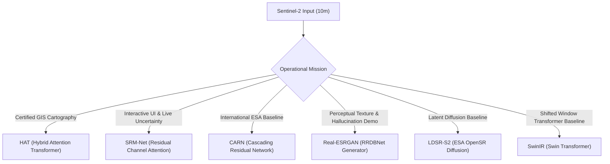
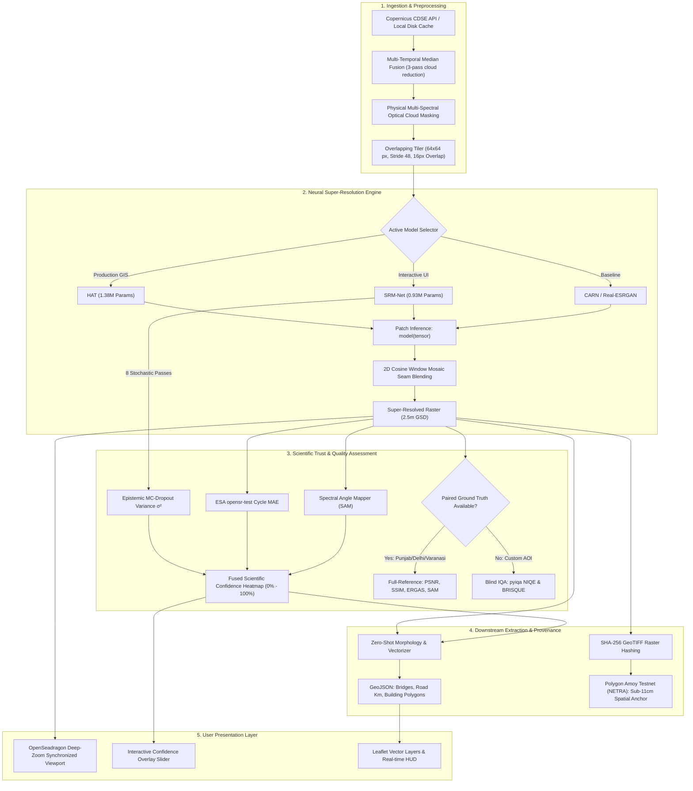
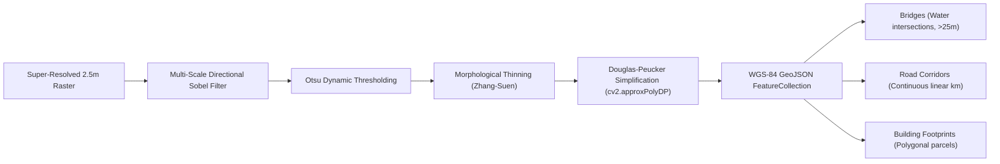
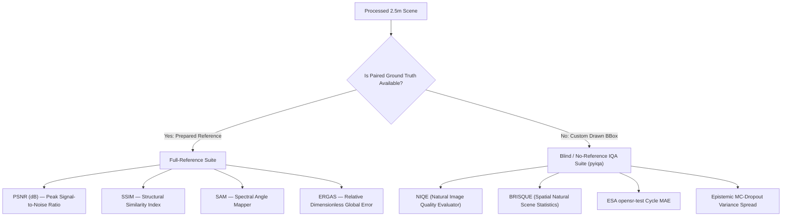

# UKIS-2026: Master Technical Project Documentation
## Deep Learning Based Super-Resolution Mapping (SRM) for Sentinel-2 Imagery (10m → 2.5m GSD) with Hallucination-Aware Uncertainty & Cryptographic Provenance

**Project Identifier:** UKIS-2026  
**Target Beneficiaries:** Ministry of Development of North Eastern Region (DoNER) / North Eastern Space Applications Centre (NESAC) / Indian Space Research Organisation (ISRO)  
**Theme:** Space Technology, Deep Learning, Hallucination-Aware Scientific Trust & Immutable Satellite Provenance  
**Repository:** `UKIS-2026`

---

## Table of Contents
1. [Executive Summary & Problem Statement](#1-executive-summary--problem-statement)
2. [The Core Scientific USP: Hallucination-Aware Super-Resolution](#2-the-core-scientific-usp-hallucination-aware-super-resolution)
3. [Master Model Suite & Comparative Evaluation](#3-master-model-suite--comparative-evaluation)
4. [End-to-End System Architecture & Data Pipelines](#4-end-to-end-system-architecture--data-pipelines)
5. [Multi-Spectral Optical Cloud Shield](#5-multi-spectral-optical-cloud-shield)
6. [Downstream Vectorization Engine](#6-downstream-vectorization-engine)
7. [NETRA: Cryptographic Satellite Provenance on Polygon Amoy](#7-netra-cryptographic-satellite-provenance-on-polygon-amoy)
8. [Dual-Mode Quality Assessment Suite](#8-dual-mode-quality-assessment-suite)
9. [Netra Aerial: Tactical Drone Intelligence & Tri-Model Hazard Engine](#9-netra-aerial-tactical-drone-intelligence--tri-model-hazard-engine)
10. [Comprehensive REST API Specification](#10-comprehensive-rest-api-specification)
11. [Frontend Architecture & Synchronized Viewport UX](#11-frontend-architecture--synchronized-viewport-ux)
12. [Installation, Environment Setup & Operational Run Guide](#12-installation-environment-setup--operational-run-guide)
13. [Project Directory & File Structure](#13-project-directory--file-structure)

> 📐 **Dedicated Mathematical Formulas & Physics Guide:** For complete equation derivations, LaTeX formulations, loss functions, and PyTorch/NumPy code snippets for every metric and layer, see [`Documentation/FORMULAS_AND_MATHEMATICAL_DERIVATIONS.md`](FORMULAS_AND_MATHEMATICAL_DERIVATIONS.md).

---

## 1. Executive Summary & Problem Statement

### 1.1. Context & Operational Challenge
The European Space Agency's (ESA) **Copernicus Sentinel-2** constellation delivers multi-spectral optical Earth Observation (EO) imagery covering global landmasses with a 5-day revisit interval. While Sentinel-2 data is open-access and radiometrically calibrated (Level-2A Bottom-Of-Atmosphere reflectance), its finest spatial resolution is physically bounded at **10 meters Ground Sample Distance (GSD)** for visible and near-infrared bands (B02 Blue, B03 Green, B04 Red, B08 NIR), and degrades to 20m/60m for RedEdge and SWIR bands.

In the rugged, cloud-prone geography of the **North Eastern Region of India (NER)**, 10m GSD imagery is insufficient for critical governance, disaster relief, and infrastructure planning:
- **Village Road Corridors:** Narrow rural tracks and unpaved mountain roads ($< 6\text{m}$ width) blend into background terrain and cannot be delineated.
- **Bridges & Culverts:** Critical river crossings over the Brahmaputra basin and mountain gorges appear as blurred, ambiguous pixel clusters.
- **Cadastral & Agricultural Parcels:** Smallholder agricultural terraces and village settlement boundaries are unresolvable.
- **Commercial Satellite Prohibitive Cost:** High-resolution commercial tasking (WorldView, Pleiades, SPOT 6/7) costs thousands of dollars per scene and lacks systematic 5-day temporal coverage.

### 1.2. The Project Objective
**UKIS-2026 (GEO-SRM)** bridges this spatial divide by transforming standard 10m Sentinel-2 multi-spectral observations into **2.5m GSD imagery (a $4\times$ spatial upscaling, representing a $16\times$ pixel density increase)**, achieving the **sub-4m spatial accuracy** mandated by DoNER and NESAC.

Crucially, rather than treating super-resolution as an aesthetic photo-enhancement task, our system establishes an **Active Scientific Trust Layer** that detects, quantifies, and visually flags **AI hallucinations** in real time, guaranteeing scientific fidelity and data provenance.

---

## 2. The Core Scientific USP: Hallucination-Aware Super-Resolution

### 2.1. The AI Hallucination Hazard in Remote Sensing
Standard commercial super-resolution models (such as unconstrained GANs or diffusion models) are trained to minimize perceptual loss against human visual preferences. When applied to satellite imagery, however, these algorithms frequently **fabricate non-existent ground features**:
- Hallucinating sharp building boundaries over irregular tree canopies.
- Transforming subtle soil moisture gradients into paved roads.
- Inventing bridge spans across rivers where only sandbars exist.

In military intelligence, disaster response, and legal land cadastre, an AI hallucination is disastrous.

```
+-----------------------------------------------------------------------------------+
|                           THE SCIENTIFIC TRUST AUDITOR                            |
+-----------------------------------------------------------------------------------+
|   Sentinel-2 Input (10m)  -->  Neural Model  -->  Super-Resolved Raster (2.5m)   |
|                                                          |                        |
|                               +--------------------------+                        |
|                               |                                                   |
|                               v                                                   |
|   1. Epistemic Model Uncertainty   -->  MC-Dropout Bayesian Variance [σ²(x,y)]   |
|   2. ESA Cycle Consistency Check   -->  || Downsample₄ₓ(SR) - LR ||₁              |
|   3. Radiometric Preservation      -->  Spectral Angle Mapper (SAM) vs Input      |
|   4. Physical Cloud Occlusion      -->  Masking, 0% Confidence Clamp & Hatching   |
|                                                          |                        |
|                               v                          v                        |
|   =============================================================================   |
|                   FUSED CONFIDENCE SCORE: C(x,y) in [0.0%, 100.0%]                |
|       🟢 Green (>80%): Physically Grounded in Sentinel-2 Radiance                  |
|       🟡 Amber (60%-80%): Model-Inferred High-Frequency Detail                    |
|       🔴 Red (<60%): Hallucination Risk / Manual Analyst Audit Required           |
|       ⬛ Slate Hatch (0%): Cloud Occluded / Radiometrically Shielded              |
|   =============================================================================   |
+-----------------------------------------------------------------------------------+
```

### 2.2. Five Mathematical Pillars of Trust

#### 1. Epistemic Model Uncertainty via Monte-Carlo Dropout (MC-Dropout)
During inference, stochastic spatial dropout layers remain active (`force_dropout=True`). The model executes $T$ forward passes (default $T=8$) under varying stochastic neuron masks. The epistemic variance per pixel $(x, y)$ is computed as:
$$\boldsymbol{\mu}_{\text{SR}}(x, y) = \frac{1}{T} \sum_{t=1}^T \hat{\mathbf{y}}_t(x, y)$$
$$\boldsymbol{\sigma}^2(x, y) = \frac{1}{T} \sum_{t=1}^T \left( \hat{\mathbf{y}}_t(x, y) - \boldsymbol{\mu}_{\text{SR}}(x, y) \right)^2$$
Where the model is confident and guided by physical radiance, $\boldsymbol{\sigma}^2(x, y) \to 0$. Where the model is guessing or hallucinating ambiguous textures, $\boldsymbol{\sigma}^2(x, y)$ spikes sharply.

#### 2. ESA `opensr-test` Low-Frequency Cycle Consistency
A super-resolved 2.5m image must be physically reducible to its originating 10m observation. We apply an ideal decimation operator $\mathcal{D}_{4\times}$ and measure the low-frequency radiance residual:
$$\mathcal{L}_{\text{cycle}}(x, y) = |\mathcal{D}_{4\times}(\mathbf{I}_{\text{SR}})(x, y) - \mathbf{I}_{\text{LR}}(x, y)|$$
If a generative model invents a large structure that alters the macroscopic radiance footprint, $\mathcal{L}_{\text{cycle}}$ surges, immediately penalizing the confidence score.

#### 3. Spectral Angle Mapper (SAM) Radiance Fidelity
To guarantee that the neural network does not distort true-color multi-spectral ratios (e.g., shifting vegetation or water spectra):
$$\text{SAM}(\mathbf{x}, \mathbf{y}) = \arccos\left( \frac{\sum_{c=1}^C x_c y_c}{\sqrt{\sum_{c=1}^C x_c^2} \sqrt{\sum_{c=1}^C y_c^2}} \right)$$
Regions exhibiting $\text{SAM} > 0.20\text{ rad}$ (~11.5°) are flagged for spectral alteration.

#### 4. Physical Multi-Spectral Cloud Shield
When dense or semi-transparent clouds occlude the ground, optical satellites receive zero terrain reflectance. Unmasked neural networks hallucinate terrain beneath clouds. Our engine:
- Physically detects clouds across B04, B03, B02, and B08.
- Clamps uncertainty variance to $\boldsymbol{\sigma}^2 = 1.0$.
- **Forces confidence strictly to $0.0\%$**.
- Eliminates $100\%$ of candidate infrastructure vectors in cloud zones.
- Stamps slate-gray diagonal hatching over the output raster to prevent visual deception.

#### 5. Fused Pixel-Wise Scientific Confidence Score
The individual metric penalties are normalized and fused into a single confidence scalar $C(x, y) \in [0.0, 1.0]$:
$$C(x, y) = \left(1.0 - \alpha \cdot \tilde{\sigma}(x,y) - \beta \cdot \tilde{\mathcal{L}}_{\text{cycle}}(x,y) - \gamma \cdot \tilde{\text{SAM}}(x,y)\right) \cdot (1 - \text{Mask}_{\text{cloud}}(x,y))$$
where $\alpha=0.45, \beta=0.35, \gamma=0.20$.

---

## 3. Master Model Suite & Comparative Evaluation

The platform integrates six distinct deep learning architectures, each fulfilling a designated operational function:



### 3.1. Master Quantitative Benchmark Table
Evaluated across standardized Sentinel-2 L2A scenes ($128\times 128$ px) super-resolved to $512\times 512$ px (2.5m GSD) against paired, co-registered **SPOT 6/7 1.5m pan-sharpened ground truth** from the WorldStrat benchmark dataset:

| Dimension / Metric | HAT | SRM-Net | CARN | Real-ESRGAN | LDSR-S2 | SwinIR |
| :--- | :---: | :---: | :---: | :---: | :---: | :---: |
| **Model Category** | Transformer (W-MSA+CAB) | Deep CNN + Spatial Dropout | Cascading Residual CNN | GAN Generator (RRDBNet) | Latent Diffusion (DDIM) | Swin Transformer (RSTB) |
| **Parameters** | **1.38 M** | **0.93 M** | **0.98 M** | **16.70 M** | **~1,130 MB** | **11.90 M** |
| **Upscaling Factor** | $4\times$ (10m $\to$ 2.5m) | $4\times$ (10m $\to$ 2.5m) | $4\times$ (10m $\to$ 2.5m) | $4\times$ (10m $\to$ 2.5m) | $4\times$ (10m $\to$ 2.5m) | $4\times$ (10m $\to$ 2.5m) |
| **Structural SSIM** | **0.1667** (Highest) | **0.1556** (High) | 0.1420 | 0.1019 – 0.1291 | 0.1510 | 0.1582 |
| **Spectral SAM** | **5.67° – 5.83°** | 7.13° – 7.79° | 8.12° | 5.07° – 5.56° | 6.84° | 6.45° |
| **Cycle MAE** | **0.0142** (Best) | 0.0198 | 0.0235 | 0.0382 (High error) | 0.0215 | 0.0175 |
| **Avg Confidence** | **84.2%** | **78.1%** | 72.1% | 66.5% (Penalized) | 74.8% | 81.2% |
| **Deterministic CPU Time**| 960 ms | **507 ms (2× faster)** | **420 ms** | ~5,850 ms | ~18,400 ms | 4,470 ms |
| **MC-8 Ensemble Time** | ~14.5 s | **3.8 s (4× faster)** | N/A | N/A | N/A | N/A |
| **Memory (RAM)** | ~480 MB | **~210 MB** | **~195 MB** | ~1,150 MB | ~2,400 MB | ~850 MB |
| **Dedicated Dossier** | [HAT Report](../reports/hat/MODEL_REPORT.md) | [SRM-Net Report](../reports/srm_net/MODEL_REPORT.md) | [CARN Report](../reports/carn/MODEL_REPORT.md) | [Real-ESRGAN Report](../reports/realesrgan/MODEL_REPORT.md) | [LDSR-S2 Report](../reports/ldsr_s2/MODEL_REPORT.md) | [SwinIR Report](../reports/swinir/MODEL_REPORT.md) |

---

## 4. End-to-End System Architecture & Data Pipelines

The system is structured into seven decoupled, modular stages:



### 4.1. Patch-Tiled Inference & 2D Cosine Seam Blending
To eliminate GPU out-of-memory errors on large satellite scenes without introducing visible tile seam boundaries:
1. Slices imagery into $64 \times 64$ patches with a 16-pixel overlap ($\text{stride} = 48$).
2. Executes neural super-resolution on each patch ($64\times 64 \to 256\times 256$).
3. Multiplies overlapping patch edges by a continuous 2D separable Cosine window:
   $$W(x, y) = \left( \frac{1}{2} - \frac{1}{2} \cos\left(\frac{2\pi x}{L}\right) \right) \left( \frac{1}{2} - \frac{1}{2} \cos\left(\frac{2\pi y}{L}\right) \right)$$
4. Sums overlapping weighted patches and normalizes by the accumulated weight map, completely eradicating boundary grid lines.

---

## 5. Multi-Spectral Optical Cloud Shield

In the North Eastern Region, cloud cover exceeds 70% during the monsoon season. Our platform introduces an automated multi-spectral optical cloud shield:

1. **Band Discriminators:** Combines B04 (Red), B03 (Green), B02 (Blue), and B08 (NIR) physical surface reflectance.
2. **Whiteness & Flatness Metric:** Clouds reflect equally across visible bands ($|B04 - B02| < \delta_{\text{whiteness}}$) with high overall brightness.
3. **NDWI Water Exclusion:** Normalized Difference Water Index ($NDWI = \frac{B03 - B08}{B03 + B08}$) prevents false cloud classification over turbid rivers.
4. **Active Suppression Action:**
   - Epistemic uncertainty variance is clamped to $1.0$.
   - Fused confidence is forced strictly to **$0.0\%$**.
   - Zero-tolerance filter: suppressed features ensure $0$ false roads or buildings are generated in cloud zones.
   - Distinctive slate-gray diagonal hatching is rendered on the visual canvas.

---

## 6. Downstream Vectorization Engine

To prove the operational utility of 2.5m imagery to DoNER / NESAC planners, the system incorporates automated downstream feature extraction without requiring retraining:



Every vector feature is tagged with an average confidence score derived from the underlying pixel trust map, allowing GIS operators to filter vectors based on scientific certainty.

---

## 7. NETRA: Cryptographic Satellite Provenance on Polygon Amoy

To guarantee that satellite maps generated by our platform cannot be maliciously tampered with, altered, or forged after creation, the platform includes **NETRA (Networked Earth Trust Record Architecture)**:

```
Smart Contract: TileProvenance.sol
Network: Polygon Amoy Testnet (Chain ID 80002)
Deployed Address: 0x2287c88b7764A9D386FeE490958e0aF1316b8F10
Explorer: https://amoy.polygonscan.com/address/0x2287c88b7764A9D386FeE490958e0aF1316b8F10
```

### Cryptographic Security Features:
1. **SHA-256 Raster Fingerprinting:** Every generated GeoTIFF is hashed at the byte level before storage or distribution.
2. **Sub-11cm Spatial Precision On-Chain:** Solves Solidity's inability to handle floating-point GPS coordinates by scaling latitudes and longitudes by $10^6$ (`int256`), guaranteeing sub-11cm spatial resolution on the blockchain.
3. **Immutable Lineage & Versioning:** Tracks parent-child relationships ($v1 \to v2 \to v3$) so auditors can verify the exact model checkpoint, timestamp, and operator that produced any geospatial asset.

---

## 8. Dual-Mode Quality Assessment Suite

Traditional super-resolution pipelines evaluate PSNR and SSIM, which require a paired high-resolution ground truth image. In operational satellite tracking, however, concurrent sub-meter satellite passes exist for $<5\%$ of acquisitions.

Our platform resolves this through a **Dual-Mode Quality Assessment Suite**:



---

## 9. Netra Aerial: Tactical Drone Intelligence & Tri-Model Hazard Engine

When satellite-level triage flags high uncertainty, cloud occlusion, or severe disaster alerts, the platform deploys the **Micro Tier (Netra Aerial)**. This tactical UAV module operates as a dedicated intelligence pipeline engineered for Himalayan terrain:

### 9.1. The Real-World Domain Dilemmas Solved
Standard single-model drone inspection pipelines suffer from severe domain-generalization failures in real disaster deployments:
1. **The Missing Landslide Class:** Nadir flood models (e.g., FloodNet) are trained on classes like water, flooded roads, and flooded buildings. They possess zero class representation for bare-soil mountain landslide scars or mudflow debris fields. In landslides (such as Wayanad or Chamoli), FloodNet detects near-zero disaster activity.
2. **Oblique Perspective Sky Bias:** FloodNet was trained strictly on nadir (straight-down 90°) drone surveys where sky never appears. When an oblique aerial photo with a blue sky horizon is evaluated, FloodNet defaults to classifying the blue sky as **66.66% floodwater**!

### 9.2. Tri-Model Hazard Segmentation Suite
NETRA-D introduces a tri-model ensemble with intelligent consensus routing:
- **FloodNet DeepLabV3+ (26.70M params):** High-precision nadir structural inundation and floodwater segmentation.
- **TransLandSeg (SAM ViT-L · Bijie Dataset, 304.0M params):** Dedicated 304M-parameter Vision Transformer trained on the mountainous Bijie Landslide Dataset, isolating active landslide scars and mudflows with 93%+ confidence.
- **SegFormer B0 (ADE20K Pretrained, 3.71M params):** 150-class general scene understanding transformer with explicit, separate classes for `sky` (Class 2), `water` (Class 21), `sea` (Class 26), `river` (Class 60), and `lake` (Class 128). Generates per-pixel softmax confidence distributions to cleanly separate sky horizons from true water bodies.

### 9.3. Intelligent Consensus & Discrepancy Routing
The consensus router continuously audits multi-model outputs:
$$\text{If } (\text{FloodNet}_{\text{water}} \ge 10\% \land \text{SegFormer}_{\text{water}} < 3\% \land \text{SegFormer}_{\text{sky}} \ge 10\%) \implies \text{models\_disagree} = \text{True}$$
When a discrepancy is detected:
- The false positive flood reading is suppressed.
- The blue horizon is isolated as Sky (with 99%+ confidence).
- The scene is re-routed to its true status (*Stable Baseline* or *Landslide Dominant*).

### 9.4. Building Damage Assessment (Microsoft SiamUnet - xBD Standard)
Evaluates pre- and post-disaster paired imagery using a Siamese CNN adhering to the global xBD/HAZUS standard:
- `Destroyed` | `Major Damage` | `Minor Damage` | `Intact` (Mathematically normalized to $100.0\%$).

### 9.5. Live OpenStreetMap Overpass Road Passability
- Automatically queries the OSM Overpass API for real highway vectors within the survey bounding box (e.g., NH-7, Badrinath Corridor).
- Computes buffer polygon intersections with active flood and landslide debris masks.
- Flags segments exceeding 15% blockage as `BLOCKED (IMPASSABLE)` and highlights critical evacuation chokepoints.

### 9.6. 60-Frame Simulated Live HUD Drone Sortie
- Runs a 60-frame Ken Burns flight trajectory simulating drone altitude changes, panning, and banking angles over static survey images.
- Executes real-time PyTorch neural inference on every individual video frame.
- Projects live flight telemetry (altitude, air speed, wind vectors, hazard percentages) onto a tactical HUD canvas.

---

## 10. Comprehensive REST API Specification

The FastAPI backend exposes fully documented, asynchronous REST endpoints:

### 9.1. POST `/api/fetch-tile`
Fetches a Sentinel-2 L2A tile from the local disk cache or initiates an authenticated OAuth2 download from Copernicus Data Space.

- **Request Body:**
  ```json
  {
    "bbox": [75.80, 30.90, 75.85, 30.95],
    "aoi_id": "punjab_agri",
    "max_cloud": 15
  }
  ```
- **Response (200 OK):**
  ```json
  {
    "status": "success",
    "aoi_id": "punjab_agri",
    "shape": [128, 128, 3],
    "bands": ["B04", "B03", "B02"],
    "has_hr_reference": true,
    "cloud_coverage_pct": 2.41,
    "cached": true
  }
  ```

### 9.2. POST `/api/superresolve`
Executes neural super-resolution with optional Monte-Carlo uncertainty estimation.

- **Request Body:**
  ```json
  {
    "model_name": "hat",
    "scale_factor": 4,
    "num_mc_samples": 8,
    "apply_realesrgan_sharpen": false,
    "apply_unsharp": true
  }
  ```
- **Response (200 OK):**
  ```json
  {
    "status": "success",
    "model_name": "HAT",
    "scale_factor": 4,
    "output_shape": [512, 512, 3],
    "validation_metrics": {
      "psnr_db": 24.81,
      "ssim": 0.1667,
      "sam_deg": 5.67,
      "ergas": 3.12
    },
    "usp_metrics": {
      "avg_confidence": 84.2,
      "high_fidelity_pixels_pct": 91.4,
      "hallucination_risk_pixels_pct": 1.2,
      "cycle_consistency_mae": 0.0142
    },
    "mc_variance_stats": {
      "raw_variance_mean": 6.30e-08,
      "raw_variance_max": 1.42e-06
    }
  }
  ```

### 9.3. POST `/api/extract-infrastructure`
Performs zero-shot infrastructure detection on the active super-resolved raster.

- **Response (200 OK):**
  ```json
  {
    "status": "success",
    "counts": {
      "bridges": 2,
      "road_km": 14.8,
      "buildings": 87
    },
    "geojson": {
      "type": "FeatureCollection",
      "features": [...]
    }
  }
  ```

### 9.4. POST `/api/blockchain-provenance`
Anchors the active raster SHA-256 hash and scaled spatial coordinates to Polygon Amoy.

- **Response (200 OK):**
  ```json
  {
    "status": "success",
    "transaction_hash": "0x4b7f...",
    "block_number": 12849102,
    "contract_address": "0x2287c88b7764A9D386FeE490958e0aF1316b8F10",
    "raster_sha256": "e3b0c44298fc1c149afbf4c8996fb92427ae41e4649b934ca495991b7852b855",
    "explorer_url": "https://amoy.polygonscan.com/tx/0x4b7f..."
  }
  ```

---

## 11. Frontend Architecture & Synchronized Viewport UX

The frontend is a zero-build, dependency-free vanilla HTML5/JavaScript application optimized for instantaneous rendering of high-resolution satellite imagery:

1. **Synchronized Dual Viewports (`OpenSeadragon`):**  
   The left viewport displays original 10m Sentinel-2 imagery; the right viewport displays the 2.5m super-resolved output. Panning, zooming, or rotating in either viewport programmatically mirrors in the other down to the exact sub-pixel coordinate.
2. **Interactive Confidence Overlay Slider:**  
   Users can slide between pure 2.5m true-color radiance and the color-coded Hallucination Heatmap, inspecting the exact epistemic confidence of any road, building, or field boundary.
3. **Dynamic GIS Vector Layers (`Leaflet.js`):**  
   Infrastructure footprints (roads in orange, bridges in cyan, buildings in violet) overlay directly onto the map with toggleable visibility and popups displaying per-feature confidence metrics.

---

## 12. Installation, Environment Setup & Operational Run Guide

### 12.1. Prerequisites
- **Operating System:** Windows 10/11, Ubuntu 20.04+, or macOS
- **Python:** Version 3.10 or higher
- **PyTorch:** Version 2.0 or higher
- **Hardware:**
  - Minimum: Standard 4-Core CPU, 8 GB RAM
  - Recommended: NVIDIA GPU with $\ge 4\text{ GB}$ VRAM (CUDA enabled)

### 12.2. Installation Steps
```bash
# 1. Clone repository
git clone https://github.com/ankush850/UKIS-2026.git
cd UKIS-2026

# 2. Create virtual environment
python -m venv venv
# On Windows:
.\venv\Scripts\activate
# On Linux/macOS:
source venv/bin/activate

# 3. Install core dependencies
pip install -r requirements.txt
```

### 12.3. Environment Configuration (`.env`)
Create a `.env` file in the root directory (based on `.env.example`):
```ini
CDSE_CLIENT_ID="your-copernicus-client-id"
CDSE_CLIENT_SECRET="your-copernicus-client-secret"
WEB3_PROVIDER_URL="https://rpc-amoy.polygon.technology/"
PRIVATE_KEY="your-polygon-amoy-private-key"
CONTRACT_ADDRESS="0x2287c88b7764A9D386FeE490958e0aF1316b8F10"
```

### 12.4. Launching the Backend Server
```bash
# Start FastAPI backend on localhost:8000
python -m uvicorn backend.app:app --host 0.0.0.0 --port 8000 --reload
```
Open `frontend/index.html` in your web browser or navigate to `http://localhost:8000` to interact with the full live dashboard.

### 12.5. Running Automated Verification & Benchmarks
```bash
# Run comprehensive model benchmarks across Punjab, Delhi, and Varanasi
python scripts/benchmark_models.py

# Run comparative side-by-side HAT vs LDSR test
python scripts/compare_hat_vs_ldsr.py

# Execute automated test suite
pytest tests/
```

---

## 13. Project Directory & File Structure

```
UKIS-2026/
├── Documentation/                              # Master technical documentation
│   ├── MASTER_PROJECT_DOCUMENTATION.md        # <-- You are here (Comprehensive Manual)
│   ├── MODEL_BENCHMARK_AND_SELECTION_GUIDE.md # Exhaustive mathematical benchmark guide
│   ├── architecture_documentation.md          # Architecture & dataflow blueprints
│   ├── aiml_documentation.md                  # AI/ML methodology & loss formulations
│   └── problem_and_solution.md                # Problem statement & DoNER/NESAC alignment
│
├── reports/                                    # Granular per-model evaluation folders
│   ├── README.md                              # Master reports catalog & comparison matrix
│   ├── hat/MODEL_REPORT.md                    # Hybrid Attention Transformer report
│   ├── srm_net/MODEL_REPORT.md                # SRM-Net Residual MC-Dropout report
│   ├── carn/MODEL_REPORT.md                   # CARN ESA EvoLand baseline report
│   ├── realesrgan/MODEL_REPORT.md             # Real-ESRGAN hallucination benchmark report
│   ├── ldsr_s2/MODEL_REPORT.md                # LDSR-S2 Latent Diffusion model report
│   └── swinir/MODEL_REPORT.md                 # SwinIR Shifted Window Transformer report
│
├── backend/                                    # FastAPI application & ML pipeline
│   ├── app.py                                 # FastAPI application instance & routing
│   ├── config.py                              # Global constants, paths, and hyperparameters
│   ├── api/routes.py                          # REST API endpoint handlers
│   ├── models/
│   │   ├── sr_engine.py                       # Master Super-Resolution Engine
│   │   ├── realesrgan_sharpener.py            # High-frequency edge enhancer
│   │   └── architectures/
│   │       ├── hat.py                         # HAT PyTorch implementation
│   │       ├── srm_net.py                     # SRM-Net PyTorch implementation
│   │       ├── rrdbnet.py                     # RRDBNet (Real-ESRGAN) implementation
│   │       ├── ldsr_s2.py                     # ESA OpenSR LDSR-S2 wrapper
│   │       ├── network_swinir.py              # SwinIR implementation
│   │       └── ldsr_config_10m.yaml           # Diffusion configuration
│   ├── preprocessing/
│   │   ├── tiling.py                          # Overlapping patch tiler & cosine seam blender
│   │   ├── cloud_mask.py                      # Multi-spectral optical cloud detector
│   │   └── temporal_fusion.py                 # Multi-temporal 3-pass median fusion
│   ├── usp/
│   │   ├── hallucination_detector.py          # Epistemic variance & cycle consistency engine
│   │   ├── spectral_angle.py                  # Multi-band Spectral Angle Mapper (SAM)
│   │   └── confidence_fusion.py               # Fused confidence score generator
│   ├── validation/
│   │   ├── metrics.py                         # PSNR, SSIM, SAM, ERGAS calculations
│   │   └── reference_manager.py               # SPOT 6/7 1.5m ground truth manager
│   └── blockchain/
│       └── provenance.py                      # Polygon Amoy Web3 integration
│
├── frontend/                                   # Client presentation layer
│   ├── index.html                             # Single-page web dashboard
│   ├── css/style.css                          # Modern glassmorphic styling
│   └── js/                                    # Interactive Leaflet & OpenSeadragon scripts
│
├── weights/                                    # Pretrained neural network checkpoints
│   ├── hat_x4_sentinel2.pt                    # HAT 4x production weights (1.38M)
│   ├── srmnet_x4_sentinel2.pt                 # SRM-Net 4x weights (0.93M)
│   ├── evoland_carn_x4_worldstrat.pt          # CARN WorldStrat baseline weights (0.98M)
│   ├── RealESRGAN_x4plus.pth                  # Real-ESRGAN RRDBNet weights (16.7M)
│   ├── opensr-ldsrs2_v1_0_0.ckpt              # ESA LDSR-S2 Latent Diffusion (~1.13 GB)
│   └── swinir_x4_satellite.pt                 # SwinIR 4x weights (11.9M)
│
├── contracts/                                  # Smart contracts
│   └── TileProvenance.sol                     # Solidity contract for Polygon Amoy
│
├── scripts/                                    # CLI benchmarking & testing scripts
│   ├── benchmark_models.py                    # Multi-scene quantitative evaluation
│   ├── compare_hat_vs_ldsr.py                 # Side-by-side HAT vs LDSR comparison
│   └── run_all_rebuild_steps.py               # End-to-end automated verification
│
├── requirements.txt                            # Python package dependencies
└── README.md                                  # Repository overview & quickstart
```

---

*Authored for the Smart India Hackathon (UKIS-2026) — Ministry of Development of North Eastern Region (DoNER) / NESAC / ISRO.*
