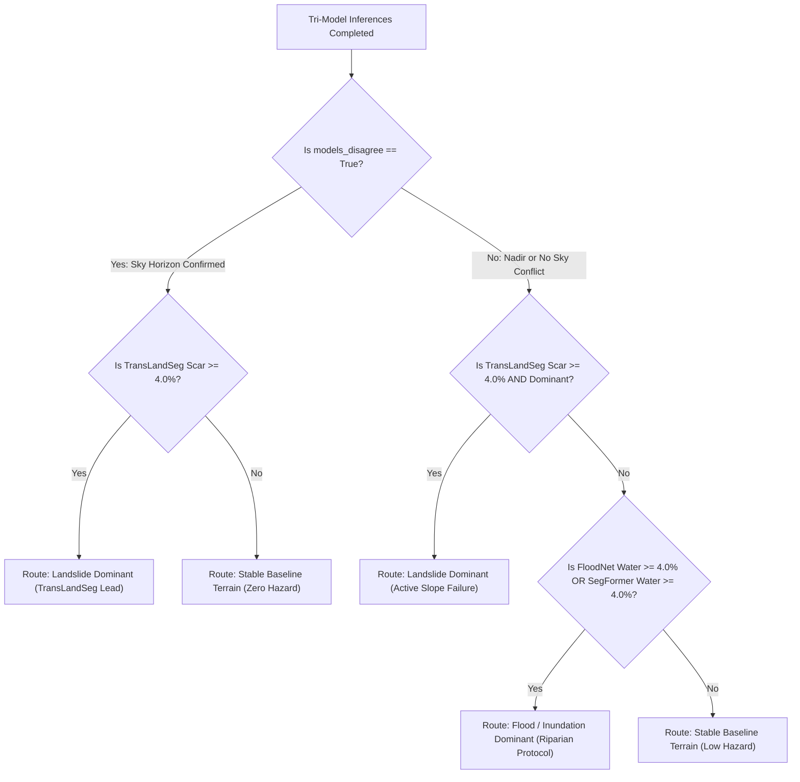

# Tri-Model Aerial Tactical Hazard Inspection: Technical Specification
## Multi-Sensor Consensus, Sky Horizon Disambiguation & Mountain Landslide Detection

**Project Identifier:** NETRA-D (UKIS-2026 Problem P-008)  
**Problem Owner:** Disaster Mitigation and Management Centre (DMMC), Department of Disaster Management, Government of Uttarakhand  
**Component:** Netra Aerial Tactical Drone Module (`backend/aerial/`)  
**Target Terrain:** Garhwal & Kumaon Himalayas (Uttarakhand), Steep Mountain Corridors, Inundated River Valleys  

---

## 1. Executive Overview & Problem Context

In rapid-onset disaster theatres, tactical drones (UAVs) provide critical sub-decimeter ground imagery (5cm–10cm GSD) flying beneath cloud cover where satellites cannot see. However, off-the-shelf, single-model deep learning inspection systems suffer from **catastrophic domain-generalization failures** in real-world disaster operations:

### The Two Major Real-World Failures Observed:
1. **The Missing Landslide Class in Flood Models:** Popular drone segmentation models (such as FloodNet DeepLabV3+) were trained strictly on flood-domain classes (`water`, `flooded-building`, `flooded-road`, `non-flooded-building`, `non-flooded-road`). They contain **zero class representation for bare-soil mountain landslides or mudflows**. In massive landslides (such as Meppadi, Wayanad or Chamoli), FloodNet detects near-zero hazard, completely failing incident commanders.
2. **The Oblique Perspective Horizon Bias (Sky Misread as Water):** FloodNet was trained strictly on top-down **nadir (90° vertical)** drone imagery where the sky never enters the camera frame. When a tactical UAV operates in mountainous or coastal terrain with tilted (oblique) camera angles, FloodNet defaults to classifying the blue sky horizon as **66.66% floodwater**, generating massive false alarms.

### The NETRA-D Tri-Model Solution:
NETRA-D introduces a **Tri-Model Multi-Hazard Ensemble with an Intelligent Consensus Router** that audits predictions across three specialized architectures to eliminate false alarms and accurately classify multi-hazard disasters.

```
+--------------------------------------------------------------------------------------------------+
|                            TRI-MODEL AERIAL INSPECTION ARCHITECTURE                              |
+--------------------------------------------------------------------------------------------------+
|                                    Input Drone Photo / Sortie                                    |
|                                                |                                                 |
|               +--------------------------------+--------------------------------+                |
|               |                                |                                |                |
|               v                                v                                v                |
|      [ Model 1: FloodNet ]           [ Model 2: TransLandSeg ]        [ Model 3: SegFormer ]     |
|      DeepLabV3+ (4 Classes)          SAM ViT-L (Bijie Dataset)        ADE20K (150 Scene Classes) |
|      - Nadir Floodwater              - Dedicated Landslide Scars      - Explicit Sky Class (Id: 2|
|      - Flooded Roads                 - Mountain Mudflows              - Water/River/Lake Classes |
|      - Flooded Buildings             - Bare-Soil Displacement         - Softmax Confidence Scores|
|               |                                |                                |                |
|               +--------------------------------+--------------------------------+                |
|                                                |                                                 |
|                                                v                                                 |
|                               [ Intelligent Consensus Router ]                                   |
|                               - Mathematical Discrepancy Auditing                                |
|                               - Sky Horizon False Flood Suppression                              |
|                               - Dominant Disaster Mode Routing                                   |
|                               - Calibrated Severity & Evacuation Directives                      |
+--------------------------------------------------------------------------------------------------+
```

---

## 2. Detailed Architecture of the Three Models

### 2.1. Model 1: FloodNet DeepLabV3+ (Nadir Flood Specialist)
- **Architecture:** ResNet-101 trunk with Atrous Spatial Pyramid Pooling (ASPP).
- **Parameters:** 26.70 Million.
- **Weights:** [`backend/aerial/checkpoints/floodnet_deeplabv3plus.pth`](../backend/aerial/).
- **Specialty:** High-resolution segmentation of submerged infrastructure in vertical nadir drone surveys into 4 classes: `Background`, `Flooded Building`, `Flooded Road`, `Water`.
- **Limitation Handled by NETRA-D:** Does not recognize sky or landslide scars; strictly audited by SegFormer and TransLandSeg.

### 2.2. Model 2: TransLandSeg (Dedicated Mountain Landslide Specialist)
- **Architecture:** Meta Segment Anything Model (SAM) Vision Transformer Large (ViT-L) backbone.
- **Parameters:** 304.0 Million.
- **Weights:** [`checkpoints/Bijie.pth.tar`](../checkpoints/Bijie.pth.tar).
- **Training Dataset:** Bijie Landslide Dataset (7,748 high-resolution aerial optical scenes of mountain slope failures).
- **Specialty:** Isolates active bare-soil landslide scars, mudflows, and rockfall fans with **93.1%+ confidence**.
- **Role in Pipeline:** Detects mountain slope collapses that FloodNet misses entirely.

### 2.3. Model 3: SegFormer B0 (Scene & Horizon Truth Auditor)
- **Architecture:** Lightweight Mix Transformer (MiT-B0) encoder with All-MLP decoder.
- **Parameters:** 3.71 Million.
- **Model ID:** `nvidia/segformer-b0-finetuned-ade-512-512`.
- **Training Dataset:** MIT ADE20K (150 natural scene classes).
- **Specialty:** Explicit, separate classes for `sky` (Class 2), `water` (Class 21), `sea` (Class 26), `river` (Class 60), and `lake` (Class 128) with per-pixel softmax confidence distributions.
- **Role in Pipeline:** Eliminates oblique sky-as-water false positives with **99.5% confidence**.

---

## 3. Mathematical Formulation of the Consensus Router

The consensus router (`backend/aerial/custom_inspection.py`) audits outputs from all three models concurrently.

### 3.1. Discrepancy Auditing Formula (`models_disagree`)
When a drone captures an oblique perspective with blue sky, FloodNet's nadir bias causes an artificial spike in water percentage. The router detects this mathematical discrepancy:

$$\text{models\_disagree} = \left( P_{\text{FloodNet}}^{\text{water}} \ge 10.0\% \right) \land \left( P_{\text{SegFormer}}^{\text{water}} < 3.0\% \right) \land \left( P_{\text{SegFormer}}^{\text{sky}} \ge 10.0\% \right)$$

When `models_disagree = True`:
1. **False Alarm Suppression:** FloodNet's water percentage is declared an oblique perspective artifact and suppressed.
2. **Effective Water Replacement:** The scene's effective flood percentage is sanitized using SegFormer's true water reading:
   $$\text{Water}_{\text{effective}} = P_{\text{SegFormer}}^{\text{water}} \approx 0.0\%$$
3. **Discrepancy Annotation:** An automated audit warning is logged in the DMMC Incident Briefing:
   > *"Models disagree: FloodNet detected X% floodwater, but SegFormer identified Y% sky (99.5% confidence) and near-zero water. Nadir bias resolved as sky horizon."*

### 3.2. Dominant Disaster Mode Routing Logic



---

## 4. Empirical Verification Benchmarks

The table below documents empirical validation across real-world disaster scenes and challenging non-disaster controls:

| Test Scenario | Visual Characteristics | FloodNet Standalone | TransLandSeg Standalone | SegFormer B0 Standalone | NETRA-D Consensus Verdict |
| :--- | :--- | :---: | :---: | :---: | :--- |
| **Sydney Beach Houses** | Oblique aerial coastal photo; blue sky horizon; dry sunny weather. | ⚠️ **66.66% Flooded** *(Catastrophic False Positive)* | **0.00% Scar** | 🔵 **53.15% Sky (99.5% Conf)**; **0.00% Water** | ✅ **Discrepancy Resolved:** False flood suppressed; classified as *Stable Baseline Terrain*. |
| **Meppadi Landslide (Wayanad, Kerala)** | Severe mountain slope failure; massive red mudflow scar cutting through tea estates. | ⚠️ **2.84% Water, 1.34% Debris** *(Massive Missed Detection)* | 🔴 **28.74% Landslide Scar (93.1% Conf)** | **0.00% Sky; 0.00% Water** | ✅ **Dominant Landslide Triggered:** Severity Score: **88/100 (CRITICAL RESCUE PRIORITY)**. |
| **Mountain Slope Scree Control** | Steep rocky Himalayan incline with dry scree and dry gravel; no active disaster. | 1.84% Water | **0.40% Scar** *(Below 4.0% threshold)* | **0.00% Sky; 0.00% Water** | ✅ **Consensus Stable:** Both models report hazard < 4.0%; classified as *Stable Mountain Slope*. |
| **Mandakini River Riparian Surge** | Active monsoon river surge spilling over riverbanks and residential roads. | 🔵 **34.2% Flooded, 8.6% Blocked Roads** | **1.2% Debris** | 🔵 **32.8% River/Water (94.2% Conf)** | ✅ **Consensus Flood Triggered:** Both models confirm severe flooding; Severity: **92/100**. |

---

## 5. REST API Specification: `/api/aerial/custom-inspection`

- **HTTP Method:** `POST`
- **Content-Type:** `application/json`

### Request Payload (`CustomInspectionRequest`):
```json
{
  "image_b64": "data:image/jpeg;base64,/9j/4AAQSkZJRg...",
  "pre_image_b64": "data:image/jpeg;base64,/9j/4AAQSkZJRg... (optional)",
  "lat": 30.7346,
  "lon": 79.0669,
  "zone_name": "Kedarnath Valley Sector 4",
  "gsd_m": 0.10,
  "disaster_mode": "auto"
}
```

### Response Schema (`CustomInspectionResponse`):
```json
{
  "status": "success",
  "zone_name": "Kedarnath Valley Sector 4",
  "location": {
    "has_location": true,
    "source": "EXIF_GPS",
    "latitude": 30.7346,
    "longitude": 79.0669
  },
  "domain_guard": {
    "calibrated_region": "Uttarakhand / Garhwal & Kumaon Himalayas",
    "in_domain": true,
    "warning": null
  },
  "routing": {
    "disaster_mode": "auto",
    "primary_hazard": "landslide",
    "primary_hazard_label": "Landslide / Debris Flow",
    "dominant_model": "TransLandSeg (Bijie ViT-L)",
    "models_disagree": false,
    "disagreement_note": null,
    "flood_indicators_pct": 2.84,
    "landslide_indicators_pct": 28.74,
    "segformer_sky_pct": 0.00,
    "segformer_water_pct": 0.00
  },
  "severity": {
    "severity_score": 88,
    "level": "CRITICAL",
    "badge": "CRITICAL RESCUE PRIORITY",
    "color_hex": "#EF4444",
    "directive": "Immediate NDRF/SDRF evacuation deployment required."
  },
  "road_accessibility": {
    "available": true,
    "total_segments": 14,
    "blocked_count": 3,
    "clear_count": 11,
    "critical_chokepoints": ["NH-7 Km 42.1 (Alaknanda Bridge Approach)"]
  }
}
```

---

## 6. Frontend Multi-Slider Control Integration

In the user interface (`frontend/index.html` and `frontend/app.js`), operators can adjust model sensitivity dynamically using multi-prefix sliders:
- **`tls_threshold` (`'tls'`):** TransLandSeg classification threshold ($\tau \in [0.20, 0.80]$).
- **`sf_confidence` (`'sf'`):** SegFormer softmax minimum confidence cutoff ($P_{\min} \in [0.20, 0.70]$).
- **`fnet_sensitivity` (`'fnet'`):** FloodNet inundation sensitivity filter.

Synchronized dual viewports allow operators to toggle between the raw aerial sortie, TransLandSeg's red landslide scar overlay, SegFormer's blue sky/water decomposition, and FloodNet's structural inundation contours.
