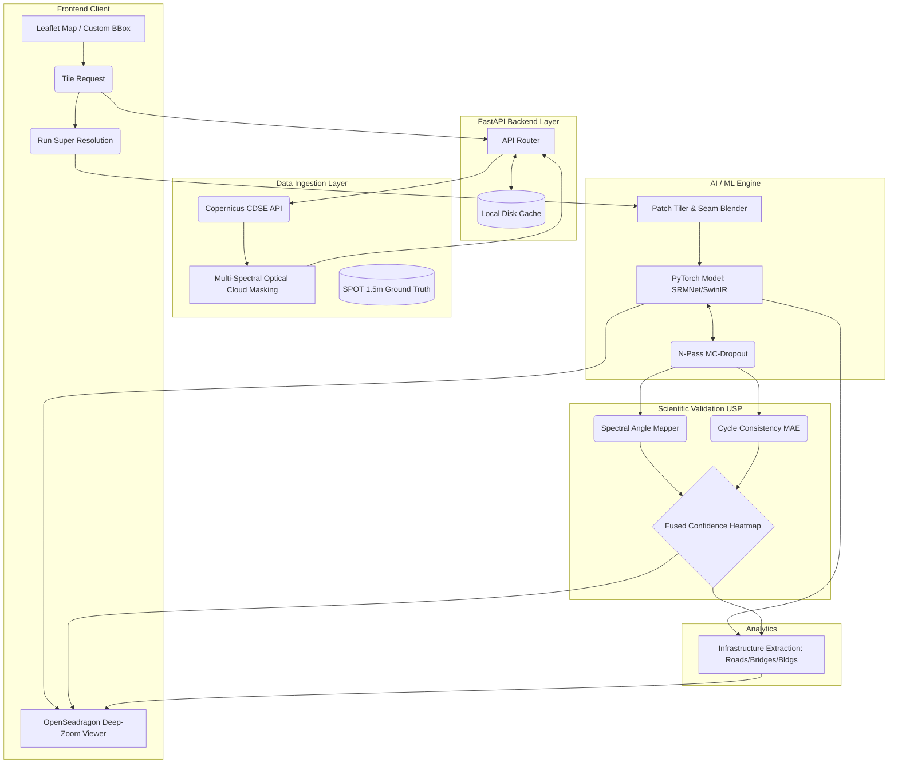

# System Architecture: UKIS-2026 (GEO-SRM)

This document outlines the high-level architecture, data flow, and modular components of the UKIS-2026 Super Resolution Mapping (SRM) system. 

## 1. High-Level Data Flow Architecture

The following diagram illustrates how user requests move from the interactive map to the cloud satellite API, through the PyTorch super-resolution models, and back to the user interface.

---

## 2. Component Breakdown

### 2.1. Client & Presentation Layer (Frontend)
The frontend is a lightweight, zero-build vanilla JS application that focuses on rendering massive geospatial images efficiently.
*   **Bounding Box Selector:** Uses `Leaflet.js` and `Leaflet.draw` to allow users to intuitively select any region on the globe.
*   **Synchronized Viewports:** Uses `OpenSeadragon` to render 16-bit/32-bit images as Deep Zoom pyramids. The 10m Sentinel-2 viewport and 2.5m SRM viewport are programmatically linked so that panning/zooming one mirrors exactly in the other.
*   **Real-time HUDs:** Custom HTML/CSS overlays that display confidence scores, validation metrics, and infrastructure counts fetched asynchronously from the FastAPI backend.

### 2.2. API & Orchestration Layer (Backend)
Built on `FastAPI` to handle non-blocking asynchronous calls.
*   **Stateful Session Management:** The backend holds the `current_session` in memory, storing the active Low-Resolution (LR) matrix, High-Resolution (HR) reference, and Super-Resolved (SR) outputs to prevent redundant computations.
*   **Caching Strategy:** To combat Copernicus CDSE rate-limits and ensure a smooth hackathon demonstration, tiles fetched via `/api/fetch-tile` are cached to `cache/tiles/` locally. Subsequent clicks on the same preset return in sub-100ms.

### 2.3. Data Ingestion & Fallback Layer
*   **Copernicus Client (`copernicus_client.py`):** Negotiates OAuth2 tokens and fetches real 10m Sentinel-2 L2A Level imagery.
*   **Multi-Temporal Fusion:** Rather than relying on a single image that may have cloud cover, the system can pull 3 distinct temporal passes and apply a pixel-wise median filter to generate a highly clean input tensor.
*   **Ground Truth Pipeline:** Automatically searches local directories for paired `SPOT 6/7 1.5m` reference imagery corresponding to the drawn Bounding Box for true scientific validation.

### 2.4. Deep Learning Super-Resolution Engine
*   **Patch-Tiled Inference:** Satellite images (e.g., 512x512) are too heavy to process in one pass on lower-end GPUs. The `Tiler` slices the image into 64x64 patches with a 16px overlap.
*   **2D Cosine Blending:** When reconstructing the super-resolved patches, a 2D cosine window is applied to the overlapping edges to completely eliminate grid artifacts (seam lines).
*   **Monte-Carlo Dropout Engine:** During inference, Dropout layers remain active (`force_dropout=True`). The engine runs $N$ forward passes to calculate per-pixel epistemic variance (Uncertainty).

### 2.5. USP: Hallucination-Aware Uncertainty Pipeline
The defining scientific architecture of this project. Standard generative models (like GANs/Diffusion) invent textures. This pipeline acts as a mathematical auditor:
*   **Spectral Consistency (SAM):** Computes the N-dimensional spectral angle between the original 10m bands and the generated 2.5m bands to ensure radiometric integrity.
*   **Cycle Consistency:** Downscales the 2.5m image back to 10m using bicubic interpolation and compares it to the original Sentinel-2 10m image. Any large divergence indicates a model hallucination.
*   **Heatmap Fusion:** These penalties are mathematically fused into a 2D confidence array (0.0 to 1.0) and served to the frontend as a visual heatmap overlay.

### 2.6. Infrastructure Extraction
*   **Detector Module:** Runs classic computer vision and thresholding operations on the Super-Resolved array (alongside the Confidence Map) to extract structural footprints (roads, bridges, buildings) and exports them natively as `GeoJSON` topology.
