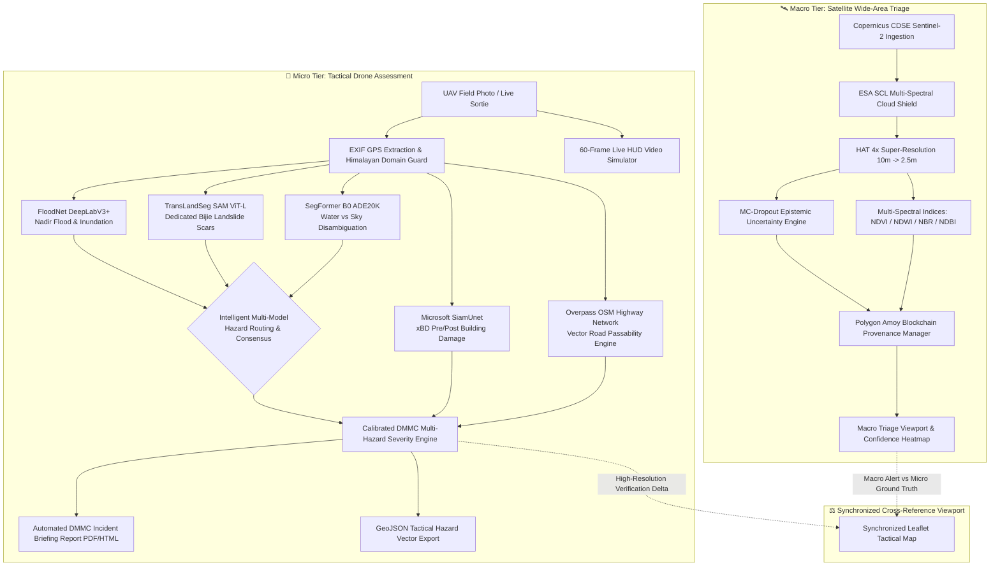

# System Architecture: NETRA-D (UKIS-2026)
## Dual-Tier Disaster Intelligence & Infrastructure Assessment Platform

This document outlines the high-level architecture, multi-tier data flow, and modular components of the NETRA-D system engineered for the **Disaster Mitigation and Management Centre (DMMC), Uttarakhand** under UKIS-2026 Problem P-008.

---

## 1. High-Level Multi-Tier Architecture

NETRA-D connects wide-area satellite monitoring with localized high-resolution drone inspections:

---

## 2. Component Breakdown

### 2.1. Presentation Layer (Frontend)
- **Zero-Build Architecture:** Pure Vanilla HTML5, CSS3, and modern ES6+ JavaScript. No bulky build steps or external bundler dependencies.
- **Aerospace Defense Design System:** Sleek dark-mode aesthetic with glassmorphic cards, telemetry readouts, status badges, and animated HUD overlays.
- **Dual Synchronized Viewports:** Uses Leaflet.js with linked pan/zoom controllers to cross-reference satellite wide-area heatmaps against sub-decimeter tactical drone orthomosaics.
- **Multi-Prefix Real-Time Sliders:** Interactive controls for TransLandSeg thresholding (`tls`), SegFormer confidence thresholding (`sf`), and FloodNet sensitivity (`fnet`).

### 2.2. API & Orchestration Layer (Backend)
- **FastAPI Core (`backend/app.py`):** Asynchronous ASGI server utilizing Uvicorn for sub-millisecond route dispatching and non-blocking I/O.
- **Stateful In-Memory Session Storage:** Caches active Low-Resolution (LR) and High-Resolution (HR) tensors to avoid redundant model re-initialization during repeated user queries.
- **Multi-Model Concurrency:** Asynchronously routes custom drone inspection requests through all three neural segmentation backbones in parallel.

### 2.3. Macro Tier: Satellite Processing Engine
- **Copernicus Ingestion Client (`backend/ingestion/copernicus_client.py`):** Negotiates OAuth2 credentials with Copernicus Data Space Ecosystem (CDSE) to fetch live Bottom-Of-Atmosphere Level-2A granules.
- **Patch Tiler & Seam Blender (`backend/models/sr_engine.py`):** Slices large multi-band satellite rasters into $64 \times 64$ patches with 16-pixel overlapping boundaries, applying a 2D cosine reconstruction window to eliminate boundary stitch seams.
- **HAT Super-Resolution Engine:** Upsamples 10m bands to 2.5m GSD ($16\times$ pixel density increase) using Hybrid Attention Transformers trained on paired Sentinel-2/SPOT 6/7 scenes.
- **Hallucination-Aware Uncertainty Pipeline (`backend/usp/`):** Runs $N=8$ stochastic Monte-Carlo Dropout passes to compute epistemic parameter variance $\boldsymbol{\sigma}^2(x, y)$, combined with low-frequency cycle consistency and SAM spectral angle checks.

### 2.4. Micro Tier: Tactical Drone Intelligence Engine
- **Tri-Model Hazard Segmentation Suite (`backend/aerial/`):**
  1. `segmentation.py`: FloodNet DeepLabV3+ for nadir floodwater and submerged infrastructure.
  2. `landslide_segmentation.py`: TransLandSeg (SAM ViT-L Bijie model) for dedicated active landslide scar and mudflow segmentation.
  3. `water_detection_segformer.py`: SegFormer B0 (ADE20K) for scene-level water/sea/river/lake segmentation with explicit sky class filtering.
- **Intelligent Consensus Router (`backend/aerial/custom_inspection.py`):** Compares outputs between FloodNet, TransLandSeg, and SegFormer. Flags discrepancies (`models_disagree`) when oblique sky horizons cause false positive floods in FloodNet, suppressing the false flag and promoting SegFormer's sky classification.
- **Building Damage Engine (`backend/aerial/damage_assessment.py`):** Microsoft SiamUnet Siamese CNN classifying paired pre- and post-disaster buildings into Destroyed, Major Damage, Minor Damage, and Intact categories (strictly normalized to $100.0\%$).
- **Road Passability Engine (`backend/aerial/road_accessibility.py`):** Direct Overpass OSM query engine calculating polygon intersections between active disaster zones and Himalayan highway vectors (NH-7, Badrinath, Kedarnath corridors).
- **Simulated Live Drone HUD Sortie Engine (`backend/aerial/live_stream.py`):** 60-frame Ken Burns trajectory engine streaming WebSocket video with per-frame PyTorch neural inference and HUD overlays.

### 2.5. Blockchain Provenance Layer (NETRA)
- **Polygon Amoy Smart Contract (`contracts/TileProvenance.sol`):** Anchors processed rasters with SHA-256 digests, integer-scaled sub-11cm geographic coordinates, model version hashes, and block timestamps.
- **Local Ledger Fallback (`backend/blockchain/provenance_manager.py`):** Seamless local JSON audit log maintaining transactional continuity during temporary RPC drops or network offline conditions.
