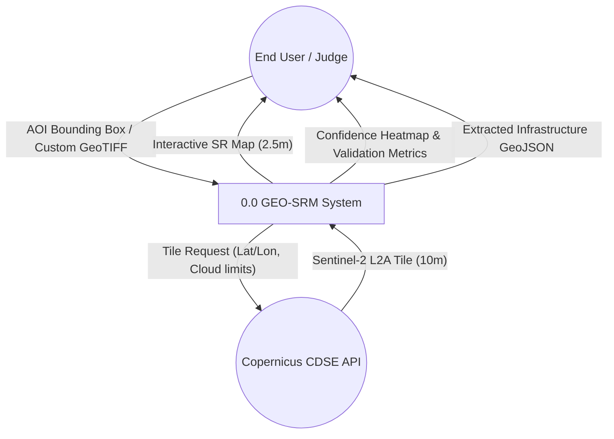
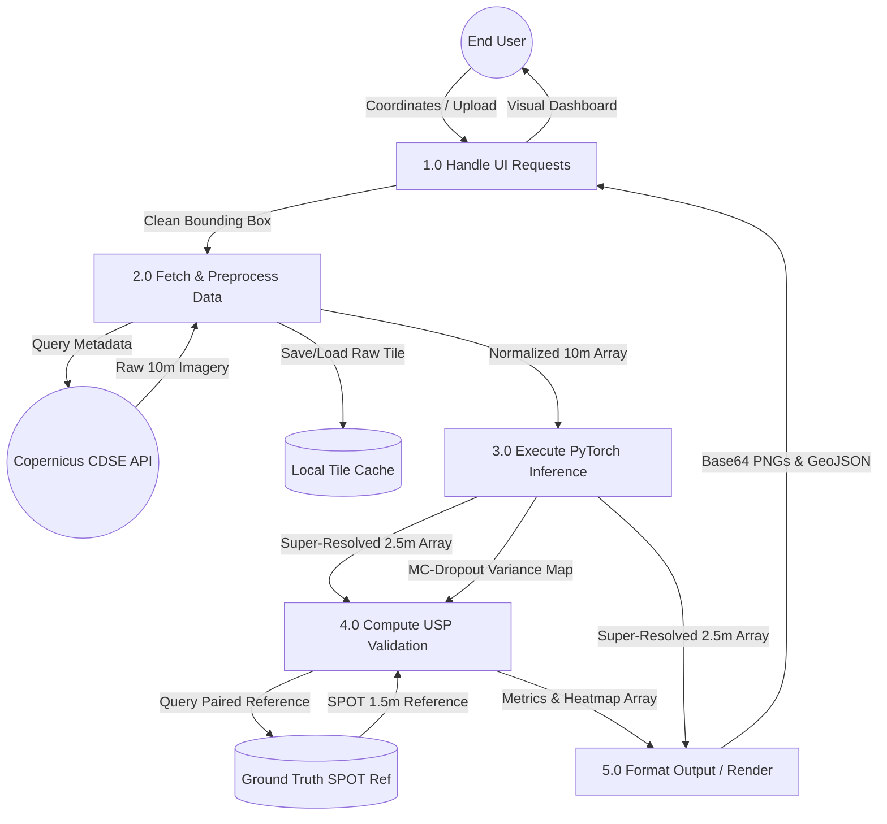
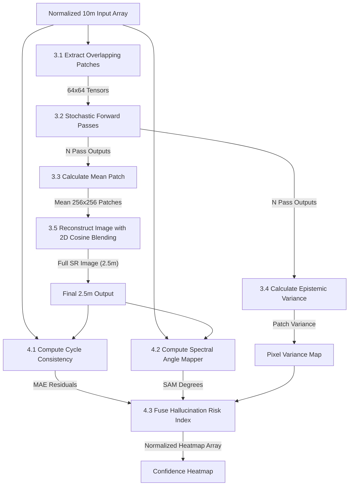
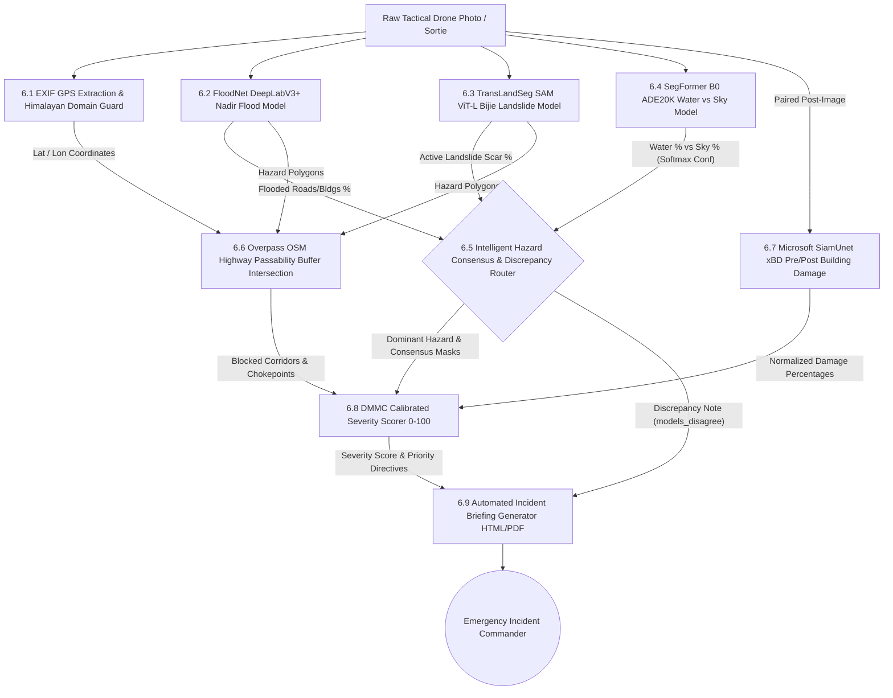

# Data Flow Diagram (DFD): UKIS-2026 (GEO-SRM)

This document provides a detailed Data Flow Diagram (DFD) analysis of the Super Resolution Mapping system. It is broken down into three levels of granularity: Level 0 (Context), Level 1 (High-Level Subsystems), and Level 2 (Detailed AI Data Flow).

---

## 1. Level 0 DFD: Context Diagram
The Context Diagram shows the entire GEO-SRM System as a single process and how it interacts with external entities (Users and External Cloud APIs).

---

## 2. Level 1 DFD: Subsystems Breakdown
Level 1 breaks the main system into its primary functional processes. It shows how data moves between data ingestion, the AI processing engine, and the frontend presentation layers.

---

## 3. Level 2 DFD: Deep Learning & USP Engine
Level 2 dives deep into Process 3.0 and 4.0, exposing the intricate data manipulation inside the PyTorch Super Resolution engine and the Hallucination-Aware Uncertainty Pipeline.

## Summary of the DFD Levels
*   **Level 0** shows that a user simply gives a location (Bounding Box or Drone Upload) and receives high-resolution intelligence, trust metrics, and incident briefings in return.
*   **Level 1** explains that the backend maintains a local database (`D1` Cache) to save bandwidth and gracefully separates data fetching from machine learning processing.
*   **Level 2** illustrates the mathematical operations where a single satellite tile is sliced into tensor patches (`P3.1`), pushed through active PyTorch Dropout layers multiple times (`P3.2`), and finally audited by the SAM (`P4.2`) and Cycle Consistency (`P4.1`) modules to detect hallucinations.

---

## 4. Level 3 DFD: Tactical Drone Tri-Model Inspection Pipeline
Level 3 illustrates the Micro Tier (Netra Aerial) data flow when evaluating tactical UAV sorties and field imagery:

