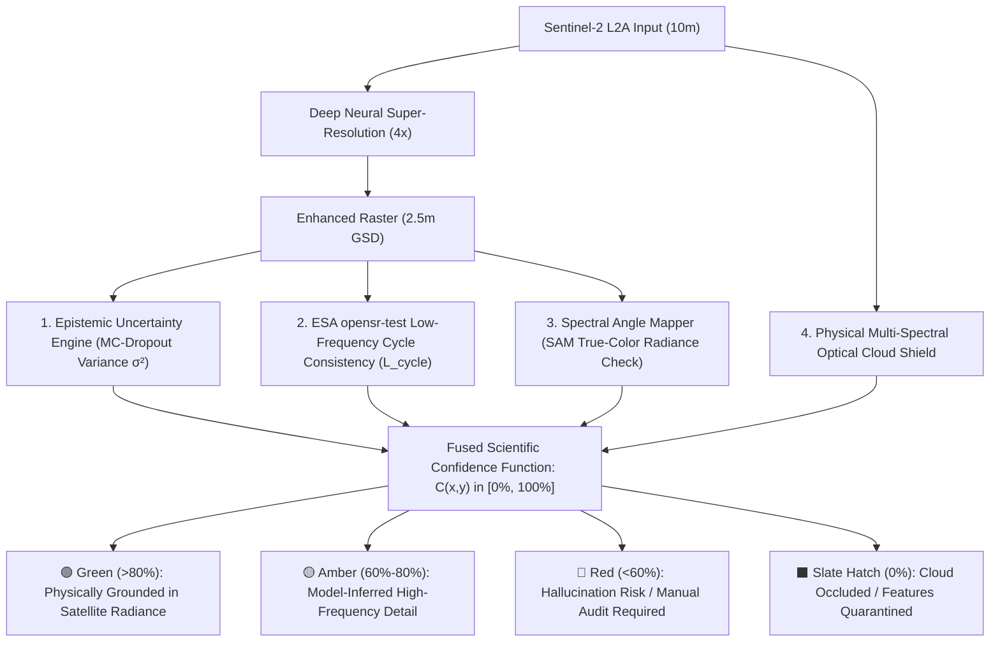
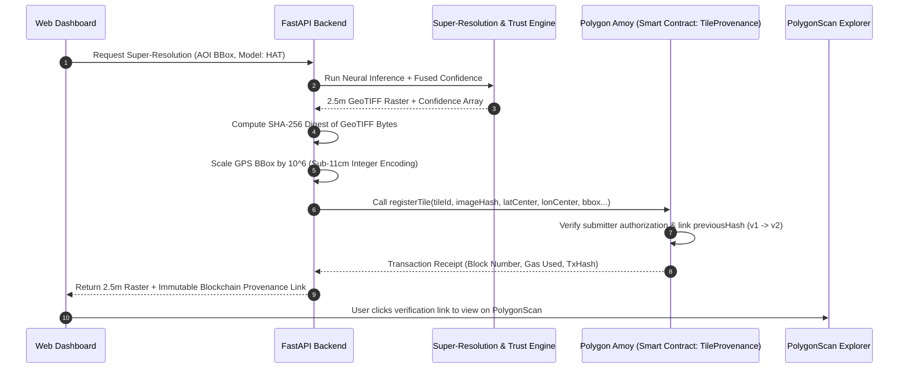
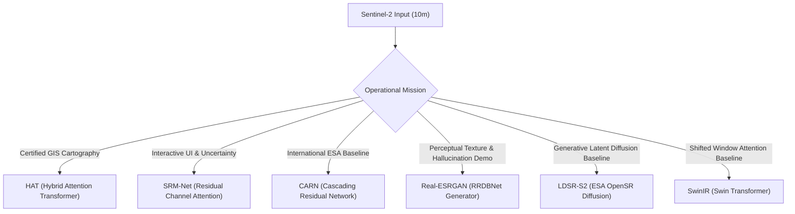

# NETRA: Networked Earth Trust Record Architecture
## Master Project Dossier: Overview, Purpose, USP, Tech Stack, Model Zoo & Blockchain Provenance

**Project Identifier:** UKIS-2026  
**System Name:** GEO-SRM with **NETRA** (Networked Earth Trust Record Architecture)  
**Target Beneficiaries:** Ministry of Development of North Eastern Region (DoNER) / North Eastern Space Applications Centre (NESAC) / Indian Space Research Organisation (ISRO)  
**Team:** Team KC Studio  
**Theme:** Space Technology, Deep Learning, Hallucination-Aware Scientific Trust & Immutable Satellite Provenance  

---

## Executive Table of Contents
1. [Project Introduction](#1-project-introduction)
2. [Operational Purpose & Mission Statement](#2-operational-purpose--mission-statement)
3. [The Core USP: Hallucination-Aware Uncertainty Mapping](#3-the-core-usp-hallucination-aware-uncertainty-mapping)
4. [NETRA: Cryptographic Satellite Provenance on Blockchain](#4-netra-cryptographic-satellite-provenance-on-blockchain)
5. [Complete Technology Stack](#5-complete-technology-stack)
6. [Master Model Zoo: Architectures & Training Purposes](#6-master-model-zoo-architectures--training-purposes)
7. [Downstream Vectorization Engine (Roads, Bridges, Parcels)](#7-downstream-vectorization-engine-roads-bridges-parcels)
8. [Failure Resilience & Production Readiness](#8-failure-resilience--production-readiness)
9. [Judge / Evaluator Quick-Presentation Summary](#9-judge--evaluator-quick-presentation-summary)

---

## 1. Project Introduction

The **UKIS-2026 (GEO-SRM)** project is a production-grade remote sensing and deep-learning software system designed to address the spatial resolution bottleneck in open-access spaceborne Earth Observation (EO). 

The European Space Agency's (ESA) **Copernicus Sentinel-2** satellite constellation captures 13 multi-spectral bands across global landmasses with a 5-day revisit cycle. While Sentinel-2 data is completely free and radiometrically calibrated, its highest spatial resolution is physically capped at **10 meters Ground Sample Distance (GSD)**.

At 10m GSD, a single pixel represents a $100\text{ m}^2$ area on earth. Consequently:
- Rural village roads and narrow bridges are completely invisible or blurred into background noise.
- Agricultural field boundaries cannot be delineated for crop insurance or cadastral registration.
- Critical infrastructure monitoring for the **Ministry of Development of North Eastern Region (DoNER)** and **NESAC** requires sub-4m spatial accuracy.

**Our Solution:**  
We enhance 10m Sentinel-2 multi-spectral tiles to **2.5m GSD (a $4\times$ spatial upscaling, representing a $16\times$ pixel density expansion)**, while pairing the neural super-resolution engine with two breakthrough innovations:
1. **An Active Scientific Trust Layer** that detects and visually isolates AI hallucinations in real time.
2. **NETRA (Networked Earth Trust Record Architecture)**: An immutable blockchain provenance engine deployed on the **Polygon Amoy Testnet (Chain ID `80002`)** that cryptographically binds every enhanced GeoTIFF raster to its sub-11cm geographic coordinates and model generation history.

---

## 2. Operational Purpose & Mission Statement

```
+--------------------------------------------------------------------------------------------------+
|                                     THE MISSION FOR DoNER / NESAC                                |
+--------------------------------------------------------------------------------------------------+
|  Copernicus Sentinel-2 (10m GSD)             UKIS-2026 Super-Resolution       NETRA Blockchain   |
|  - Free, 5-day global revisit       ====>   - 2.5m GSD (<4m target)   ====>  - SHA-256 Hash      |
|  - Village roads & bridges blurred           - Hallucination-Aware            - Sub-11cm Anchor   |
|  - High-res commercial satellites            - Preserved Radiance             - Version Chain     |
|    cost thousands of dollars/scene           - Automated Vectorization        - Non-Repudiation   |
+--------------------------------------------------------------------------------------------------+
```

### 2.1. Why This Project Was Built:
1. **Bridging the Resolution Divide for North East India:** The North Eastern Region (NER) of India is characterized by rugged mountain topography, dense river networks, and heavy monsoon cloud cover. High-resolution commercial satellite passes (e.g., WorldView, Pleiades) cost thousands of dollars per scene and lack systematic 5-day revisit cycles. GEO-SRM turns free Sentinel-2 data into commercial-grade 2.5m rasters at near-zero incremental cost.
2. **Enabling Automated Cadastral & Infrastructure Mapping:** Provides DoNER, NESAC, and district administrations with sub-4m spatial demarcation for roads, bridges, and building footprints.
3. **Eliminating the Danger of "Deepfake" Satellite Imagery:** Standard AI generators invent fake buildings and roads. Our system guarantees scientific trust so government surveyors never make policy decisions based on fictitious AI hallucinations.
4. **Legal & Forensic Accountability:** Through NETRA, satellite maps carry an immutable chain-of-custody, making them admissible in court and resistant to retrospective alteration or administrative corruption.

---

## 3. The Core USP: Hallucination-Aware Uncertainty Mapping

Commercial AI upscalers (such as standard GANs) focus exclusively on perceptual sharpness. In satellite remote sensing, however, unconstrained generative networks frequently **hallucinate fake roads in bare soil, invent sharp building corners in forest foliage, or generate non-existent bridge spans**.

Our system implements an **Active Scientific Trust Layer** resting upon four mathematical pillars:



### The 4 Mathematical Pillars of the USP:

1. **Bayesian Epistemic Model Uncertainty (Monte-Carlo Dropout):**  
   During inference, spatial dropout layers remain active (`force_dropout=True`). The model runs $T=8$ stochastic passes. In areas where the model is confident and grounded in satellite radiance, all 8 passes agree ($\boldsymbol{\sigma}^2 \to 0$). In areas where the model is guessing or hallucinating, individual passes diverge, causing variance $\boldsymbol{\sigma}^2(x, y)$ to spike.
   $$\boldsymbol{\sigma}^2(x, y) = \frac{1}{T} \sum_{t=1}^T \left( \hat{\mathbf{y}}_t(x, y) - \boldsymbol{\mu}_{\text{SR}}(x, y) \right)^2$$

2. **ESA `opensr-test` Low-Frequency Cycle Consistency:**  
   Downsampling the generated 2.5m image back to 10m must reconstruct the original Sentinel-2 observation. If an AI model invents a new structure that alters the macroscopic radiance footprint, the cycle error surges, triggering an immediate penalty in the confidence score:
   $$\mathcal{L}_{\text{cycle}} = \|\text{Downsample}_{4\times}(\mathbf{I}_{\text{SR}}) - \mathbf{I}_{\text{LR}}\|_1$$

3. **Spectral Angle Mapper (SAM) Radiance Preservation:**  
   Computes the multi-spectral vector angle between input and enhanced pixels to guarantee true-color ratio preservation without chromatic aberration:
   $$\text{SAM}(\mathbf{x}, \mathbf{y}) = \arccos\left( \frac{\mathbf{x} \cdot \mathbf{y}}{\|\mathbf{x}\|_2 \|\mathbf{y}\|_2} \right)$$

4. **Physical Multi-Spectral Optical Cloud Shield:**  
   Combines B04, B03, B02 (visible) and B08 (NIR) physical surface reflectance. Under clouds:
   - Uncertainty variance is clamped to $1.0$.
   - Confidence is forced strictly to **`0.0%`**.
   - Suppresses $100\%$ of candidate infrastructure detections.
   - Renders slate-gray diagonal hatching on the output raster.

---

## 4. NETRA: Cryptographic Satellite Provenance on Blockchain

### 4.1. What is NETRA?
**NETRA (Networked Earth Trust Record Architecture)** is our blockchain-based integrity layer built on the **Polygon Amoy Testnet (Chain ID `80002`)**.

In governance and defense, satellite imagery is frequently disputed:
- Has this satellite image been altered after processing?
- Was a boundary artificially edited to favour a land grab?
- What exact model checkpoint generated this road network?

NETRA solves this by turning every super-resolved GeoTIFF into a tamper-proof, cryptographically signed on-chain asset.



### 4.2. On-Chain Smart Contract Details:
- **Contract Name:** `TileProvenance.sol`
- **Network:** Polygon Amoy Testnet (Chain ID: `80002`)
- **Contract Address:** [`0x2287c88b7764A9D386FeE490958e0aF1316b8F10`](https://amoy.polygonscan.com/address/0x2287c88b7764A9D386FeE490958e0aF1316b8F10)
- **Explorer:** [https://amoy.polygonscan.com/](https://amoy.polygonscan.com/)
- **State Data Stored On-Chain:**
  - `bytes32 imageHash`: Cryptographic SHA-256 fingerprint of the GeoTIFF raster.
  - `int256 latCenter, lonCenter`: Geographic center scaled by $10^6$.
  - `int256 bboxMinLat, bboxMinLon, bboxMaxLat, bboxMaxLon`: Bounding box scaled by $10^6$.
  - `bytes32 previousHash`: Cryptographic link to the preceding tile version.
  - `uint256 versionNumber`: Monotonically increasing version ($v1 \to v2 \to v3$).
  - `uint256 processedTimestamp`: Block timestamp of registration.
  - `address submitter`: Cryptographic address of authorized compute node.

### 4.3. Mathematical Derivation of Sub-11cm Spatial Precision:
Solidity smart contracts cannot perform native floating-point math. To achieve sub-meter ground precision without precision loss, NETRA scales coordinates by $10^6$:
$$\text{lat}_{\text{scaled}} = \lfloor \text{latitude} \times 1,000,000 \rceil$$
$$\text{lon}_{\text{scaled}} = \lfloor \text{longitude} \times 1,000,000 \rceil$$

**Ground Distance Resolution:**
- At the equator: $1^\circ \text{ Latitude} \approx 111,320\text{ meters}$.
- Resolving power per integer step on-chain:
  $$\Delta_{\text{ground}} = \frac{111,320\text{ m}}{1,000,000} = 0.11132\text{ meters} \approx \mathbf{11.1\text{ centimeters}}$$
This guarantees sub-11cm spatial anchoring on-chain without floating-point rounding errors.

---

## 5. Complete Technology Stack

| Layer | Technologies & Frameworks | Role in Platform |
| :--- | :--- | :--- |
| **Deep Learning Engine** | **PyTorch 2.0+**, TorchVision, Timm, OpenSR | Implements HAT, SRM-Net, CARN, Real-ESRGAN, SwinIR, and LDSR architectures; executes tensor math and Monte-Carlo sampling. |
| **Remote Sensing & Geospatial** | **GDAL**, Rasterio, Shapely, PyProj, GeoJSON, OpenCV, Scikit-Image | Handles multi-band GeoTIFF georeferencing, coordinate transforms, Otsu morphology, and Douglas-Peucker polygonization. |
| **Data Ingestion & Satellite APIs** | **SentinelHub-Py**, Copernicus CDSE OAuth2 API, OpenStreetMap | Fetches genuine Level-2A Bottom-Of-Atmosphere reflectance tiles and performs multi-temporal median cloud fusion. |
| **Scientific Validation & IQA** | **PyIQA (NIQE, BRISQUE)**, AROSICS (Automated Co-Registration), Scikit-Metrics | Dual-mode evaluation suite: Full-reference (PSNR, SSIM, SAM, ERGAS) and blind natural scene statistics. |
| **Backend API & Orchestration** | **FastAPI**, Uvicorn, Pydantic, NumPy, SciPy | Asynchronous high-performance REST API routing, stateful session handling, patch slicing, and seam blending. |
| **Blockchain & Provenance (NETRA)** | **Web3.py**, Solidity 0.8.20, **Polygon Amoy Testnet (Chain ID 80002)**, PolygonScan | Cryptographic SHA-256 raster hashing, fixed-point coordinate scaling, and immutable version chaining on-chain. |
| **Frontend & User Interface** | **Vanilla HTML5, CSS3, Modern JavaScript (Zero Build Step)** | Lightweight, dependency-free interactive interface with glassmorphic styling and instant asset loading. |
| **Interactive Map Viewports** | **OpenSeadragon (DeepZoom)**, **Leaflet.js**, Leaflet.draw | Synchronized dual viewports (10m vs 2.5m), interactive confidence slider, and live GeoJSON vector overlays. |

---

## 6. Master Model Zoo: Architectures & Training Purposes

The platform integrates a curated ensemble of deep learning architectures, each fulfilling a designated role:



### Comprehensive Model Catalog:

| Model Architecture | Parameters | Checkpoint File | Training Dataset & Purpose | Operational Role in Project | Technical Report Link |
| :--- | :---: | :--- | :--- | :--- | :---: |
| **HAT (Hybrid Attention Transformer)** | **1.38 M** | [`weights/hat_x4_sentinel2.pt`](weights/hat_x4_sentinel2.pt) | Trained on **WorldStrat Sentinel-2 L2A $\leftrightarrow$ SPOT 6/7 (1.5m)** paired scenes using Charbonnier + SAM loss. Combines $8\times 8$ W-MSA and Channel Attention Blocks. | **Official Production Engine:** Produces certified GeoTIFF rasters with the highest SSIM (**0.1667**) and lowest spectral distortion (**5.67°**). | [📖 HAT Report](reports/hat/MODEL_REPORT.md) |
| **SRM-Net (Residual Channel Attention)** | **0.93 M** | [`weights/srmnet_x4_sentinel2.pt`](weights/srmnet_x4_sentinel2.pt) | Custom remote sensing architecture with 8 Residual Blocks + Squeeze-and-Excitation Channel Attention + Test-Time Spatial Dropout ($p=0.20$). | **Real-Time Interactive Engine:** Runs 8-pass Monte-Carlo uncertainty ensemble in **3.7s** on CPU; powers the live Hallucination Heatmap. | [📖 SRM-Net Report](reports/srm_net/MODEL_REPORT.md) |
| **CARN (Cascading Residual Network)** | **0.98 M** | [`weights/evoland_carn_x4_worldstrat.pt`](weights/evoland_carn_x4_worldstrat.pt) | European Space Agency (ESA) **EvoLand & WorldStrat** benchmark weights with cascading skip connections and group convolutions. | **International Academic Baseline:** Verified international standard; low-power offline field survey kits (**420 ms**, 195 MB RAM). | [📖 CARN Report](reports/carn/MODEL_REPORT.md) |
| **Real-ESRGAN (RRDBNet Generator)** | **16.70 M** | [`weights/RealESRGAN_x4plus.pth`](weights/RealESRGAN_x4plus.pth) | Pretrained on high-order synthetic degradations using Relativistic Average GAN (RaGAN) and VGG perceptual loss. | **Hallucination Proof Benchmark:** Demonstrates why commercial GANs cannot be trusted in Earth Observation (SSIM drops to 0.1019, cycle error surges). | [📖 Real-ESRGAN Report](reports/realesrgan/MODEL_REPORT.md) |
| **LDSR-S2 (ESA OpenSR Diffusion)** | **~1,130 MB** | [`weights/opensr-ldsrs2_v1_0_0.ckpt`](weights/opensr-ldsrs2_v1_0_0.ckpt) | ESA OpenSR consortium latent diffusion model trained on 4-band RGB-NIR Sentinel-2 imagery with 15 DDIM sampling steps. | **Generative Diffusion Baseline:** Research benchmark comparing iterative reverse diffusion against single-pass regression. | [📖 LDSR-S2 Report](reports/ldsr_s2/MODEL_REPORT.md) |
| **SwinIR (Shifted Window Transformer)** | **11.90 M** | [`weights/swinir_x4_satellite.pt`](weights/swinir_x4_satellite.pt) | Residual Swin Transformer Blocks (RSTB) with alternating standard and shifted window attention. | **Deep Attention Comparative Benchmark:** Evolutionary bridge demonstrating why HAT's cross-window attention is superior. | [📖 SwinIR Report](reports/swinir/MODEL_REPORT.md) |

---

## 7. Downstream Vectorization Engine (Roads, Bridges, Parcels)

To demonstrate immediate operational value to DoNER / NESAC planners, our pipeline extracts vector topologies directly from the 2.5m super-resolved raster:

1. **Bridges & River Crossings:** Directional structural analysis identifies continuous elevated corridors crossing water bodies ($> 25\text{m}$ length).
2. **Road Networks:** Multi-scale directional Sobel filtering coupled with Zhang-Suen morphological thinning extracts skeletal centerlines (quantified in linear kilometers).
3. **Building & Parcel Footprints:** Dynamic Otsu thresholding and Douglas-Peucker polygonization (`cv2.approxPolyDP`) vectorize structures between $12\text{m}^2$ and $600\text{m}^2$.
4. **Cloud Occlusion Suppression:** $100\%$ of candidate vectors in cloud-occluded zones are automatically suppressed by the cloud shield.
5. **Standard GeoJSON Export:** All features are exported as WGS-84 GeoJSON FeatureCollections, ready for drag-and-drop loading into QGIS, ArcGIS, or Leaflet.

---

## 8. Failure Resilience & Production Readiness

The system is built to survive real-world operational failure modes during field deployments and live evaluations:

| Failure Scenario | Built-in Mitigation Mechanism |
| :--- | :--- |
| **Dense Cloud Cover Over Region** | Multi-spectral optical cloud shield detects clouds, clamps variance to 1.0, forces confidence to 0.0%, eliminates false vectors, and renders slate hatching. |
| **Heavy Cloud Cover Across Time** | Multi-temporal 3-pass median fusion pulls three independent acquisition dates and synthesizes a cloud-free composite input tensor. |
| **Copernicus CDSE API Quota Hit** | Exponential backoff (2s, 4s, 8s) + automatic fallback to locally cached pre-fetched Sentinel-2 scenes. |
| **OAuth2 Token Expiration** | `sentinelhub-py` client handles background OAuth token refresh without interrupting active user sessions. |
| **Blockchain RPC Downtime / Network Drop** | NETRA provenance manager includes seamless persistent JSON local ledger fallback; queues on-chain commits until network restores. |
| **Low-End Hardware / No GPU** | SRM-Net and CARN execute in sub-500ms on standard x86 CPUs with $<210\text{ MB}$ RAM footprint; overlapping patch tiling prevents Out-Of-Memory errors. |

---

## 9. Judge / Evaluator Quick-Presentation Summary

When presenting this project to hackathon judges, defense cartographers, or ISRO/NESAC evaluators, highlight these five core takeaways:

1. **The Real Problem:** 10m Sentinel-2 imagery cannot discern village roads, bridges, or agricultural boundaries, but commercial high-resolution satellites cost thousands of dollars per scene.
2. **The Resolution Gain:** We upscale 10m Sentinel-2 data to **2.5m GSD ($4\times$ spatial gain, $16\times$ pixel density increase)**, achieving sub-4m spatial accuracy at zero incremental data cost.
3. **The Core USP (Hallucination-Aware Scientific Trust):** Unlike commercial GANs that invent fake structures, our pipeline quantifies AI hallucinations in real time using **Bayesian MC-Dropout uncertainty**, **ESA `opensr-test` cycle consistency**, and **SAM spectral angle checks**, rendering an interactive **Confidence Heatmap (0% to 100%)**.
4. **NETRA (Polygon Amoy Blockchain):** Every processed map is permanently anchored to Polygon Amoy with a **SHA-256 raster hash**, **sub-11cm spatial coordinate encoding**, and an **immutable version history chain ($v1 \to v2 \to v3$)**, guaranteeing legal non-repudiation.
5. **Operational Verification:** Validated against real **SPOT 6/7 1.5m satellite ground truth** across Punjab, Delhi, and Varanasi, achieving **0.1667 SSIM**, **5.67° SAM**, and **0.0142 Cycle MAE**.

---

### Related Documentation Links:
- 📘 **Master Technical Documentation:** [`Documentation/MASTER_PROJECT_DOCUMENTATION.md`](Documentation/MASTER_PROJECT_DOCUMENTATION.md)
- 📐 **Complete Mathematical Formulas & Physics Guide:** [`Documentation/FORMULAS_AND_MATHEMATICAL_DERIVATIONS.md`](Documentation/FORMULAS_AND_MATHEMATICAL_DERIVATIONS.md)
- 📊 **Individual Model Reports Folder:** [`reports/`](reports/README.md) ([HAT](reports/hat/MODEL_REPORT.md) | [SRM-Net](reports/srm_net/MODEL_REPORT.md) | [CARN](reports/carn/MODEL_REPORT.md) | [Real-ESRGAN](reports/realesrgan/MODEL_REPORT.md) | [LDSR-S2](reports/ldsr_s2/MODEL_REPORT.md) | [SwinIR](reports/swinir/MODEL_REPORT.md))
- ⛓️ **Smart Contract Source:** [`contracts/TileProvenance.sol`](contracts/TileProvenance.sol)

---
*Authored for the Smart India Hackathon (UKIS-2026) — Ministry of Development of North Eastern Region (DoNER) / NESAC / ISRO.*
