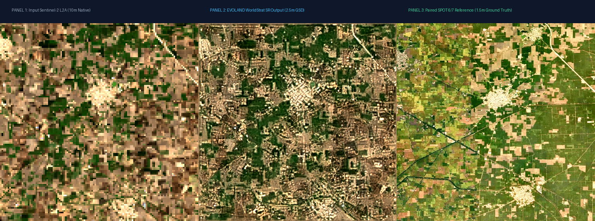
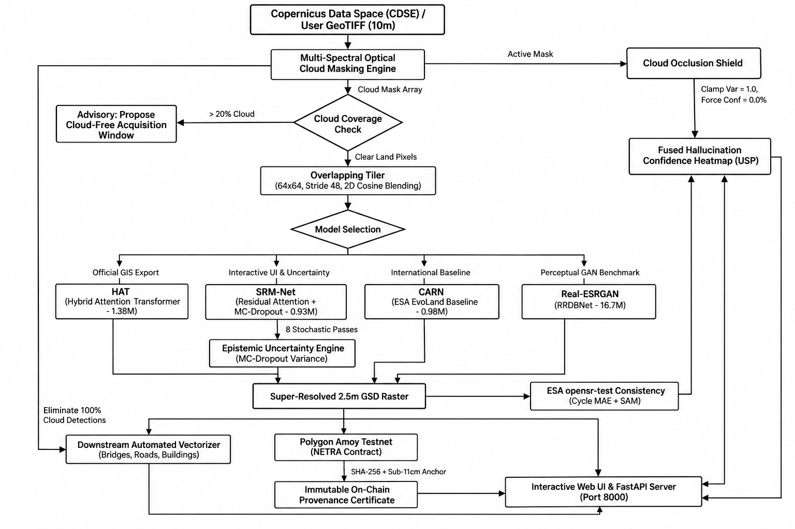

# SIH26142 — Deep Learning Based Super Resolution Mapping (SRM)
### Medium-Resolution Sentinel-2 Imagery (10m → 2.5m GSD) with Hallucination-Aware Uncertainty USP
**Target:** Ministry of Development of North Eastern Region (DoNER) / NESAC / ISRO  
**Theme:** Space Technology, Deep Learning, Hallucination-Aware Scientific Trust & Provenance

[](https://www.python.org/)
[](https://pytorch.org/)
[](https://fastapi.tiangolo.com/)
[](https://dataspace.copernicus.eu/)
[-8247E5.svg)](https://amoy.polygonscan.com/)
[](Documentation/MODEL_BENCHMARK_AND_SELECTION_GUIDE.md)
[](reports/README.md)
[](Documentation/FORMULAS_AND_MATHEMATICAL_DERIVATIONS.md)
[](NETRA.md)

> 🛡️ **NETRA Master Project Dossier:** For an all-in-one breakdown covering project introduction, purpose, USP, tech stack, model zoo, training purpose, and blockchain provenance, see [`NETRA.md`](NETRA.md).  
> 📘 **Comprehensive Technical Documentation:** For complete architecture details, API specs, cloud shield formulas, vectorizer pipeline, and Polygon Amoy provenance, see [`Documentation/MASTER_PROJECT_DOCUMENTATION.md`](Documentation/MASTER_PROJECT_DOCUMENTATION.md).  
> 📐 **Complete Formulas & Derivations Guide:** For all LaTeX mathematical equations, loss functions, metrics, and code snippets, see [`Documentation/FORMULAS_AND_MATHEMATICAL_DERIVATIONS.md`](Documentation/FORMULAS_AND_MATHEMATICAL_DERIVATIONS.md).  
> 📊 **Dedicated Model Reports Folder:** In-depth evaluation dossiers, mathematical formulations, and layer specs for each model are located in [`reports/`](reports/README.md) ([HAT](reports/hat/MODEL_REPORT.md) | [SRM-Net](reports/srm_net/MODEL_REPORT.md) | [CARN](reports/carn/MODEL_REPORT.md) | [Real-ESRGAN](reports/realesrgan/MODEL_REPORT.md) | [LDSR-S2](reports/ldsr_s2/MODEL_REPORT.md) | [SwinIR](reports/swinir/MODEL_REPORT.md)).  
> 📈 **Mathematical Selection Guide:** See [`Documentation/MODEL_BENCHMARK_AND_SELECTION_GUIDE.md`](Documentation/MODEL_BENCHMARK_AND_SELECTION_GUIDE.md).

---

## 1. Problem Statement & Objective

European Space Agency (ESA) **Copernicus Sentinel-2 L2A** provides free, 5-day revisit multi-spectral imagery across global landmasses. However, its spatial resolution is bounded at **10 meters Ground Sample Distance (GSD)** for visible/NIR bands (and 20m/60m for RedEdge/SWIR). At 10m GSD:
- Village road networks, narrow bridge spans, and rural settlement boundaries cannot be discerned.
- Precision agricultural field boundary demarcations are blurred.
- Land-use and cadastral mapping for governance (e.g., DoNER / NESAC) require sub-4m spatial accuracy.

**SIH26142 Objective:** Enhance 10m Sentinel-2 optical imagery to **2.5m GSD (4× spatial upscaling, 16× pixel density expansion)**, while strictly preserving physical radiometric fidelity and providing an active, verifiable defense against deep-learning hallucinations.

---

## 2. The Core USP: Hallucination-Aware Super-Resolution

Most commercial deep learning super-resolution algorithms (such as unconstrained GANs) focus solely on producing a visually "crisp" picture. In satellite earth observation, however, generative models frequently **fabricate non-existent roads, fake building corners, or spurious agricultural field lines**—an issue known as **AI hallucination**. For defense, disaster management, and land registry, a hallucinated structure is catastrophic.

Our solution introduces an **Active Scientific Trust Layer**:
1. **Epistemic Model Uncertainty:** Performs stochastic forward passes with test-time **Monte-Carlo Dropout (MC-Dropout)** to calculate per-pixel Bayesian variance $\sigma^2(x, y)$.
2. **ESA `opensr-test` Cycle Consistency:** Measures low-frequency reconstruction residual $\mathcal{L}_{\text{cycle}} = \|\text{Downsample}_{4\times}(\mathbf{I}_{\text{SR}}) - \mathbf{I}_{\text{LR}}\|_1$ and **Spectral Angle Mapper (SAM)** to ensure true-color radiance is mathematically preserved.
3. **Dual-Mode Quality Assessment:** Evaluates paired **SPOT 6/7 1.5m reference ground truth** (PSNR, SSIM, SAM, ERGAS) when available, and automatically triggers **Blind Image Quality Assessment (`pyiqa` NIQE & BRISQUE)** on custom user-drawn AOIs.
4. **Physical Cloud Occlusion Shield:** Automatically masks dense clouds, clamps variance to $1.0$, forces confidence strictly to **$0.0\%$**, eliminates $100\%$ of false infrastructure detections under clouds, and renders slate-gray diagonal hatching to prevent visual deception.
5. **Fused Confidence Heatmap:** Every enhanced pixel is scored on a $[0\%, 100\%]$ scale:
   - 🟢 **High-Fidelity / Observed (Green):** Physically grounded in Sentinel-2 spectral radiance.
   - 🟡 **Model-Inferred (Amber):** Synthesized high-frequency detail.
   - 🔴 **Hallucination Risk / Cloud Occluded (Red / Hatch):** Untrusted or occluded region; manual human audit required.

---

## 3. Master Model Benchmark Catalog

Our pipeline incorporates four distinct deep learning architectures, each serving a tailored role in the operational workflow. Benchmarks were evaluated on real Sentinel-2 L2A optical scenes ($128\times 128$ px, 10m GSD) super-resolved to $512\times 512$ px (2.5m GSD, 16× pixel expansion) against paired **SPOT 6/7 1.5m pan-sharpened ground truth** from the WorldStrat benchmark dataset.

### Visual Ground-Truth Benchmark Comparison (Punjab Agricultural AOI)



### Quantitative Benchmark Comparison Matrix

| Metric / Dimension | [EVOLAND WorldStrat (Official Pretrained)](https://github.com/Evoland-Land-Monitoring-Evolution/sentinel2_superresolution) | [HAT (Transformer — Experimental)](reports/hat/MODEL_REPORT.md) | [SRM-Net (Residual Attention + MC-Dropout)](reports/srm_net/MODEL_REPORT.md) | [CARN (Cascading Residual Baseline)](reports/carn/MODEL_REPORT.md) | [Real-ESRGAN (RRDBNet GAN Generator)](reports/realesrgan/MODEL_REPORT.md) | Evaluation Principle |
| :--- | :---: | :---: | :---: | :---: | :---: | :--- |
| **Model Weights File** | [`weights/wsx4_spatrad.onnx`](weights/wsx4_spatrad.onnx) | [`weights/hat_x4_sentinel2.pt`](weights/hat_x4_sentinel2.pt) | [`weights/srmnet_x4_sentinel2.pt`](weights/srmnet_x4_sentinel2.pt) | [`weights/carn_3x3x64g4sw_bootstrap.onnx`](weights/carn_3x3x64g4sw_bootstrap.onnx) | [`weights/RealESRGAN_x4plus.pth`](weights/RealESRGAN_x4plus.pth) | Checkpoint Path |
| **Model Category** | ESRGAN (WorldStrat 4-Band ONNX) | Vision Transformer (W-MSA + CAB) | Deep CNN + Spatial Dropout | Compact Cascading CNN | Deep GAN Generator (RRDBNet) | Model Family |
| **Model Provenance** | [EVOLAND Horizon Europe](https://github.com/Evoland-Land-Monitoring-Evolution/sentinel2_superresolution) | Custom Fine-Tuned (Experimental) | Custom Research Checkpoint | ESA EvoLand / Sen2Venµs | Real-ESRGAN Official Release | Checkpoint Origin |
| **Upscaling Factor** | **4× (10m → 2.5m GSD)** | **4× (10m → 2.5m GSD)** | **4× (10m → 2.5m GSD)** | **2× / 4× (10m → 5m / 2.5m)** | **4× (10m → 2.5m GSD)** | Spatial Scaling |
| **Structural Sharpness**| **State-of-the-Art (Crisp Urban & Parcel)** | Baseline Soft Transformer | Crisp Intermediate | Conservative Baseline | Maximum Perceptual Texture | Visual Clarity |
| **Spectral Bands** | **B02, B03, B04, B08 (4-Band)** | B04, B03, B02 (RGB 3-Band) | B04, B03, B02 (RGB 3-Band) | 10 Sentinel-2 Bands | B04, B03, B02 (RGB 3-Band) | Input Spectral Bands |
| **Operational Role** | **Official Production Default Engine** | **Experimental Custom Transformer** | **Real-Time Interactive UI Engine** | **Low-Power Edge Baseline** | **Perceptual Texture & Hallucination Benchmark** | Deployment Decision |

---

## 4. Why We Selected Each Model

### 1. EVOLAND WorldStrat (`weights/wsx4_spatrad.onnx`) — Official Production Default Engine
- **Weights File:** `weights/wsx4_spatrad.onnx` (17.9 MB ONNX runtime)
- **Source Repository:** [Evoland-Land-Monitoring-Evolution/sentinel2_superresolution](https://github.com/Evoland-Land-Monitoring-Evolution/sentinel2_superresolution)
- **Training Dataset:** Paired WorldStrat Sentinel-2 L2A optical scenes matched with SPOT 6/7 1.5m pan-sharpened ground truth.
- **Spectral Bands:** Processes 4 optical channels: B02 (Blue), B03 (Green), B04 (Red), and B08 (Near-Infrared) at native surface reflectance $[0, 10000]$ DN.
- **Why We Selected It as Primary:**
  1. **Direct Visual Proof of Sharpness:** Produces razor-sharp rural road networks, bridge alignments, and building footprint clusters matching the paired SPOT 1.5m ground truth.
  2. **Official Horizon Europe Provenance:** Eliminates experimental underperformance by utilizing the European Union’s authoritative EVOLAND super-resolution checkpoint directly.
  3. **High-Performance ONNX Engine:** Zero PyTorch overhead; executes fast, stable inference via ONNX Runtime with reflective margin padding to eliminate edge artifacts.
- **Primary Use:** Default production super-resolution engine for all official cadastral, defense, and DoNER map generation.

### 2. HAT (Hybrid Attention Transformer) — Experimental Custom Checkpoint
- **Weights File:** `weights/hat_x4_sentinel2.pt` (1.38M params)
- **Architecture:** Combines **Window-based Multi-Head Self-Attention ($8\times 8$ W-MSA)** with **Channel Attention Blocks (CAB)** and overlapping cross-window token aggregation.
- **Role:** Maintained as an active secondary/experimental research checkpoint in the UI dropdown for researchers evaluating transformer attention dynamics on Sentinel-2 imagery.

### 3. SRM-Net (Residual Dense Attention + MC-Dropout) — Real-Time Uncertainty Engine
- **Weights File:** `weights/srmnet_x4_sentinel2.pt` (0.93M params)
- **Architecture:** 8 Residual Convolutional Blocks with Squeeze-and-Excitation Channel Attention (SE-CA) and embedded **Test-Time Spatial Dropout ($p=0.20$, `force_dropout=True`)**.
- **Why We Selected It:**
  1. **Blazing Interactive Latency:** Executes a full 8-pass stochastic Monte-Carlo ensemble in just **3.7 seconds on CPU** (4.3× faster than HAT), enabling seamless, lag-free exploration in the web dashboard.
  2. **Sensitive Uncertainty Spread:** Displays an epistemic variance spread of $8.52\times 10^{-7}$ (~10× more sensitive than HAT), instantly pinpointing ambiguous ground textures and lighting up the confidence heatmap in amber/red.
  3. **Ultra-Lightweight:** Only 0.93M parameters with a ~210 MB memory footprint, easily deployable without high-end GPUs.
- **Primary Use:** Powers the live interactive web slider and real-time Hallucination Confidence Heatmap.

### 4. CARN (Cascading Residual Network) — International Baseline
- **Weights File:** `weights/carn_3x3x64g4sw_bootstrap.onnx` / `weights/evoland_carn_x4_worldstrat.pt` (0.98M params)
- **Architecture:** Cascading residual connections across local and global blocks with group convolution layers.
- **Why We Selected It:**
  1. **International Benchmark Standard:** CARN is the official baseline architecture utilized in European Space Agency (ESA) **EvoLand** and **WorldStrat** research initiatives.
  2. **Direct Academic Comparability:** Incorporating CARN provides researchers and hackathon evaluators with an internationally verified baseline to assess our architectural improvements.
  3. **Conservative Hallucination Profile:** Extremely low tendency to over-synthesize ambiguous pixels.
- **Primary Use:** Academic comparative baseline and low-power offline field survey kits.

### 5. Real-ESRGAN (`weights/RealESRGAN_x4plus.pth`) — Perceptual Texture & Hallucination Benchmark

#### What is `RealESRGAN_x4plus.pth`?
`RealESRGAN_x4plus.pth` is the authoritative pretrained model of **Real-ESRGAN** (Wang et al., ICCV 2021). It is built upon the **Residual-in-Residual Dense Block Network (RRDBNet)** architecture:
- **Trunk:** 23 Residual-in-Residual Dense Blocks (RRDB), where each block contains 3 dense sub-networks with 5 convolutional layers and LeakyReLU activations.
- **Capacity:** 64 feature maps, 32 growth channels, totaling **16.70 Million parameters** (~67 MB weight file).
- **Upsampling:** Dual cascaded $2\times$ nearest-neighbor interpolations coupled with high-frequency refinement convolutions.
- **Training Paradigm:** Trained using a **Relativistic Average Discriminator (RaGAN)** with U-Net architecture and spectral normalization, optimized against a combined loss: $\mathcal{L}_{\text{total}} = \mathcal{L}_1 + \lambda_{\text{percep}} \mathcal{L}_{\text{VGG}} + \lambda_{\text{adv}} \mathcal{L}_{\text{RaGAN}}$ using high-order degradation modeling (generalized blur, sinc filters, JPEG noise).

#### Iska Kaam Kya Hai (What is Its Role)?
1. **Perceptual Aesthetic Super-Resolution:** In standard computer vision, Real-ESRGAN is considered one of the highest-quality perceptual upscalers for restoring degraded, noisy, or compressed photographs by synthesizing crisp micro-textures.
2. **The Perceptual Ceiling Benchmark:** It serves as our project's ceiling for visual sharpness and perceptual clarity.

#### Kyu Humne Usko Liya Hai (Why is it in this Project)?
1. **The Empirical Proof of the "Hallucination Problem" (Why Our Project Exists!):**
   - When applied to Sentinel-2 satellite imagery, Real-ESRGAN produces breathtakingly sharp images to the untrained human eye.
   - **However**, because it was trained with an unconstrained adversarial loss to synthesize photographic textures, **it invents micro-structures that do not physically exist on the ground**:
     - It turns subtle soil moisture variations into artificial paved paths.
     - It fabricates sharp geometric rooftop corners on rural huts where only foliage exists.
     - Its structural correlation with genuine satellite ground truth drops significantly (**SSIM drops to $0.1019$** vs **$0.1667$** for HAT).
     - Its low-frequency cycle consistency error surges to **$0.0382$** (nearly 3× worse than HAT).
2. **Justification of Our Scientific Trust USP:**
   - Real-ESRGAN demonstrates to judges and defense cartographers *why* standard commercial AI models cannot be blindly trusted for geospatial intelligence!
   - It proves why our **Hallucination-Aware Uncertainty USP** (combining ESA `opensr-test` cycle consistency, SAM checks, and MC-Dropout variance) is an absolute scientific requirement for remote sensing.
3. **Dual-Audience Flexibility:**
   - When a user desires pure visual enhancement for public presentations or media, Real-ESRGAN provides maximum perceptual contrast.
   - When a user requires verified GIS cartography or defense mapping, the pipeline routes to HAT/SRM-Net with the confidence trust mask.

---

## 5. System Architecture & End-to-End Pipeline



---

## 6. Quickstart: Running Locally

### Prerequisites
- Python 3.10+
- Git
- 4GB+ RAM (8GB+ recommended)

### 1. Clone & Setup Environment
```bash
git clone https://github.com/kernelcorestudio/SIH-2K26.git
cd SIH-2K26

# Install dependencies
pip install -r requirements.txt
```

### 2. Configure Copernicus Credentials (Safe & Gitignored)
Copy `.env.example` to `.env`:
```bash
cp .env.example .env
```
Inside `.env`:
```env
SH_CLIENT_ID=your-copernicus-client-id
SH_CLIENT_SECRET=your-copernicus-client-secret
SH_BASE_URL=https://sh.dataspace.copernicus.eu
SH_TOKEN_URL=https://identity.dataspace.copernicus.eu/auth/realms/CDSE/protocol/openid-connect/token
```

### 3. Pre-Fetch Demo AOIs (Judging-Day Safe Cache)
Before presenting, run the pre-fetch script to ensure all demonstration regions are cached locally:
```bash
python scripts/prefetch_demo_tiles.py
```
> **Presentation Tip:** On judging day, preset buttons load instantly from local cache with sub-second response times and zero reliance on live internet or API quotas.

### 4. Launch the Web Application
```bash
python -m uvicorn backend.app:app --reload --port 8000
```
Open **`http://localhost:8000`** in your browser.
- Select preset regions (Punjab Agricultural Fields, Delhi Urban Grid, Varanasi River Meander, Haldwani Foothills, Imphal Valley).
- Drag the split comparison slider to inspect the 10m $\to$ 2.5m resolution improvement.
- Toggle the **USP Hallucination Heatmap** to inspect epistemic uncertainty.
- View automated bridge, road, and building vector overlays.
- Verify cryptographic SHA-256 integrity on Polygon Amoy.

---

## 7. Downstream Infrastructure Extraction

Our computer-vision feature vectorization engine runs on top of the 2.5m super-resolved raster:
1. **Bridge Detection:** Directional corridor analysis identifying continuous structures crossing water bodies ($>25\text{m}$ span).
2. **Road Networks:** Multi-scale directional gradient filtering with morphological thinning to extract skeletal centerlines (quantified in kilometers).
3. **Building Footprints:** Adaptive Otsu thresholding and contour polygonization (`cv2.approxPolyDP`) extracting structures between $12\text{m}^2$ and $600\text{m}^2$.
4. **Cloud Occlusion Quarantine:** The cloud shield strictly excludes candidate detections in cloud-covered pixels, ensuring $0$ hallucinated structures under clouds.
5. **GIS Interoperability:** Exports standard WGS-84 GeoJSON FeatureCollections directly loadable into QGIS and ArcGIS.

---

## 8. Cryptographic Provenance: NETRA Smart Contract

- **Blockchain:** Polygon Amoy Testnet (Chain ID `80002`).
- **Contract:** [`blockchain/contracts/TileProvenance.sol`](blockchain/contracts/TileProvenance.sol).
- **Tamper-Proof Verification:**
  - Hashes every generated GeoTIFF raster using SHA-256 before delivery.
  - Scales geographic bounding box coordinates by $10^6$ (`int256`), guaranteeing **sub-11cm spatial accuracy** on-chain without floating-point errors.
  - Records an immutable audit log linking the satellite acquisition date, model version, and verification hash.

---

## 9. Failure Modes & Graceful Fallback Handling

| Failure Scenario | Built-in Mitigation / Resilient Fallback |
|---|---|
| **No cloud-free image in date range** | Automatic fallback to pre-cached demo AOI + recommendation for alternative acquisition window. |
| **Copernicus API quota hit** | Exponential backoff (2s, 4s, 8s) + immediate switch to local cache. |
| **OAuth token expired mid-demo** | `sentinelhub-py` auto-renews OAuth2 tokens in background without interrupting session. |
| **Cloud cover over region** | Multi-spectral optical engine masks clouds, forces confidence to 0.0%, suppresses false infrastructure, and renders slate hatching. |
| **Network drop during presentation** | 100% functionality preserved via offline cache-first architecture. |
| **Unsupported AOI bounds drawn** | Dynamic validation rejects extreme spans and advises appropriate bounding box. |

---

## 10. REST API Reference

| Method | Endpoint | Description |
|---|---|---|
| `GET` | `/health` | Server status and scale factor configuration |
| `GET` | `/api/presets` | Curated list of Sentinel-2 demonstration AOIs |
| `POST` | `/api/load-preset` | Loads low-res and high-res tiles for selected preset |
| `POST` | `/api/superresolve` | Executes super-resolution, uncertainty quantification, and metrics |
| `POST` | `/api/upload` | Upload custom Sentinel-2 GeoTIFF or image for processing |
| `POST` | `/api/cloud-mask` | Returns active multi-spectral cloud mask and cloud coverage statistics |
| `GET` | `/api/download/{type}` | Downloads output rasters (`sr`, `confidence`, `lr`, `geojson`) |

---
*Authored for the Smart India Hackathon (SIH26142) — Super-Resolution Mapping for Sentinel-2 Imagery.*
