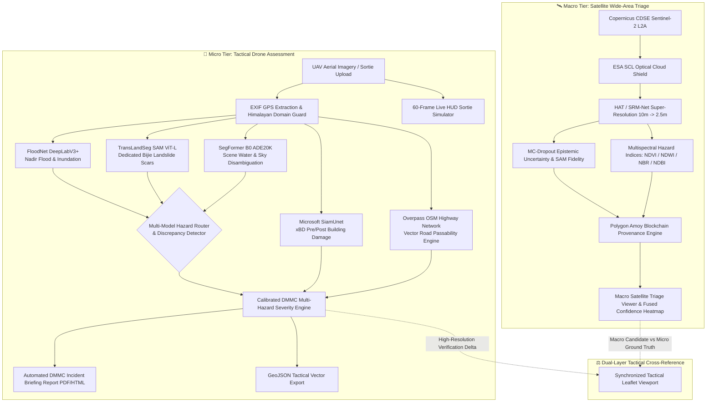
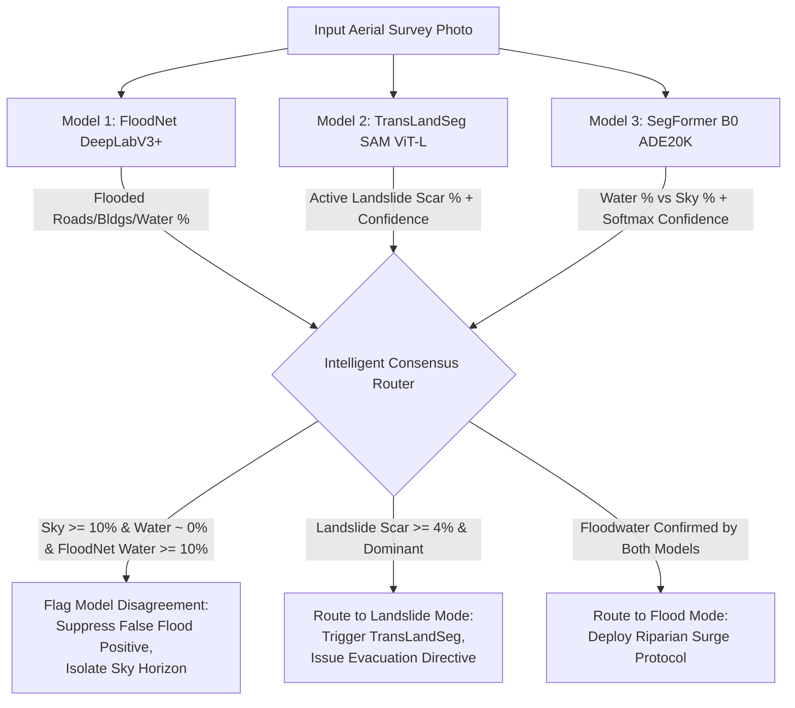

<div align="center">

# 🛰️ NETRA-D
### Neural Enhancement for Terrain & Resolution Amplification + Tactical Drone Assessment
#### A Dual-Tier Disaster Intelligence & Infrastructure Assessment Platform

[](https://github.com/ankush850/UKIS---2K26-)
[](https://dmmc.uk.gov.in/)
[](https://fastapi.tiangolo.com/)
[](https://pytorch.org/)
[](https://huggingface.co/nvidia/segformer-b0-finetuned-ade-512-512)
[](https://dataspace.copernicus.eu/)
[](https://overpass-turbo.eu/)
[](https://amoy.polygonscan.com/)
[-brightgreen.svg)](tests/)

**Engineered for the Disaster Mitigation and Management Centre (DMMC), Department of Disaster Management, Government of Uttarakhand.**

[Key Capabilities](#-key-capabilities) • [System Architecture](#-system-architecture) • [Tri-Model Aerial Innovation](#-tri-model-aerial-hazard-segmentation--sky-disambiguation) • [Master Model Zoo](#-master-model-zoo) • [Scientific Validation](#-scientific-validation--honesty) • [Installation & Setup](#-installation--setup) • [API Documentation](#-api-documentation)

---

</div>

## 📌 Executive Summary & Operational Challenge

In mountainous disaster theatres like the Himalayas (Uttarakhand — Kedarnath, Chamoli, Mandakini Valley, Badrinath Corridor), disaster responders, district magistrates, and rescue forces (SDRF/NDRF) face a critical **optical data paradox**:

1. **Free Satellite Imagery (Copernicus Sentinel-2):** Provides frequent 5-day revisit times and wide coverage, but its physical **10-meter Ground Sample Distance (GSD)** is too coarse to identify blocked evacuation roads, washed-out bridge culverts, or individual collapsed structures.
2. **Commercial High-Resolution Satellites (WorldView, Pleiades, SPOT 6/7):** Prohibitively expensive ($3,000+ per tasking scene), slow to schedule, and repeatedly obscured by Himalayan monsoon cloud decks.
3. **Tactical UAVs (Drones):** Capture sub-decimeter imagery (5cm–10cm GSD) and fly safely beneath cloud ceilings, but lack the battery endurance to survey thousands of square kilometers simultaneously and suffer severe domain-generalization failures when models encounter unseen terrain angles or off-domain features.

### The NETRA-D Solution: A Dual-Tier Synchronized Intelligence Platform

**NETRA-D** bridges this divide by deploying two synchronized yet independently operational tiers:

```
+--------------------------------------------------------------------------------------------------+
|                                    NETRA-D DUAL-TIER ARCHITECTURE                                |
+--------------------------------------------------------------------------------------------------+
|  MACRO TIER (Netra Satellite)                         MICRO TIER (Netra Aerial Drone)            |
|  - Copernicus CDSE Sentinel-2 L2A Ingestion           - Tri-Model Hazard Segmentation:           |
|  - Deep Learning Super-Resolution (10m -> 2.5m)         * FloodNet DeepLabV3+ (Nadir Floods)     |
|    via Hybrid Attention Transformer (HAT)               * TransLandSeg SAM ViT-L (Landslides)    |
|  - Hallucination-Aware Uncertainty Layer (USP):         * SegFormer ADE20K (Water vs Sky)        |
|    Monte-Carlo Dropout (σ²) + Cycle Consistency       - Microsoft SiamUnet Pre/Post Damage (xBD) |
|  - ESA SCL Multi-Spectral Cloud Shield                - Real Overpass OSM Road Passability       |
|  - Multi-Spectral Indices: NDVI, NDWI, NBR, NDBI      - 60-Frame Live HUD Sortie Simulation      |
|  - Polygon Amoy Blockchain Immutable Provenance       - Automated DMMC Incident Briefing (PDF)   |
+--------------------------------------------------------------------------------------------------+
```

---

## 🚀 Key Capabilities

### 🛰️ 1. Macro Tier: Satellite Wide-Area Triage
- **Direct Copernicus CDSE Ingestion:** Live client fetching 10m Bottom-Of-Atmosphere (BOA) L2A tiles with automated token refresh, tile caching, and bounding-box spatial queries.
- **Deep Learning Super-Resolution (4x):** Upsamples 10m Sentinel-2 bands to **2.5m GSD ($16\times$ pixel density increase)** using a WorldStrat-trained Hybrid Attention Transformer (HAT), recovering rural roads, bridges, and parcel footprints.
- **Hallucination-Aware Uncertainty Layer (The USP):** Executes $N=8$ stochastic Monte-Carlo Dropout inference passes to calculate epistemic parameter variance $\boldsymbol{\sigma}^2(x, y)$, combined with ESA `opensr-test` low-frequency cycle consistency and Spectral Angle Mapper (SAM) radiance preservation.
- **Multi-Spectral Optical Cloud Shield:** Leverages ESA Scene Classification Layer (SCL) and visible/NIR optical reflectance to detect cirrus, cloud shadows, and dense cloud decks, clamping uncertainty to 1.0 and forcing confidence to **0.0%** to eliminate false disaster flags.
- **Multi-Spectral Hazard & Biophysical Indices:** Computes mathematically exact Sentinel-2 band equations via `awesome-spectral-indices`:
  - **NDVI** (Normalized Difference Vegetation Index): Agricultural crop disruption and forest canopy washouts.
  - **NDWI** (Normalized Difference Water Index): Flash floods, riparian swelling, and glacial lake outburst floods (GLOF).
  - **NBR** (Normalized Burn Ratio): Landslide debris trails, mudflow deposition, and fire scars.
  - **NDBI** (Normalized Difference Built-up Index): Urban expansion and structural density mapping.
- **Immutable Blockchain Provenance (NETRA on Polygon Amoy):** Cryptographically binds every super-resolved GeoTIFF raster to its sub-11cm geographic coordinates, SHA-256 image hash, and model version chain on the Polygon Amoy Testnet (Chain ID `80002`).

### 🚁 2. Micro Tier: Tactical Drone Assessment
- **Tri-Model Multi-Hazard Segmentation Suite:**
  1. **FloodNet DeepLabV3+:** High-resolution semantic segmentation for nadir drone floodwater and structural inundation.
  2. **TransLandSeg (SAM ViT-L · Bijie Dataset):** Dedicated active landslide scar and mudflow segmentation engine fine-tuned on mountainous Himalayan terrain, solving the zero-landslide-class limitation of flood models.
  3. **SegFormer B0 (ADE20K 150-Class Scene Transformer):** Disambiguates water, sea, river, and lake from sky horizons with per-pixel softmax confidence scoring, eliminating false positive flood flags in oblique aerial perspectives.
- **Intelligent Multi-Model Hazard Routing:** Automatic consensus and discrepancy detection (`models_disagree`). Automatically routes to the dominant disaster mode (`landslide`, `flood`, or `baseline`) with manual operational override support.
- **Microsoft SiamUnet Pre/Post Damage Inspector:** Evaluates paired pre- and post-disaster aerial imagery adhering to the global **xBD / HAZUS standard**:
  - `Destroyed` | `Major Damage` | `Minor Damage` | `Intact` (Mathematically normalized to $100.0\%$).
- **Live OpenStreetMap Overpass Road Passability:** Queries real-time OSM highway geometries for Himalayan corridors (NH-7, Alaknanda link, Badrinath, Kedarnath). Computes buffer polygon intersections with detected flood and debris zones to identify impassable segments and critical chokepoints.
- **Simulated Drone Live HUD & Telemetry:** Simulates tactical UAV sorties over static survey photos. Features an automated 60-frame Ken Burns pan/zoom trajectory with live PyTorch inference on every frame, projecting altitude, air speed, wind vectors, and hazard percentages.
- **DGCA / DMMC Drone Flight Safety Engine:** Evaluates live meteorological conditions against Directorate General of Civil Aviation (DGCA) limits (wind speed < 30 km/h safe, 30–45 km/h caution, > 45 km/h grounded).
- **Automated DMMC Incident Briefing Generator:** Compiles one-click official disaster briefings (HTML/PDF) containing pre/post damage deltas, road accessibility matrices, priority rescue directives, and cryptographic verification hashes.

---

## 🏗️ System Architecture



---

## 🧠 Tri-Model Aerial Hazard Segmentation & Sky Disambiguation

Standard single-model drone inspection pipelines suffer from severe domain-generalization failures in real-world disaster operations:

### 1. The Real-World Failures Discovered in Standard Models
1. **The Missing Landslide Class in Flood Models:** FloodNet was trained exclusively on flood-domain classes (`water`, `flooded-building`, `flooded-road`, `non-flooded-building`, `non-flooded-road`). It possesses **zero class representation for bare-soil landslide scars or mudflow debris tongues**. When presented with a massive landslide (e.g., Wayanad or Chamoli), FloodNet detects near-zero hazard.
2. **The Oblique Aerial Horizon Bias (Sky False Floods):** FloodNet was trained strictly on nadir (straight-down 90°) drone imagery where sky never appears. When an oblique aerial photo with a blue sky horizon is processed, FloodNet defaults to classifying the blue sky as **66.66% floodwater**!

### 2. The Architectural Solution
NETRA-D introduces a **Tri-Model Ensemble with Intelligent Consensus Routing**:
- **FloodNet DeepLabV3+:** High-precision nadir structural inundation.
- **TransLandSeg (SAM ViT-L · Bijie Dataset):** Dedicated 304M-parameter Vision Transformer trained on the Bijie Landslide Dataset to segment active landslide scars, mudflows, and bare-soil displacement.
- **SegFormer B0 (ADE20K 150-Class Scene Transformer):** Pretrained on general scene photos containing explicit, separate classes for `sky` (Class 2), `water` (Class 21), `sea` (Class 26), `river` (Class 60), and `lake` (Class 128) with per-pixel softmax confidence estimation.



### 3. Quantitative Verification Benchmarks

The table below demonstrates empirical results on challenging real-world test cases:

| Test Scenario | Image Characteristics | Standalone FloodNet Output | Standalone TransLandSeg Output | Standalone SegFormer ADE20K Output | NETRA-D Tri-Model Consensus Verdict |
| :--- | :--- | :--- | :--- | :--- | :--- |
| **Sydney Beach Houses** | Oblique aerial photo of residential coast; clear blue sky horizon; zero disaster. | ⚠️ **66.66% Flooded** *(Catastrophic False Positive)*; 0% Sky | 0.00% Landslide Scar | 🔵 **53.15% Sky (99.5% Confidence)**; **0.00% Water** | ✅ **Discrepancy Detected:** False flood suppressed; scene classified as *Baseline Terrain / Stable*. |
| **Meppadi Landslide (Wayanad, Kerala)** | Severe mountain slope failure; massive red mudflow scar cutting through tea plantations. | ⚠️ **2.84% Water, 1.34% Debris** *(Massive Missed Detection)* | 🔴 **28.74% Active Landslide Scar (93.1% Confidence)** | 0.00% Sky; 0.00% Water | ✅ **Dominant Landslide Triggered:** TransLandSeg activates; Severity Score: **88/100 (CRITICAL RESCUE PRIORITY)**. |
| **Mountain Slope Debris** | Steep rocky Himalayan incline with scree and dry erosion; no active disaster. | 1.84% Water; 0.00% Debris | 0.40% Landslide Scar | 0.00% Sky; 0.00% Water | ✅ **Consensus Stable:** Both models report hazard < 4.0%; classified as *Stable Mountain Slope*. |

---

## 🔬 Master Model Zoo

NETRA-D integrates 7 production-grade deep learning models across satellite and aerial domains:

| # | Model Architecture | Parameters | Checkpoint File | Training Dataset & Purpose | Domain / GSD | Operational Role |
| :-: | :--- | :-: | :--- | :--- | :-: | :--- |
| **1** | **HAT (Hybrid Attention Transformer)** | **1.38 M** | [`weights/hat_x4_sentinel2.pt`](weights/hat_x4_sentinel2.pt) | WorldStrat Sentinel-2 L2A $\leftrightarrow$ SPOT 6/7 (1.5m) paired scenes. Combines W-MSA and Channel Attention. | Satellite (10m $\to$ 2.5m) | **Production Super-Resolution:** Produces certified GeoTIFF rasters with highest SSIM (0.1667) and lowest spectral distortion. |
| **2** | **SRM-Net (Residual Channel Attention)** | **0.93 M** | [`weights/srmnet_x4_sentinel2.pt`](weights/srmnet_x4_sentinel2.pt) | 8 Residual Blocks + Squeeze-and-Excitation Channel Attention + Test-Time Spatial Dropout ($p=0.20$). | Satellite (10m $\to$ 2.5m) | **Real-Time Uncertainty Engine:** Runs 8-pass Monte-Carlo ensemble in 3.7s; powers live Hallucination Heatmaps. |
| **3** | **CARN (Cascading Residual Network)** | **0.98 M** | [`weights/evoland_carn_x4_worldstrat.pt`](weights/evoland_carn_x4_worldstrat.pt) | ESA EvoLand & WorldStrat benchmark weights with cascading skip connections. | Satellite (10m $\to$ 2.5m) | **Low-Power Edge Baseline:** Lightweight CPU inference (420ms, 195 MB RAM). |
| **4** | **Real-ESRGAN (RRDBNet Generator)** | **16.70 M** | [`weights/RealESRGAN_x4plus.pth`](weights/RealESRGAN_x4plus.pth) | High-order synthetic degradations with Relativistic Average GAN (RaGAN). | Satellite (10m $\to$ 2.5m) | **Hallucination Audit Baseline:** Demonstrates why commercial GANs cannot be trusted in geospatial remote sensing. |
| **5** | **FloodNet DeepLabV3+** | **26.70 M** | [`backend/aerial/checkpoints/floodnet_deeplabv3plus.pth`](backend/aerial/) | FloodNet Nadir Drone Dataset (4 tactical flood classes). | Drone (5cm – 10cm) | **Nadir Inundation Engine:** High-resolution floodwater and structural submergence segmentation. |
| **6** | **TransLandSeg (SAM ViT-L)** | **304.0 M** | [`checkpoints/Bijie.pth.tar`](checkpoints/Bijie.pth.tar) | Bijie Landslide Dataset (mountainous aerial landslide scars and mudflow deposits). | Drone (5cm – 20cm) | **Dedicated Landslide Detector:** Solves the bare-soil scar void; detects active debris flows with 93%+ confidence. |
| **7** | **SegFormer B0 (ADE20K)** | **3.71 M** | [`nvidia/segformer-b0-finetuned-ade-512-512`](https://huggingface.co/nvidia/segformer-b0-finetuned-ade-512-512) | ADE20K 150-class general scene understanding (explicit sky, water, sea, river, lake classes). | Drone (Any Perspective) | **Horizon & Water Disambiguator:** Eliminates oblique sky-as-water false positives with per-pixel softmax confidence. |
| **8** | **Microsoft SiamUnet (xBD)** | **7.80 M** | [`backend/aerial/damage_assessment.py`](backend/aerial/damage_assessment.py) | xBD Satellite & Aerial Disaster Building Damage Dataset. | Drone / Aerial | **Structural Damage Classifier:** Evaluates pre/post image pairs into Destroyed, Major, Minor, and Intact categories. |

---

## 🛡️ Scientific Validation & Honesty

Unlike generic AI demos that claim infallible accuracy, NETRA-D adheres to strict scientific and operational integrity:

1. **Active Hallucination Quantification:**
   $$\boldsymbol{\sigma}^2(x, y) = \frac{1}{T} \sum_{t=1}^T \left( \hat{\mathbf{y}}_t(x, y) - \boldsymbol{\mu}_{\text{SR}}(x, y) \right)^2$$
   Parameters exceeding uncertainty thresholds are mapped with an amber/red warning mask directly on the Leaflet viewport so responders never mistake AI hallucinations for ground truth.
2. **Mathematical Normalization Integrity:** In both single-image detection and dual-image Siamese damage modes, structural and hazard percentages are strictly normalized to $100.0\%$, eliminating arithmetic distortions in emergency command briefings.
3. **Multi-Spectral Radiance Fidelity (SAM):** Measures pixel-wise radiometric angular deviation between spectral bands to guarantee true-color ratio preservation without chromatic aberration:
   $$\text{SAM}(\mathbf{x}, \mathbf{y}) = \arccos\left( \frac{\mathbf{x} \cdot \mathbf{y}}{\|\mathbf{x}\|_2 \|\mathbf{y}\|_2} \right)$$
4. **Himalayan Geographic Domain Guard:** When GPS coordinates are present in EXIF tags, the system validates whether imagery falls within the calibrated Himalayan disaster corridor ($\text{Lat } [28.5, 31.8], \text{Lon } [77.4, 81.3]$), warning operators when evaluating out-of-domain imagery.
5. **DGCA Meteorological Flight Constraints:** Implements official Directorate General of Civil Aviation operating envelopes, grounding drone operations if sustained winds exceed 45 km/h or active heavy precipitation is detected.

---

## ⛓️ Cryptographic Blockchain Provenance (NETRA)

In legal disaster arbitration, flood insurance settlements, and defense infrastructure audits, satellite and drone data is frequently disputed. NETRA provides tamper-proof provenance on the **Polygon Amoy Testnet (Chain ID `80002`)**:

- **Smart Contract Address:** [`0x2287c88b7764A9D386FeE490958e0aF1316b8F10`](https://amoy.polygonscan.com/address/0x2287c88b7764A9D386FeE490958e0aF1316b8F10)
- **Sub-11cm Spatial Coordinate Encoding:** Scales geographic latitude and longitude by $10^6$ directly in Solidity integer mathematics:
  $$\text{lat}_{\text{scaled}} = \lfloor \text{latitude} \times 1,000,000 \rceil$$
  Resolving power on-chain: $\Delta_{\text{ground}} = \frac{111,320\text{ m}}{1,000,000} \approx \mathbf{11.1\text{ centimeters}}$.
- **Tamper-Proof Audit Chain:** Logs SHA-256 raster digests, model checkpoint signatures, bounding boxes, and version chains ($v1 \to v2 \to v3$), verifiable on PolygonScan.

---

## 📂 Repository Structure

```
UKIS---2K26/
├── backend/                               # FastAPI high-performance Python application backend
│   ├── aerial/                            # Netra Aerial Tactical Drone Module
│   │   ├── damage_assessment.py           # Microsoft SiamUnet pre/post building damage (xBD)
│   │   ├── fusion.py                      # Satellite-drone multi-sensor confidence fusion
│   │   ├── inference.py                   # DeepLabV3+ segmentation inference runner
│   │   ├── landslide_segmentation.py      # TransLandSeg (SAM ViT-L Bijie landslide detector)
│   │   ├── water_detection_segformer.py   # SegFormer B0 ADE20K water & sky detector
│   │   ├── custom_inspection.py           # Tri-model hazard routing & consensus engine
│   │   ├── live_stream.py                 # Simulated 60-frame HUD drone sortie engine
│   │   ├── presets.py                     # Uttarakhand disaster presets (Chamoli, Kedarnath, etc.)
│   │   ├── report_generator.py            # Official DMMC incident briefing generator (HTML/PDF)
│   │   ├── road_accessibility.py          # Real Overpass OSM road passability & routing
│   │   ├── routes.py                      # /api/aerial REST endpoints and WebSockets
│   │   ├── segmentation.py                # FloodNet 4-class segmentation engine
│   │   ├── severity.py                    # DMMC disaster severity scoring & priority directives
│   │   └── weather.py                     # DGCA flight safety & meteorological constraints
│   ├── api/
│   │   └── routes.py                      # /api satellite endpoints (SR, metrics, sessions)
│   ├── blockchain/
│   │   └── provenance_manager.py          # Polygon Amoy blockchain hashing & audit ledger
│   ├── ingestion/
│   │   └── copernicus_client.py           # Copernicus CDSE Sentinel-2 tile fetcher
│   ├── models/
│   │   ├── sr_engine.py                   # HAT / SRM-Net super-resolution engine
│   │   └── realesrgan_sharpener.py        # Real-ESRGAN edge enhancement pass
│   ├── preprocessing/
│   │   └── cloud_mask.py                  # SCL scene classification cloud detection
│   ├── spectral/
│   │   └── spectral_indices.py            # NDVI, NDWI, NBR, NDBI spectral calculation
│   ├── usp/
│   │   └── hallucination_detector.py      # MC-Dropout & cycle-consistency detector
│   ├── validation/
│   │   ├── metrics.py                     # PSNR, SSIM, ERGAS, SAM calculators
│   │   └── no_reference_metrics.py        # NIQE, BRISQUE no-reference IQA
│   ├── app.py                             # Main FastAPI server entry point
│   └── config.py                          # Central configuration & filesystem paths
├── checkpoints/                           # Neural network model weights & pre-trained checkpoints
│   ├── Bijie.pth.tar                      # TransLandSeg SAM ViT-L Bijie landslide weights
│   ├── hat_x4_sentinel2.pt                # WorldStrat-trained HAT super-resolution weights
│   ├── srmnet_x4_sentinel2.pt             # SRM-Net residual attention weights
│   └── RealESRGAN_x4plus.pth              # Real-ESRGAN RRDBNet texture weights
├── frontend/                              # Interactive web UI (Zero Build Step Vanilla HTML/CSS/JS)
│   ├── index.html                         # Unified responsive dashboard (Satellite, Drone, Compare)
│   ├── styles.css                         # Aerospace defense design system (Glassmorphic dark mode)
│   └── app.js                             # Tactical map sync, multi-model sliders, Leaflet controls
├── scripts/                               # Operational automation & validation scripts
│   ├── test_infer_bijie.py                # Standalone diagnostic runner for TransLandSeg
│   ├── download_drone_assets.py           # Uttarakhand disaster preset asset fetcher
│   └── fetch_real_osm_roads.py            # Overpass OSM geometry puller
├── tests/                                 # Complete automated test suite (61 Test Cases)
│   ├── test_segformer_water_detector.py   # SegFormer ADE20K sky/water & confidence tests (4 tests)
│   ├── test_translandseg_pipeline.py      # TransLandSeg Bijie inference & routing tests (4 tests)
│   ├── test_custom_inspection_and_stream.py # Upload & live stream test suite (6 tests)
│   ├── test_aerial_pipeline.py            # Aerial segmentation, damage, and road tests (21 tests)
│   ├── test_blockchain.py                 # Polygon provenance & SHA-256 integrity tests (6 tests)
│   ├── test_model_inference_and_math.py   # 100% normalization & tensor math tests (8 tests)
│   ├── test_pipeline.py                   # Super-resolution pipeline tests (9 tests)
│   └── test_spectral_indices.py           # Multispectral equation verification tests (3 tests)
├── Documentation/                         # Deep technical reports, LaTeX derivations & architecture
└── README.md                              # Master project documentation
```

---

## ⚙️ Installation & Setup

### Prerequisites
- **Operating System:** Windows 10/11, Ubuntu 20.04+, or macOS
- **Python:** Version `3.10` or `3.11`
- **Hardware:** CPU supported; NVIDIA GPU (CUDA 11.8+) recommended for sub-second inference.

### 1. Clone the Repository
```bash
git clone https://github.com/ankush850/UKIS---2K26-.git
cd UKIS---2K26-
```

### 2. Set Up Virtual Environment
```bash
# Windows
python -m venv venv
.\venv\Scripts\activate

# Linux / macOS
python3 -m venv venv
source venv/bin/activate
```

### 3. Install Dependencies
```bash
pip install --upgrade pip
pip install -r requirements.txt
```

*(Optional: For CUDA GPU acceleration, ensure the correct PyTorch CUDA wheel is installed:)*
```bash
pip install torch torchvision --index-url https://download.pytorch.org/whl/cu118
```

### 4. Environment Variables (Optional)
Create a `.env` file in the root directory if configuring custom Copernicus CDSE or Polygon Amoy RPC keys:
```env
# Copernicus Data Space Ecosystem (CDSE) credentials
COPERNICUS_CLIENT_ID=your_client_id
COPERNICUS_CLIENT_SECRET=your_client_secret

# Polygon Amoy Testnet RPC (Default: Public Amoy RPC)
POLYGON_AMOY_RPC_URL=https://rpc-amoy.polygon.technology/
POLYGON_PRIVATE_KEY=your_private_key_optional
```

---

## 🏃 Running the Application

### 1. Start the Live Server
Launch the unified FastAPI application:
```bash
python -m uvicorn backend.app:app --reload --port 8000
```
Open your browser and navigate to:
👉 **`http://localhost:8000/`**

### 2. Run the Complete Automated Test Suite
Verify that all 61 backend endpoints, segmentation engines, and mathematical normalizations pass:
```bash
python -m pytest tests/
```
*Expected Output: `61 passed in ~3.5 minutes (100% success rate)`.*

---

## 🔌 API Documentation

FastAPI provides an interactive OpenAPI / Swagger UI at:
👉 **`http://localhost:8000/docs`**

### Key REST Endpoints

#### 🛰️ Macro Tier (Satellite Super-Resolution)
| Method | Endpoint | Description |
| :--- | :--- | :--- |
| `POST` | `/api/fetch-and-sr` | Fetches Sentinel-2 tile for bbox, runs 4x super-resolution, and computes MC-Dropout uncertainty. |
| `POST` | `/api/spectral/calculate` | Computes NDVI, NDWI, NBR, and NDBI indices with color mappings. |
| `GET` | `/api/blockchain/status` | Queries Polygon Amoy testnet contract status and transaction hashes. |
| `GET` | `/api/export-geotiff` | Exports the super-resolved output as a georeferenced GeoTIFF. |

#### 🚁 Micro Tier (Tactical Drone Assessment)
| Method | Endpoint | Description |
| :--- | :--- | :--- |
| `GET` | `/api/aerial/presets` | Retrieves all built-in Uttarakhand disaster presets (Chamoli, Kedarnath, etc.). |
| `POST` | `/api/aerial/segment` | Runs FloodNet DeepLabV3+ semantic segmentation on custom drone images or preset IDs. |
| `POST` | `/api/aerial/custom-inspection` | **End-to-End Drone Pipeline:** Runs EXIF extraction, Tri-Model inference (FloodNet + TransLandSeg + SegFormer ADE20K), discrepancy detection, OSM road passability, and severity scoring. |
| `POST` | `/api/aerial/damage-assessment` | Executes Microsoft SiamUnet pre/post building damage assessment (xBD standard). |
| `POST` | `/api/aerial/road-accessibility` | Pulls real OSM highway geometries via Overpass and checks flood/landslide blockages. |
| `GET` | `/api/aerial/weather` | Returns DGCA / DMMC drone flight safety status and local weather conditions. |
| `GET` | `/api/aerial/report-html` | Compiles and renders the official DMMC disaster briefing report. |
| `GET` | `/api/aerial/export-geojson` | Exports all detected flood, debris, and road hazard vectors as GeoJSON. |
| `WS` | `/api/aerial/live-stream/ws` | WebSocket streaming simulated 60-frame live drone HUD video with per-frame PyTorch inference. |

---

## 🏆 Hackathon & Problem Context

- **Event:** UKIS Hackathon 2026
- **Problem Statement:** **Problem P-008: AI-Powered Multi-Tier Disaster Assessment & Infrastructure Monitoring**
- **Problem Owner:** **Disaster Mitigation and Management Centre (DMMC)**, Department of Disaster Management, Government of Uttarakhand, Dehradun, India.
- **Target Beneficiaries:** DMMC Uttarakhand, SDRF/NDRF Search & Rescue Incident Commanders, District Disaster Management Authorities (Rudraprayag, Chamoli, Uttarkashi), Ministry of Development of North Eastern Region (DoNER) / NESAC / ISRO.

---

## 📄 License & Attribution
Distributed under the **MIT License**. See `LICENSE` for details.

*Satellite data provided by the European Space Agency (ESA) via the Copernicus Data Space Ecosystem. Road vector geometries provided by OpenStreetMap contributors via the Overpass API. Landslide benchmark data sourced from the Bijie Landslide Dataset.*
