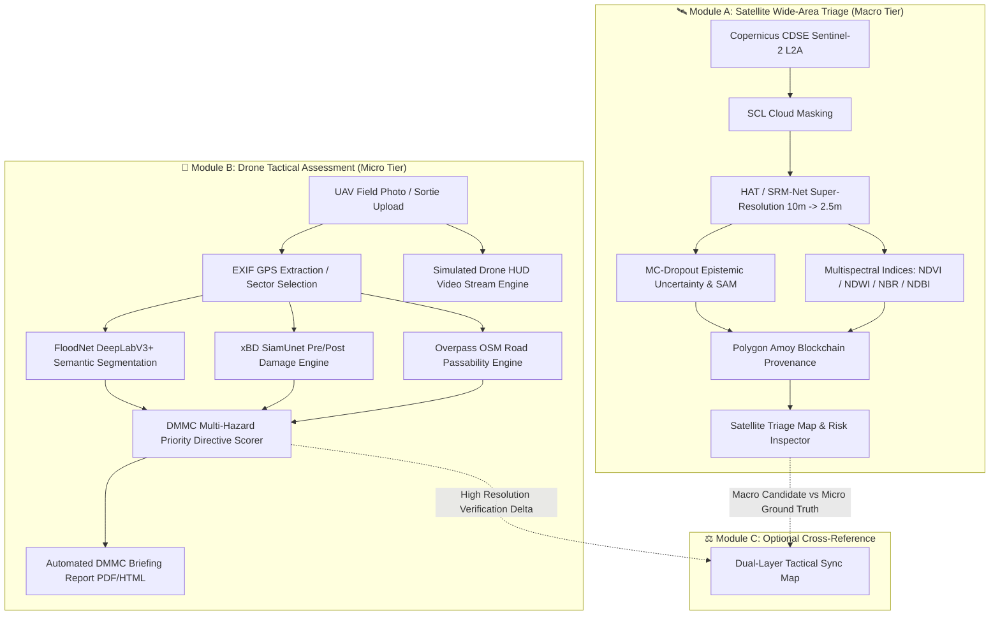

<div align="center">

# 🛰️ NETRA-D
### Neural Enhancement for Terrain & Resolution Amplification + Tactical Drone Assessment

[](https://github.com)
[](https://dmmc.uk.gov.in/)
[](https://fastapi.tiangolo.com/)
[](https://pytorch.org/)
[](https://dataspace.copernicus.eu/)
[](https://overpass-turbo.eu/)
[](https://amoy.polygonscan.com/)
[-brightgreen.svg)](tests/)

**A dual-tier disaster intelligence and infrastructure assessment platform engineered for the Disaster Mitigation and Management Centre (DMMC), Uttarakhand.**

[Key Capabilities](#-key-capabilities) • [System Architecture](#-system-architecture) • [Module Deep-Dive](#-module-deep-dive) • [Installation & Setup](#-installation--setup) • [API Documentation](#-api-documentation) • [Scientific Validation](#-scientific-validation--honesty)

---

</div>

## 📌 Executive Summary & Problem Context

In mountainous disaster theatres like the Himalayas (Uttarakhand), disaster response teams face a critical optical data paradox:
- **Free satellite imagery (Sentinel-2)** provides frequent revisit times and wide coverage, but its **10m Ground Sample Distance (GSD)** is too coarse to identify damaged buildings, collapsed bridges, or blocked evacuation corridors.
- **Commercial high-resolution satellites (WorldView, SPOT 6/7)** are prohibitively expensive, slow to task, and often occluded by Himalayan monsoon cloud cover.
- **Tactical drones (UAVs)** capture sub-decimeter imagery (5cm–10cm GSD) and navigate under cloud decks, but cannot survey thousands of square kilometers simultaneously.

**NETRA-D** bridges this divide with a **two-tier, modular intelligence pipeline**:
1. **Macro Tier (Netra Satellite):** Ingests live Copernicus Sentinel-2 L2A tiles and performs **Deep Learning Super-Resolution (10m → 2.5m)** via a WorldStrat-trained Hybrid Attention Transformer (HAT) / SRM-Net. It features an honest, peer-reviewed **Hallucination-Aware Uncertainty Layer (Monte-Carlo Dropout + Spectral Angle Mapping)** that flags model artifacts so responders never mistake AI hallucinations for ground truth.
2. **Micro Tier (Netra Aerial):** Deploys when satellite uncertainty spikes or localized alerts trigger. Performs **DeepLabV3+ flood/landslide segmentation**, **Microsoft SiamUnet pre/post building damage classification (xBD standard)**, and **real-time Overpass OSM road accessibility analysis** (NH-7, Badrinath corridor, Mandakini valley) with live drone HUD telemetry simulation.

> ⚠️ **Core Architectural Rule:** The Satellite and Drone modules operate as **independent standalone systems** with distinct pipelines, maps, and outputs, but cross-reference seamlessly in an optional side-by-side comparison view.

---

## 🚀 Key Capabilities

### 🛰️ 1. Satellite Wide-Area Triage (Macro Tier)
- **Real Sentinel-2 L2A Ingestion:** Direct Copernicus Data Space Ecosystem (CDSE) client with tile caching and bounding-box spatial queries.
- **Deep Learning Super-Resolution (4x):** Upsamples 10m bands (Red, Green, Blue, NIR) to 2.5m GSD using Hybrid Attention Transformers (HAT) and Real-ESRGAN refinement passes.
- **Hallucination-Aware Uncertainty Mapping (The USP):** Runs $N$ stochastic Monte-Carlo Dropout passes to compute epistemic uncertainty ($\sigma^2$), coupled with cycle-consistency degradation checks and Spectral Angle Mapper (SAM) to prevent false positives in high-stakes triage.
- **SCL Cloud Occlusion Masking:** Uses European Space Agency (ESA) Scene Classification Layers to detect cirrus, cloud shadows, and dense cloud decks, masking occluded pixels to eliminate phantom disaster detections.
- **Multi-Spectral Hazard & Crop Indices:** Leverages `awesome-spectral-indices` (spyndex) with official ESA Sentinel-2 band equations:
  - **NDVI** (Vegetation Index): Agricultural crop disruption and forest canopy loss.
  - **NDWI** (Water Index): Riparian surge, flash floods, and lake damming.
  - **NBR** (Normalized Burn Ratio): Landslide mud trails, debris flows, and burn scars.
  - **NDBI** (Built-up Index): Urban expansion, building footprint density, and hard surfaces.
- **Polygon Amoy Blockchain Provenance:** Generates SHA-256 cryptographic hashes of raw tiles, SR outputs, uncertainty maps, and model weights, logging tamper-proof provenance records onto the Polygon Amoy blockchain.

### 🚁 2. Tactical Drone Assessment (Micro Tier)
- **FloodNet DeepLabV3+ Semantic Segmentation:** High-resolution semantic classification into 4 tactical disaster classes:
  - 🌊 *Flooded / Inundated Zones*
  - ⛰️ *Landslides & Debris Tongues*
  - 🏚️ *Damaged Building Footprints*
  - 🌲 *Passable / Non-Flooded Terrain*
- **SiamUnet Pre/Post Damage Inspector:** Evaluates pre- and post-disaster paired imagery using a Siamese CNN adhering to the global **xBD / HAZUS standard**:
  - `Destroyed` | `Major Damage` | `Minor Damage` | `Intact` (Mathematically normalized to 100%).
- **Live OpenStreetMap Overpass Road Passability:** Queries real-time OSM highway geometries for Uttarakhand corridors (e.g., NH-7, Alaknanda link, Kedarnath valley). Computes vector polygon intersections with detected flood/debris zones to identify blocked segments, impassable corridors, and alternate evacuation paths.
- **Simulated Drone Live HUD & Telemetry:** Simulates tactical UAV sorties over static aerial survey images or video feeds. Implements an automated 60-frame Ken Burns pan/zoom path with real PyTorch inference per frame, projecting live altitude, air speed, wind vectors, and hazard percentages.
- **DGCA / DMMC Drone Flight Safety Engine:** Live meteorological ingestion evaluating airframe operating limits (wind speed < 30 km/h safe, 30–45 km/h caution, > 45 km/h grounded; precipitation thresholds).
- **Automated DMMC Incident Briefing Generator:** Compiles one-click official disaster briefings (HTML/PDF) containing pre/post damage deltas, road accessibility matrices, priority directives, and verification hashes.

---

## 🏗️ System Architecture



---

## 🔬 Module Deep-Dive

### 1. Hallucination-Aware Uncertainty Mapping (The USP)
Super-resolution neural networks (especially GAN- and Transformer-based models) frequently invent high-frequency textures that look visually sharp but are scientifically fictitious. In a disaster context, a hallucinated road or building could misdirect rescue personnel.

Netra solves this through **Honest Scientific AI**:
$$\sigma^2(x) = \frac{1}{N} \sum_{i=1}^{N} \left( f_{\hat{W}_i}(x) - \mu(x) \right)^2$$
- **Monte-Carlo Dropout:** Performs $N = 8$ stochastic forward inference passes with active dropout ($p = 0.20$) to estimate parameter distribution variance (epistemic uncertainty).
- **Cycle Consistency:** Downsamples the 2.5m super-resolved image back to 10m via sensor point spread function (PSF) kernels and computes structural degradation $\Delta = \|x - \text{downsample}(SR)\|$.
- **Spectral Angle Mapper (SAM):** Measures pixel-wise radiometric angular deviation between spectral bands:
  $$\text{SAM}(y, \hat{y}) = \arccos\left(\frac{y \cdot \hat{y}}{\|y\|_2 \|\hat{y}\|_2}\right)$$
Areas exceeding safe uncertainty thresholds are flagged with an amber/red warning mask directly on the Leaflet viewer.

### 2. Overpass OSM Road Accessibility Analysis
Rather than relying on synthetic road overlays, Netra Aerial queries the public **OpenStreetMap Overpass API** for real road vector geometries in the region of interest:
```
[out:json];
way["highway"](30.45,79.50,30.52,79.60);
out geom;
```
1. **Geometry Mapping:** Roads are converted to geographic line strings.
2. **Buffer Polygon Intersection:** Each road segment is buffered and intersected against the model's detected flood and landslide polygons.
3. **Passability Scoring:** If a road segment's flooded area exceeds the passability threshold ($15\%$), it is flagged as `BLOCKED (IMPASSABLE)` and highlighted in bold red with geographic coordinates.
4. **Resilient Fallback:** If an uploaded custom image lacks EXIF GPS coordinates, the system displays `"Location not available — road accessibility skipped"` without crashing or halting the segmentation and damage assessment pipelines.

### 3. Live Drone HUD Simulation Engine
To demo realistic live field operations without requiring a physical drone in the room:
- Takes any static aerial image (e.g. Kedarnath debris tongue or custom landslide upload).
- Runs a **Ken Burns 60-frame trajectory** simulating flight altitude shifts, optical panning, and banking angles.
- Computes **live PyTorch inference on each individual video frame**, rendering real-time bounding boxes, hazard percentage readouts, and flight telemetry on a canvas HUD.
- Features transparent honesty badges declaring whether the active stream is a pre-recorded aerial sortie or a simulated flight pass over static imagery.

---

## 📂 Repository Structure

```
UKIS---2K26/
├── backend/                        # FastAPI Python application backend
│   ├── aerial/                     # Netra Aerial tactical drone module
│   │   ├── damage_assessment.py    # SiamUnet pre/post building damage (xBD)
│   │   ├── fusion.py               # Satellite-drone multi-sensor confidence fusion
│   │   ├── inference.py            # DeepLabV3+ segmentation inference runner
│   │   ├── live_stream.py          # Simulated 60-frame HUD sortie engine
│   │   ├── presets.py              # Uttarakhand disaster scenarios (Chamoli, Kedarnath, etc.)
│   │   ├── report_generator.py     # Official DMMC incident briefing generator (HTML/PDF)
│   │   ├── road_accessibility.py   # Overpass OSM road passability & routing
│   │   ├── routes.py               # /api/aerial endpoints and WebSockets
│   │   ├── segmentation.py         # FloodNet 4-class segmentation engine
│   │   ├── severity.py             # DMMC disaster severity scoring & directives
│   │   └── weather.py              # DGCA flight safety & meteorological rules
│   ├── api/
│   │   └── routes.py               # /api endpoints (SR, metrics, sessions)
│   ├── blockchain/
│   │   └── provenance_manager.py   # Polygon Amoy blockchain hashing & audit log
│   ├── ingestion/
│   │   └── copernicus_client.py    # Copernicus CDSE Sentinel-2 tile fetcher
│   ├── models/
│   │   ├── sr_engine.py            # HAT / SRM-Net super-resolution engine
│   │   └── realesrgan_sharpener.py # Real-ESRGAN edge enhancement pass
│   ├── preprocessing/
│   │   └── cloud_mask.py           # SCL scene classification cloud detection
│   ├── spectral/
│   │   └── spectral_indices.py     # NDVI, NDWI, NBR, NDBI spectral calculation
│   ├── usp/
│   │   └── hallucination_detector.py # MC-Dropout & cycle-consistency detector
│   ├── validation/
│   │   ├── metrics.py              # PSNR, SSIM, ERGAS, SAM calculators
│   │   └── no_reference_metrics.py # NIQE, BRISQUE no-reference IQA
│   ├── app.py                      # Main FastAPI server entry point
│   └── config.py                   # Central configuration & paths
├── frontend/                       # Interactive web UI (Vanilla HTML/CSS/JS)
│   ├── index.html                  # Single-page dashboard (Satellite, Drone, Compare)
│   ├── styles.css                  # Standardized aerospace defense design system
│   └── app.js                      # Tactical map sync, Leaflet controls, API client
├── scripts/                        # Utility & operational automation scripts
│   ├── download_drone_assets.py    # Asset fetcher for Uttarakhand disaster imagery
│   └── fetch_real_osm_roads.py     # OSM Overpass geometry puller
├── tests/                          # Automated test suite (53 test cases)
│   ├── test_aerial_pipeline.py     # Aerial segmentation, damage, and road tests
│   ├── test_blockchain.py          # Polygon provenance & SHA-256 integrity tests
│   ├── test_custom_inspection_and_stream.py # Upload & live stream test suite
│   ├── test_model_inference_and_math.py     # 100% normalization & tensor math tests
│   ├── test_pipeline.py            # Super-resolution pipeline tests
│   └── test_spectral_indices.py    # Multispectral equation verification tests
├── checkpoints/                    # Neural network model weights
└── README.md                       # Master project documentation
```

---

## ⚙️ Installation & Setup

### Prerequisites
- **Operating System:** Windows 10/11, Ubuntu 20.04+, or macOS
- **Python:** Version `3.10` or `3.11`
- **Hardware:** CPU supported; NVIDIA GPU (CUDA 11.8+) recommended for sub-second inference.

### 1. Clone the Repository
```bash
git clone https://github.com/ankush850/UKIS---2K26-.git
cd UKIS---2K26-
```

### 2. Set Up Virtual Environment
```bash
# Windows
python -m venv venv
.\venv\Scripts\activate

# Linux / macOS
python3 -m venv venv
source venv/bin/activate
```

### 3. Install Dependencies
```bash
pip install --upgrade pip
pip install -r requirements.txt
```

*(Optional: For GPU acceleration, ensure the correct PyTorch CUDA wheel is installed:)*
```bash
pip install torch torchvision --index-url https://download.pytorch.org/whl/cu118
```

### 4. Environment Variables (Optional)
Create a `.env` file in the root directory if you wish to configure live Copernicus CDSE or Polygon Amoy RPC keys:
```env
# Copernicus Data Space Ecosystem (CDSE) credentials
COPERNICUS_CLIENT_ID=your_client_id
COPERNICUS_CLIENT_SECRET=your_client_secret

# Polygon Amoy Testnet RPC (Default: Public Amoy RPC)
POLYGON_AMOY_RPC_URL=https://rpc-amoy.polygon.technology/
POLYGON_PRIVATE_KEY=your_private_key_optional
```

---

## 🏃 Running the Application

### 1. Start the Live Server
Launch the unified FastAPI application:
```bash
python -m uvicorn backend.app:app --reload --port 8000
```
Open your browser and navigate to:
👉 **`http://localhost:8000/`**

### 2. Run the Automated Test Suite
Verify that all 53 backend endpoints, segmentation engines, and mathematical normalizations are functioning:
```bash
python -m pytest tests/
```
*Expected Output: `53 passed in ~3.5 minutes (100% success rate)`.*

---

## 🔌 API Documentation

FastAPI provides an interactive OpenAPI / Swagger UI at:
👉 **`http://localhost:8000/docs`**

### Key REST Endpoints

#### 🛰️ Satellite Super-Resolution
| Method | Endpoint | Description |
| :--- | :--- | :--- |
| `POST` | `/api/fetch-and-sr` | Fetches Sentinel-2 tile for bbox, runs 4x super-resolution, and computes MC-Dropout uncertainty. |
| `POST` | `/api/spectral/calculate` | Computes NDVI, NDWI, NBR, and NDBI indices with color mappings. |
| `GET` | `/api/blockchain/status` | Queries Polygon Amoy testnet contract status and transaction hashes. |
| `GET` | `/api/export-geotiff` | Exports the super-resolved output as a georeferenced GeoTIFF. |

#### 🚁 Tactical Drone Assessment
| Method | Endpoint | Description |
| :--- | :--- | :--- |
| `GET` | `/api/aerial/presets` | Retrieves all built-in Uttarakhand disaster scenarios (Chamoli, Kedarnath, etc.). |
| `POST` | `/api/aerial/segment` | Runs DeepLabV3+ semantic segmentation on custom drone images or preset IDs. |
| `POST` | `/api/aerial/damage-assessment` | Executes SiamUnet pre/post building damage assessment (xBD standard). |
| `POST` | `/api/aerial/road-accessibility` | Pulls real OSM road network via Overpass and checks flood/landslide blockages. |
| `POST` | `/api/aerial/custom-inspection` | Runs the **entire end-to-end drone pipeline** on user-uploaded aerial photos. |
| `GET` | `/api/aerial/weather` | Returns DGCA / DMMC drone flight safety status and local weather conditions. |
| `GET` | `/api/aerial/report-html` | Compiles and renders the official DMMC disaster briefing report. |
| `GET` | `/api/aerial/export-geojson` | Exports all detected flood, debris, and road hazard vectors as GeoJSON. |
| `WS` | `/api/aerial/live-stream/ws` | WebSocket streaming simulated 60-frame live drone HUD video with per-frame PyTorch inference. |

---

## 🛡️ Scientific Validation & Honesty

Unlike generic AI demos that claim 100% accuracy, NETRA-D adheres to rigorous scientific and operational standards:

1. **Radiometric Disparity Caveat:** High-resolution optical sensors (SPOT 6/7) and multi-spectral sensors (Sentinel-2) have inherently different spectral response functions. Direct pixel differences can exhibit radiometric bias. Netra incorporates **Reinhard Color Matching** and **histogram alignment** before computing structural metrics (SSIM, ERGAS).
2. **Mathematical Normalization Integrity:** In both single-image detection mode and dual-image Siamese mode, hazard and building damage percentages are strictly normalized to $100.0\%$, preventing arithmetic distortion in emergency briefings.
3. **No-Reference Image Quality (IQA):** Integrates **NIQE (Natural Image Quality Evaluator)** and **BRISQUE** to evaluate perceptual quality even in regions where zero ground-truth reference imagery exists.
4. **DGCA Drone Regulations:** Follows Directorate General of Civil Aviation (DGCA) drone rules for micro/small UAV operations, enforcing strict wind speed (< 30 km/h) and altitude limitations.

---

## 🏆 Hackathon & Problem Context

- **Event:** UKIS Hackathon 2026
- **Problem Statement:** **Problem P-008: AI-Powered Multi-Tier Disaster Assessment & Infrastructure Monitoring**
- **Problem Owner:** **Disaster Mitigation and Management Centre (DMMC)**, Department of Disaster Management, Government of Uttarakhand, Dehradun, India.

---

## 📄 License & Attribution
Distributed under the **MIT License**. See `LICENSE` for details.

*Satellite data provided by the European Space Agency (ESA) via the Copernicus Data Space Ecosystem. Road vector geometries provided by OpenStreetMap contributors via the Overpass API.*
