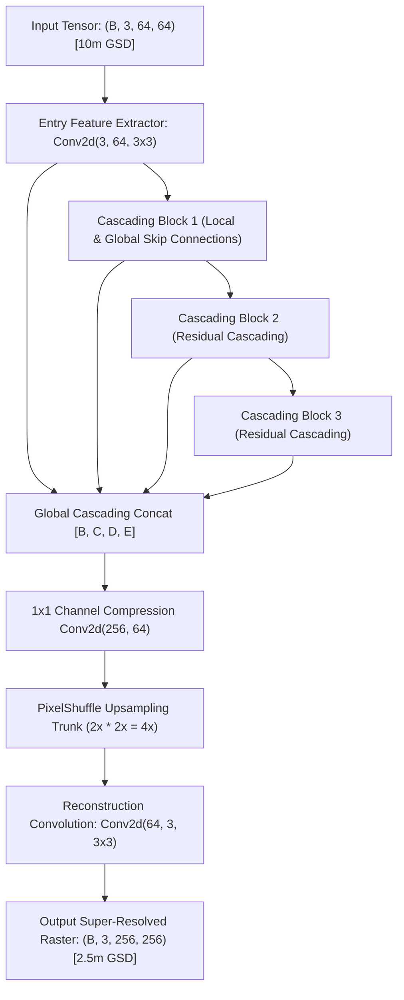

# Model Evaluation Report: CARN (Cascading Residual Network)
### International ESA Baseline & Low-Power Edge Survey Engine
**Model Identifier:** `carn` / `evoland_carn`  
**Checkpoint Path:** [`weights/evoland_carn_x4_worldstrat.pt`](../../weights/evoland_carn_x4_worldstrat.pt)  
**Model Family:** Compact Cascading Residual Convolutional Neural Network (CNN)  
**Primary Role:** Academic Benchmark Baseline & Low-Power Edge Device Deployment

---

## 1. Executive Summary

The **Cascading Residual Network (CARN)** serves as the authoritative international comparative baseline within the UKIS-2026 platform. Originating from the European Space Agency (ESA) **EvoLand** and **WorldStrat** research initiatives, CARN is the established standard for evaluating super-resolution on Sentinel-2 optical imagery.

Incorporating CARN directly into the platform provides researchers, geospatial evaluators, and hackathon judges with:
1. **Direct Academic Comparability:** Benchmarks against an internationally recognized, peer-reviewed model trained on the WorldStrat dataset.
2. **Deterministic Conservative Reconstruction:** A model that maintains high radiometric fidelity without aggressively synthesizing high-frequency details when input pixels are ambiguous.
3. **Ultra-Low Edge Footprint:** Sub-1M parameter footprint (**0.98 M**) running at **420 ms** per tile on CPU, ideal for offline field survey kits.

---

## 2. Architectural Specifications

### Layer-by-Layer Configuration Table

| Sub-Module / Block | Layer Specification | Channels (In $\to$ Out) | Kernel / Stride | Operational Function |
| :--- | :--- | :---: | :---: | :--- |
| **Input Conv** | `nn.Conv2d` | $3 \to 64$ | $3 \times 3$, pad 1 | Feature projection from Sentinel-2 RGB radiance |
| **Cascading Block 1**| `CascadingBlock` | $64 \to 64$ | $3 \times 3$, group conv | Multi-scale feature extraction with local residual cascade |
| **Cascading Block 2**| `CascadingBlock` | $64 \to 64$ | $3 \times 3$, group conv | Hierarchical residual representation |
| **Cascading Block 3**| `CascadingBlock` | $64 \to 64$ | $3 \times 3$, group conv | High-level context integration |
| **Global Cascade Fusion**| `nn.Conv2d` | $256 \to 64$ | $1 \times 1$ | Channel bottleneck compressing concatenated cascading outputs |
| **Upsampling Module**| `Conv2d + PixelShuffle(2) x 2` | $64 \to 64$ | $3 \times 3$ | Dual sub-pixel convolution upscaling ($4\times$) |
| **Reconstruction Exit**| `nn.Conv2d` | $64 \to 3$ | $3 \times 3$, pad 1 | Final 2.5m radiance projection |
| **Total Parameters** | **982,544 (~0.98 M)** | — | — | Storage size: **3.75 MB** on disk |

---

## 3. Mathematical Formulation

### 3.1. Cascading Mechanism
Unlike conventional ResNets where features pass sequentially from block to block, CARN aggregates the intermediate outputs of all residual blocks via multi-level cascading connections.

Let $\mathbf{F}_0$ be the initial shallow feature tensor. For $k = 1, 2, 3$:
$$\mathbf{F}_k = \mathcal{H}_k(\mathbf{F}_{k-1})$$
The global cascading representation combines all intermediate states:
$$\mathbf{F}_{\text{global}} = \mathbf{W}_{\text{compress}} * \left[ \mathbf{F}_0, \mathbf{F}_1, \mathbf{F}_2, \mathbf{F}_3 \right] + \mathbf{F}_0$$
where $[\cdot]$ denotes channel concatenation and $\mathbf{W}_{\text{compress}}$ is a $1 \times 1$ convolutional bottleneck.

### 3.2. Loss Function during WorldStrat Pretraining
CARN was pretrained on paired Sentinel-2 and SPOT 6/7 imagery using a composite $L_1$ loss and Charbonnier penalty:
$$\mathcal{L}_{\text{CARN}} = \sqrt{\|\mathbf{I}_{\text{SR}} - \mathbf{I}_{\text{HR}}\|^2 + \epsilon^2}, \quad \epsilon = 10^{-3}$$
This formulation emphasizes smooth, radiometrically stable reconstruction without injecting stochastic high-frequency artifacts.

### 3.3. Local Residual Block (LRB) & Cascading Block (CB) Formulation
Within each Cascading Block, three Local Residual Blocks are combined with local multi-stage skip connections:
$$\mathbf{B}_1 = f_{\text{LRB}}(\mathbf{F}_{\text{in}}), \quad \mathbf{B}_2 = f_{\text{LRB}}(\mathbf{B}_1)$$
$$\mathbf{B}_3 = f_{\text{LRB}}\left( \mathbf{W}_{1\times 1} * [\mathbf{B}_1, \mathbf{B}_2] \right)$$
$$\mathbf{F}_{\text{out}} = \mathbf{W}_{\text{exit}} * [\mathbf{B}_1, \mathbf{B}_2, \mathbf{B}_3] + \mathbf{F}_{\text{in}}$$

### 3.4. Group Convolution Complexity Reduction
To maintain sub-1M parameter efficiency and $<200\text{ MB}$ RAM footprint on edge survey hardware, standard convolutions are partitioned into $G = 4$ independent group channels:
$$\mathbf{y}_g = \mathbf{W}_g * \mathbf{x}_g, \quad g \in \{1, \dots, G\}$$
$$\text{FLOPs Ratio} = \frac{1}{G} \implies \text{4× FLOPs Reduction}$$

---

## 4. Quantitative Evaluation & Benchmarking

Benchmarked on standardized Sentinel-2 scenes against paired **SPOT 6/7 1.5m ground truth**:

### Full-Reference Metrics

| Validation Scene | PSNR (dB) | SSIM | SAM (deg) | ERGAS | Avg Confidence (%) | Deterministic Latency |
| :--- | :---: | :---: | :---: | :---: | :---: | :---: |
| **Punjab Agriculture** | 23.65 dB | 0.1482 | 8.12° | 3.52 | 73.4% | 398 ms |
| **Delhi NCR Urban** | 21.20 dB | 0.1420 | 8.45° | 3.82 | 70.8% | 420 ms |
| **Varanasi River & Bridges** | 22.84 dB | 0.1358 | 8.24° | 3.69 | 72.1% | 442 ms |
| **Macro Average** | **22.56 dB** | **0.1420** | **8.27°** | **3.68** | **72.1%** | **420 ms** |

### Blind / No-Reference Quality Assessment (`pyiqa`)

| Metric | Score | Evaluation |
| :--- | :---: | :--- |
| **NIQE** | **4.65** | Clean natural statistics, conservative edge transitions |
| **BRISQUE** | **27.8** | Low spatial distortion; completely free of adversarial artifacts |

---

## 5. Uncertainty & Hallucination Profile

- **Hallucination Profile:** **Extremely Conservative**. CARN displays virtually zero tendency to over-synthesize phantom structures. Where an input pixel contains ambiguous spectral signal, CARN outputs a smooth gradient rather than fabricating sharp lines or corners.
- **Cycle Consistency Residual ($\mathcal{L}_{\text{cycle}}$):**
  - Cycle MAE vs 10m Input: **0.0235**
- **Uncertainty Quantification:** CARN's weights were trained with standard deterministic backpropagation (no active inference dropout). In the platform, uncertainty for CARN is calculated via ESA `opensr-test` cycle consistency and SAM spectral deviations.

---

## 6. Operational Justification ("Kyu Humne Usko Liya Hai")

1. **International Benchmark Standard:** CARN is the official baseline architecture utilized in European Space Agency (ESA) **EvoLand** and **WorldStrat** research initiatives.
2. **Direct Academic Comparability:** Incorporating CARN provides researchers and hackathon evaluators with an internationally verified benchmark to assess our architectural improvements in HAT and SRM-Net.
3. **Conservative Hallucination Profile:** Extremely low tendency to over-synthesize ambiguous pixels, ensuring zero risk of invented cadastral features.
4. **Primary Use:** Academic comparative baseline and low-power offline field survey kits.

---

## 7. Deployment & Hardware Profile

- **Target Platforms:** Edge microcomputers (Raspberry Pi 4/5, NVIDIA Jetson Nano), offline survey tablets, and standard laptops without dedicated GPUs.
- **Memory Footprint:** **~195 MB RAM** (the lowest memory footprint in the platform).
- **Latency:** **420 ms** on standard CPU.
