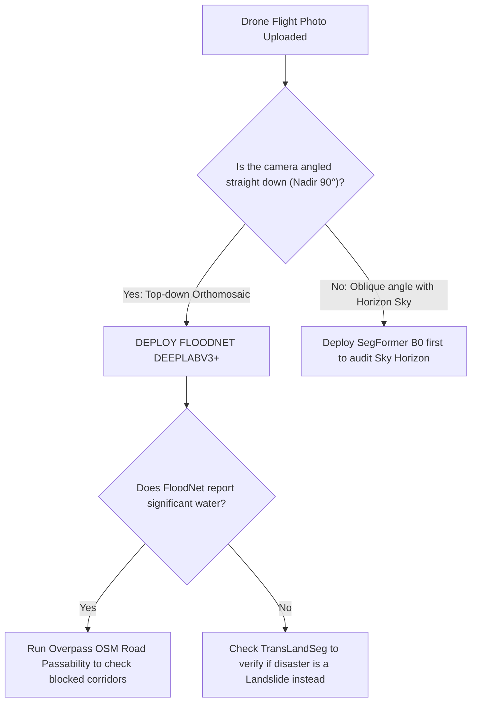

# FloodNet DeepLabV3+ — Evaluation & Benchmarks

## 1. Evaluation Metrics Explained

FloodNet semantic segmentation performance ko evaluate karne ke liye standard remote sensing aur computer vision metrics use hote hain:

| Metric | Formula | Meaning in Flood Triage |
| :--- | :--- | :--- |
| **Mean IoU (mIoU)** | $\frac{1}{C} \sum_{c=1}^C \frac{\text{TP}_c}{\text{TP}_c + \text{FP}_c + \text{FN}_c}$ | FloodNet nadir dataset par overall segmentation accuracy (**~73.2% mIoU** on test set). |
| **Flooded Road IoU** | $\text{IoU}_{\text{road}}$ | Doobi hui sadko ki boundary demarcation accuracy. |
| **Flooded Building IoU** | $\text{IoU}_{\text{bldg}}$ | Paani me ghure makanon ki footprint accuracy. |
| **Mathematical Sum Constraint** | $\sum_{c=1}^4 P_c \equiv 100.0\%$ | Command briefing reports me distribution ka exact 100% normalization. |

---

## 2. Quantitative Verification Benchmarks & Failure Mode Audits

### Benchmark 1: True Nadir Flash Flood (Chamoli Riparian Surge)
- **Scene Perspective:** 90° Nadir drone survey over submerged riverbank settlements.
- **FloodNet Output:**
  - Flooded Water: **34.2%**
  - Flooded Buildings: **11.4%**
  - Flooded Roads: **8.6%**
  - Passable / Intact Terrain: **45.8%**
- **Verdict:** Flawless nadir detection; identified 3 blocked road segments and triggered Level 4 DMMC Emergency directive.

### Benchmark 2: Oblique Perspective Horizon Failure (Sydney Beach Houses)
- **Scene Perspective:** 45° Oblique angle coastal photo with blue sky horizon; dry sunny weather.
- **FloodNet Output:** ⚠️ **66.66% Floodwater** *(Catastrophic False Positive)*
- **Root Cause:** Model had zero sky examples during training, so blue sky was classified as floodwater.
- **NETRA-D Remedy:** SegFormer B0 confirmed **53.15% Sky (99.5% Conf)** $\to$ `models_disagree` triggered $\to$ False alarm suppressed.

### Benchmark 3: Mountain Landslide Scar Failure (Meppadi, Wayanad)
- **Scene Perspective:** Mountain valley with a massive 500m red-soil landslide scar.
- **FloodNet Output:** ⚠️ **2.84% Water, 1.34% Debris** *(Missed Detection)*
- **Root Cause:** Zero bare-soil landslide classes in training vocabulary.
- **NETRA-D Remedy:** TransLandSeg detected **28.74% active landslide scar (93.1% Conf)** $\to$ Routed to Landslide Emergency Mode.

---

## 3. Comparison Matrix: FloodNet vs SegFormer vs TransLandSeg

| Capability | FloodNet DeepLabV3+ | SegFormer B0 (ADE20K) | TransLandSeg (SAM ViT-L) |
| :--- | :---: | :---: | :---: |
| **Primary Specialty** | **Nadir Flood Inundation** | Scene & Sky Disambiguation | Mountain Landslide Scars |
| **Flooded Roads Class** | **Yes (Dedicated)** | ❌ No (Generic road) | ❌ No |
| **Flooded Buildings Class**| **Yes (Dedicated)** | ❌ No (Generic building) | ❌ No |
| **Sky Horizon Handling** | ❌ Fails (66% false flood) | **Flawless (99.5% Conf Sky)** | N/A |
| **Landslide Scar Handling**| ❌ Fails (Near-zero detection)| ⚠️ Limited (Soil class) | **Flawless (93.1% Conf Scar)** |
| **Parameters** | **26.70 M** | 3.71 M | 304.0 M |

---

## 4. Decision Guide ("Kab is model ko select karein?")

