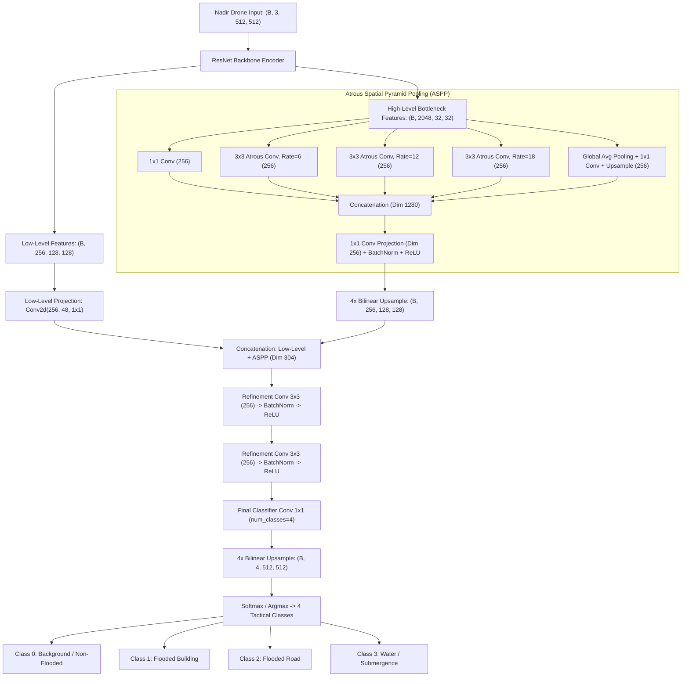

# FloodNet DeepLabV3+ — Working & Architecture

## 1. Formulas & Mathematical Equations

FloodNet DeepLabV3+ ka core mechanism **Atrous (Dilated) Spatial Pyramid Pooling (ASPP)** aur **Encoder-Decoder Skip Feature Fusion** par adharit hai.

### 1.1 Atrous (Dilated) Convolution
High-resolution drone photos me feature map ki spatial resolution bina downsampling ke preserve karne ke liye atrous convolution use hota hai:

$$y[i] = \sum_{k=1}^K x[i + r \cdot k] \cdot w[k]$$

- **$r$ (Dilation Rate):** Sampling filter ka stride. $r=1$ standard convolution hota hai; $r=6, 12, 18$ large contextual receptive field expand karta hai bina parameter count badhaye.

---

### 1.2 Atrous Spatial Pyramid Pooling (ASPP)
Encoder ke bottleneck feature map $\mathbf{X}$ ko 5 parallel multi-scale branches se process kiya jata hai:

$$\mathbf{Y}_1 = \text{Conv}_{1 \times 1}(\mathbf{X})$$

$$\mathbf{Y}_2 = \text{AtrousConv}_{3 \times 3, \, r=6}(\mathbf{X})$$

$$\mathbf{Y}_3 = \text{AtrousConv}_{3 \times 3, \, r=12}(\mathbf{X})$$

$$\mathbf{Y}_4 = \text{AtrousConv}_{3 \times 3, \, r=18}(\mathbf{X})$$

$$\mathbf{Y}_5 = \text{BilinearUpsample}\left( \text{Conv}_{1 \times 1}(\text{GlobalAvgPool}(\mathbf{X})) \right)$$

$$\mathbf{Y}_{\text{ASPP}} = \text{Conv}_{1 \times 1}\left( \text{Concat}([\mathbf{Y}_1, \mathbf{Y}_2, \mathbf{Y}_3, \mathbf{Y}_4, \mathbf{Y}_5]) \right)$$

- **Advantage:** Chhote paani ke potholes se lekar broad river inundation tak har scale par features accurately aggregate hoti hain.

---

### 1.3 Decoder Skip-Connection Boundary Refinement
Low-level spatial edges ko recover karne ke liye stem features ko ASPP features ke saath fuse kiya jata hai:

$$\mathbf{F}_{\text{low}} = \text{Conv}_{1 \times 1}(\mathbf{F}_{\text{stem}})$$

$$\mathbf{F}_{\text{fused}} = \text{Concat}\left( \text{Upsample}_{4\times}(\mathbf{Y}_{\text{ASPP}}), \, \mathbf{F}_{\text{low}} \right)$$

$$\mathbf{Z} = \text{Conv}_{3 \times 3}\left( \text{Conv}_{3 \times 3}(\mathbf{F}_{\text{fused}}) \right)$$

$$\hat{\mathbf{Y}} = \text{Softmax}\left( \text{Upsample}_{4\times}(\mathbf{Z}) \right)$$

---

### 1.4 Mathematical Normalization to Exactly 100.0%
Emergency command briefings me arithmetic integrity maintain karne ke liye tactical disaster classes ka percentage sum strictly $100.0\%$ enforce hota hai:

$$P_c = \frac{\sum_{i=1}^{HW} \mathbb{I}(\text{argmax}(\hat{\mathbf{Y}}_i) = c)}{H \cdot W} \times 100.0\%$$

$$\sum_{c \in \text{Classes}} P_c \equiv 100.0\%$$

---

## 2. Structure & Model Architecture

---

## 3. Hyperparameters & Specifications

| Parameter / Spec | Value | Description |
| :--- | :--- | :--- |
| **Model Checkpoint** | `floodnet_deeplabv3plus.pth` | Checkpoint trained on FloodNet drone dataset |
| **Total Parameters** | **26.70 Million** | ResNet-50 / ResNet-101 based ASPP trunk |
| **Input Shape** | $512 \times 512 \times 3$ | Standardized RGB drone image |
| **Number of Classes** | 4 Tactical Classes | Background, Flooded-Building, Flooded-Road, Water |
| **Atrous Dilation Rates** | $r \in \{6, 12, 18\}$ | Multi-scale spatial coverage |
| **Inference Time (CPU)** | **~650 – 850 ms** | Deterministic tactical speed |
| **Inference Time (CUDA)** | **~28 ms** | Real-time 30 FPS video capable |
