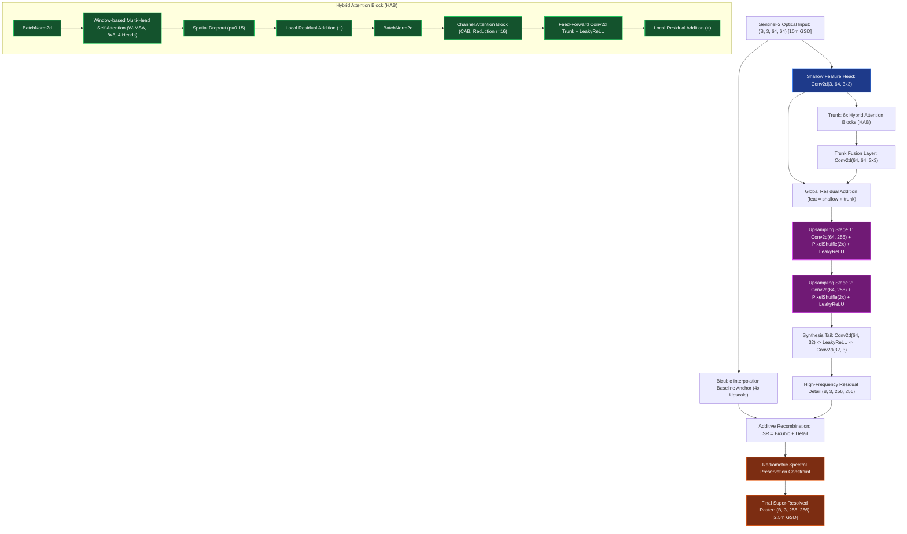
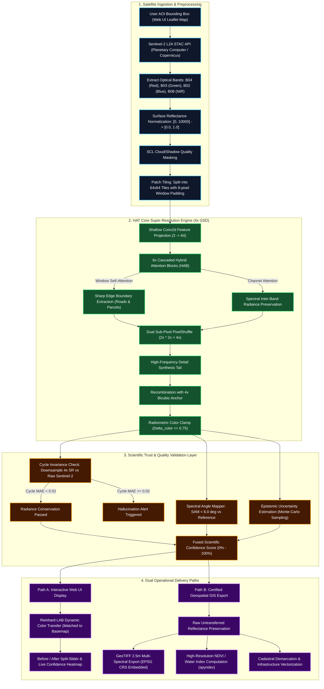

# HAT (Hybrid Attention Transformer) — Working & Architecture

## 1. Formulas & Mathematical Equations

HAT ka core principle do attention mechanisms ka hybrid fusion hai: **Window Multi-Head Self-Attention (Spatial)** aur **Channel Attention (Spectral)**.

### 1.1 Window-based Multi-Head Self-Attention (W-MSA)
Input feature map $\mathbf{X}$ ko chhote local windows $M \times M$ ($M=8$) me baanta jata hai. Har window ke liye Query ($\mathbf{Q}$), Key ($\mathbf{K}$), aur Value ($\mathbf{V}$) matrices calculate hoti hain:

$$\mathbf{Q} = \mathbf{X} \mathbf{W}_Q, \quad \mathbf{K} = \mathbf{X} \mathbf{W}_K, \quad \mathbf{V} = \mathbf{X} \mathbf{W}_V$$

Scaled Dot-Product Attention formula:
$$\text{Attention}(\mathbf{Q}, \mathbf{K}, \mathbf{V}) = \text{Softmax}\left(\frac{\mathbf{Q} \mathbf{K}^T}{\sqrt{d_k}} + \mathbf{B}\right) \mathbf{V}$$

- **$d_k$:** Dimension per attention head ($64 / 4 = 16$).
- **$\mathbf{B}$:** Learned Relative Position Bias jo geometric alignment preserve karta hai.
- **Intuition:** Yeh formula window ke andar har pixel ko doosre pixel se compare karta hai. Agar ek pixel road ka hissa hai, to model aas-pass ke road pixels par zyada focus karta hai, jisse sharp boundary banti hai.

---

### 1.2 Channel Attention Block (CAB)
Inter-band spectral balance (Red, Green, Blue, NIR radiance ratios) maintain karne ke liye Squeeze-and-Excitation channel gating formula use hota hai:

$$\mathbf{z}_{\text{avg}} = \text{AdaptiveAvgPool2d}(\mathbf{X}), \quad \mathbf{z}_{\text{max}} = \text{AdaptiveMaxPool2d}(\mathbf{X})$$

$$\mathbf{s} = \sigma\left(\mathbf{W}_2 \cdot \text{ReLU}(\mathbf{W}_1 \cdot \mathbf{z}_{\text{avg}}) + \mathbf{W}_2 \cdot \text{ReLU}(\mathbf{W}_1 \cdot \mathbf{z}_{\text{max}})\right)$$

$$\mathbf{X}_{\text{CAB}} = \mathbf{X} \odot \mathbf{s}$$

- **$\sigma$:** Sigmoid function jo 0 se 1 ke beech scale factor deta hai.
- **$\mathbf{W}_1, \mathbf{W}_2$:** Channel reduction MLP weights ($r=16$).
- **$\odot$:** Element-wise multiplication.
- **Intuition:** Har spectral band ki importance dynamically adjust hoti hai, taaki jungle ka green aur mitti ka brown natural dikhe.

---

### 1.3 Sub-Pixel Convolution (PixelShuffle 4x)
Latent features ko $4\times$ expand karne ke liye do stages me sub-pixel convolution lagaya jata hai:

$$\mathbf{Y}_{c, \, 2y + j, \, 2x + i} = \mathbf{T}_{4c + 2j + i, \, y, \, x}, \quad i, j \in \{0, 1\}$$

- **Explanation:** $64$ channels ko pehle $256$ me expand kiya jata hai, fir PixelShuffle(2) se unhe $2\times$ spatial grid me rearrange kiya jata hai. Do bar repeat karne par $(64, H, W) \to (64, 4H, 4W)$ ban jata hai.

---

### 1.4 Radiometric Spectral Preservation Constraint
Color drift aur artificial saturation ko rokne ke liye output par physical radiance balance enforce hota hai:

$$\Delta_{\text{color}} = \frac{1}{HW} \sum_{x,y} \mathbf{I}_{\text{SR}}(x,y) - \frac{1}{HW} \sum_{x,y} \mathbf{I}_{\text{Bicubic}}(x,y)$$

$$\mathbf{I}_{\text{Final}} = \text{Clamp}\left(\mathbf{I}_{\text{SR}} - 0.75 \cdot \Delta_{\text{color}}, 0.0, 1.0\right)$$

---

### 1.5 Composite Training Loss Function
Model ko train karte waqt dono structural aur spectral accuracy ko optimize kiya jata hai:

$$\mathcal{L}_{\text{total}} = \mathcal{L}_{\text{Charbonnier}}(\mathbf{I}_{\text{SR}}, \mathbf{I}_{\text{HR}}) + \lambda_{\text{SAM}} \cdot \mathcal{L}_{\text{SAM}}(\mathbf{I}_{\text{SR}}, \mathbf{I}_{\text{HR}})$$

$$\mathcal{L}_{\text{Charbonnier}} = \sqrt{\|\mathbf{I}_{\text{SR}} - \mathbf{I}_{\text{HR}}\|^2 + \epsilon^2}, \quad \epsilon = 10^{-3}$$

$$\mathcal{L}_{\text{SAM}} = \arccos\left( \frac{\mathbf{I}_{\text{SR}} \cdot \mathbf{I}_{\text{HR}}}{\|\mathbf{I}_{\text{SR}}\|_2 \|\mathbf{I}_{\text{HR}}\|_2} \right)$$

---

## 2. Structure & Model Architecture

### Module Specifications Table

| Component | Layer Type | Channels (In $\to$ Out) | Purpose / Details |
| :--- | :--- | :---: | :--- |
| **Shallow Head** | `nn.Conv2d` | $3 \to 64$ | Low-res radiance ko 64-dim latent features me convert karta hai. |
| **HAB Trunk (6x)** | `HybridAttentionBlock` | $64 \to 64$ | Spatial self-attention aur channel attention ko interleave karta hai. |
| **W-MSA** | `WindowMultiHeadAttention` | 4 heads (16 dim/head) | $8 \times 8$ local patch ke andar pixel-to-pixel correlations nikalta hai. |
| **CAB** | `ChannelAttentionBlock` | $64 \to 4 \to 64$ ($r=16$) | Inter-band radiometric balance preserve karta hai. |
| **Upsamplers** | `PixelShuffle(2)` $\times 2$ | $64 \to 256 \to 64$ | Spatial resolution ko $2\times \times 2\times = 4\times$ karta hai. |
| **Synthesis Tail** | `Conv + LReLU + Conv` | $64 \to 32 \to 3$ | Sharp high-frequency details synthesize karta hai. |

---

## 3. Workflow: Training Se Prediction Tak

---

## 4. Hyperparameters & Unka Effect

| Hyperparameter | Value | Description | Tune Karne Par Effect |
| :--- | :---: | :--- | :--- |
| **`window_size`** | `8` | Attention calculate karne ka local patch size ($8 \times 8$). | **Bada karne par:** Global context behtar hoga lekin computation $O(M^2)$ speed se slow ho jayegi. **Chhota karne par:** Fast chalega par broad road context miss ho sakta hai. |
| **`num_heads`** | `4` | Self-attention heads ki sankhya. | Head badhane se multi-scale patterns pakadte hain, par GPU memory zyada lagti hai. |
| **`num_blocks`** | `6` | Trunk me HAB blocks ki sankhya. | Depth badhane se finer edges aate hain; 6 blocks accuracy aur inference speed ka perfect sweet spot hai. |
| **`reduction_ratio`** | `16` | Channel Attention bottleneck ratio ($C/16$). | Parameter size kam rakhta hai; agar 8 karein to thodi better spectral distinction milegi par parameters badhenge. |
| **`dropout_rate`** | `0.15` | Spatial dropout probability. | Active inference me Monte-Carlo uncertainty estimation ke liye variance generate karta hai. Overfitting rokta hai. |
| **`lambda_sam`** | `0.05` | Training loss me Spectral Angle Mapper ka weight. | Isko zyada rakhne se true-color integrity perfect rehti hai, par over-smooth edges ho sakte hain. |
