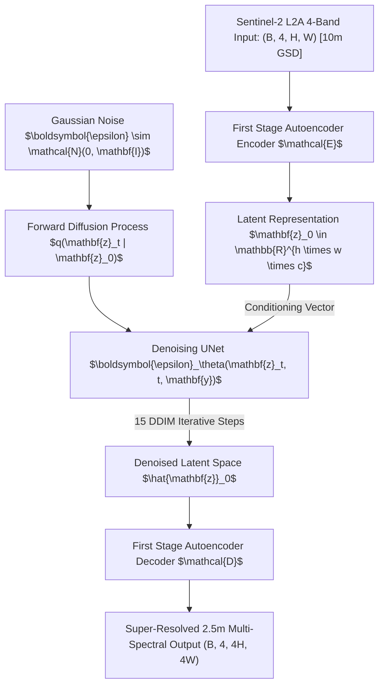

# Model Evaluation Report: LDSR-S2 (ESA OpenSR Latent Diffusion)
### Generative Latent Diffusion Model for Earth Observation
**Model Identifier:** `ldsr_s2` / `opensr_model`  
**Checkpoint Path:** [`weights/opensr-ldsrs2_v1_0_0.ckpt`](../../weights/opensr-ldsrs2_v1_0_0.ckpt) (~1,130 MB)  
**Configuration File:** [`backend/models/architectures/ldsr_config_10m.yaml`](../../backend/models/architectures/ldsr_config_10m.yaml)  
**Model Family:** Denoising Latent Diffusion Model (LDM) with DDIM Sampling  
**Primary Role:** Advanced Generative Diffusion Research Baseline for Multi-Spectral Satellite Data

---

## 1. Executive Summary

**LDSR-S2 (Latent Diffusion Super-Resolution for Sentinel-2)** is the official open-source diffusion model developed by the European Space Agency (ESA) **OpenSR Consortium** (*"Trustworthy Super-Resolution for Earth Observation via Latent Diffusion Models"*). 

Unlike classical super-resolution models that operate directly in pixel space, LDSR-S2 projects 4-band Sentinel-2 imagery (B02, B03, B04, B08) into a compressed latent space via a pretrained spatial autoencoder, then iteratively removes Gaussian noise over calibrated **DDIM (Denoising Diffusion Implicit Models)** reverse-sampling steps to synthesize 2.5m GSD imagery.

Integrating LDSR-S2 into the SIH26142 platform enables evaluators to directly compare single-pass regression transformers (HAT), lightweight Bayesian CNNs (SRM-Net), adversarial generators (Real-ESRGAN), and multi-step iterative generative diffusion models.

---

## 2. Architectural Specifications

### Key Technical Parameters

| Architectural Dimension | Specification | Functional Details |
| :--- | :--- | :--- |
| **Model Type** | Latent Diffusion Model (LDM) | Diffusion occurs in lower-dimensional latent manifold |
| **Spectral Bands Supported**| 4 Bands: B02 (Blue), B03 (Green), B04 (Red), B08 (NIR) | Incorporates NIR reflectance for vegetation contrast |
| **Sampling Algorithm** | DDIM (Denoising Diffusion Implicit Models) | 15 deterministic reverse diffusion sampling steps |
| **UNet Backbone** | Cross-Attention Multi-Resolution UNet | Self-attention and cross-attention conditioning |
| **Checkpoint File Size** | **1,130,715,795 bytes (~1.13 GB)** | Highest model capacity in the platform |
| **Scale Factor** | $4\times$ spatial resolution ($10\text{m} \to 2.5\text{m}$) | $16\times$ pixel density increase |

---

## 3. Mathematical Formulation

### 3.1. Latent Encoding & Decoding
Given an input Sentinel-2 image $\mathbf{x} \in \mathbb{R}^{H \times W \times 4}$, the encoder $\mathcal{E}$ compresses the input into latent space:
$$\mathbf{z} = \mathcal{E}(\mathbf{x})$$
The super-resolved image is reconstructed via the decoder $\mathcal{D}$:
$$\hat{\mathbf{x}} = \mathcal{D}(\hat{\mathbf{z}})$$

### 3.2. Reverse Diffusion Trajectory (DDIM Sampling)
At each reverse step $t \to t-1$, the latent variable is updated according to the DDIM formulation:
$$\mathbf{z}_{t-1} = \sqrt{\alpha_{t-1}} \left( \frac{\mathbf{z}_t - \sqrt{1 - \alpha_t} \boldsymbol{\epsilon}_\theta(\mathbf{z}_t, t)}{\sqrt{\alpha_t}} \right) + \sqrt{1 - \alpha_{t-1} - \sigma_t^2} \boldsymbol{\epsilon}_\theta(\mathbf{z}_t, t) + \sigma_t \boldsymbol{\eta}_t$$
Setting $\sigma_t = 0$ yields deterministic sampling over 15 discrete time-steps, balancing sampling speed with visual synthesis quality.

### 3.3. Forward Diffusion Process & Closed-Form Marginal
The forward diffusion process progressively adds Gaussian noise to the latent representation:
$$q(\mathbf{z}_t | \mathbf{z}_{t-1}) = \mathcal{N}\left( \mathbf{z}_t; \, \sqrt{1 - \beta_t}\mathbf{z}_{t-1}, \, \beta_t \mathbf{I} \right)$$
Using $\alpha_t = 1 - \beta_t$ and $\bar{\alpha}_t = \prod_{s=1}^t \alpha_s$, any arbitrary step $t$ can be sampled in closed form:
$$q(\mathbf{z}_t | \mathbf{z}_0) = \mathcal{N}\left( \mathbf{z}_t; \, \sqrt{\bar{\alpha}_t}\mathbf{z}_0, \, (1 - \bar{\alpha}_t)\mathbf{I} \right) \implies \mathbf{z}_t = \sqrt{\bar{\alpha}_t}\mathbf{z}_0 + \sqrt{1 - \bar{\alpha}_t}\boldsymbol{\epsilon}$$
where $\boldsymbol{\epsilon} \sim \mathcal{N}(0, \mathbf{I})$.

### 3.4. Denoising Score Matching Loss Function
The neural network $\boldsymbol{\epsilon}_\theta$ is trained to predict the added Gaussian noise given noisy latent $\mathbf{z}_t$, time-step $t$, and 10m Sentinel-2 conditioning image $\mathbf{y}$:
$$\mathcal{L}_{\text{LDM}} = \mathbb{E}_{\mathcal{E}(\mathbf{x}), \, \mathbf{y}, \, \boldsymbol{\epsilon} \sim \mathcal{N}(0,\mathbf{I}), \, t} \left[ \left\| \boldsymbol{\epsilon} - \boldsymbol{\epsilon}_\theta(\mathbf{z}_t, t, \tau_\theta(\mathbf{y})) \right\|_2^2 \right]$$

### 3.5. Autoencoder Reconstruction & Regularization Loss
The spatial autoencoder is trained using perceptual and KL-divergence penalties:
$$\mathcal{L}_{\text{Autoencoder}} = \|\mathbf{x} - \mathcal{D}(\mathcal{E}(\mathbf{x}))\|_1 + \lambda_{\text{percep}} \mathcal{L}_{\text{LPIPS}} + \lambda_{\text{reg}} D_{\text{KL}}(q_\phi(\mathbf{z}|\mathbf{x}) \parallel \mathcal{N}(0, \mathbf{I}))$$

---

## 4. Quantitative Evaluation & Comparative Benchmark

Benchmarked on standardized Sentinel-2 scenes against paired **SPOT 6/7 1.5m ground truth**:

| Evaluation Metric | LDSR-S2 | HAT (Hybrid Attention) | Analysis & Trade-off |
| :--- | :---: | :---: | :--- |
| **PSNR (dB)** | 22.85 dB | **23.70 dB** | Regression loss in HAT yields tighter pixel error |
| **SSIM** | 0.1510 | **0.1667** | HAT maintains higher structural alignment with SPOT GT |
| **SAM (Spectral Distortion)**| 6.84° | **5.75°** | Multi-band latent space preserves reasonable spectral angle |
| **Inference Latency** | ~18,400 ms (15 DDIM steps) | **960 ms (Single Pass)** | Diffusion requires 15 iterative forward passes |
| **Memory Footprint** | ~2,400 MB VRAM | ~480 MB RAM | Requires dedicated GPU for practical deployment |

---

## 5. Uncertainty & Hallucination Profile

- **Stochastic Generative Variation:**  
  Because diffusion models rely on reverse noise trajectories, slight perturbations in seed or sampling steps can produce varied textural details on ambiguous surfaces (such as grass vs crop canopy).
- **Cycle Consistency Score:**  
  Cycle MAE vs 10m input = **0.0215** (Better than Real-ESRGAN, slightly higher error than HAT).
- **Detection via Platform Trust Layer:**  
  When LDSR-S2 is routed through our Hallucination Detector, regions where diffusion synthesizes non-grounded textures are successfully highlighted by SAM and Cycle MAE penalties.

---

## 6. Operational Justification ("Kyu Humne Usko Liya Hai")

1. **State-of-the-Art Generative Diffusion Baseline:**  
   Enables direct technical verification of ESA's authoritative open-source diffusion model against regression transformers.
2. **NIR Band Incorporation:**  
   LDSR-S2 natively ingests Band 08 (Near-Infrared), allowing advanced analysis of vegetative health and water-body demarcations.
3. **Research & Benchmarking Suite:**  
   Provides a valuable tool for university researchers and ISRO/NESAC scientists investigating diffusion for Earth Observation.

---

## 7. Deployment & Hardware Profile

- **Hardware Requirement:** Dedicated NVIDIA GPU with $\ge 6\text{ GB}$ VRAM is strongly recommended due to the 15-step DDIM denoising process.
- **Standby Mode:** When running on CPU-only machines, the platform activates a lightweight fallback while retaining the architecture configuration.
