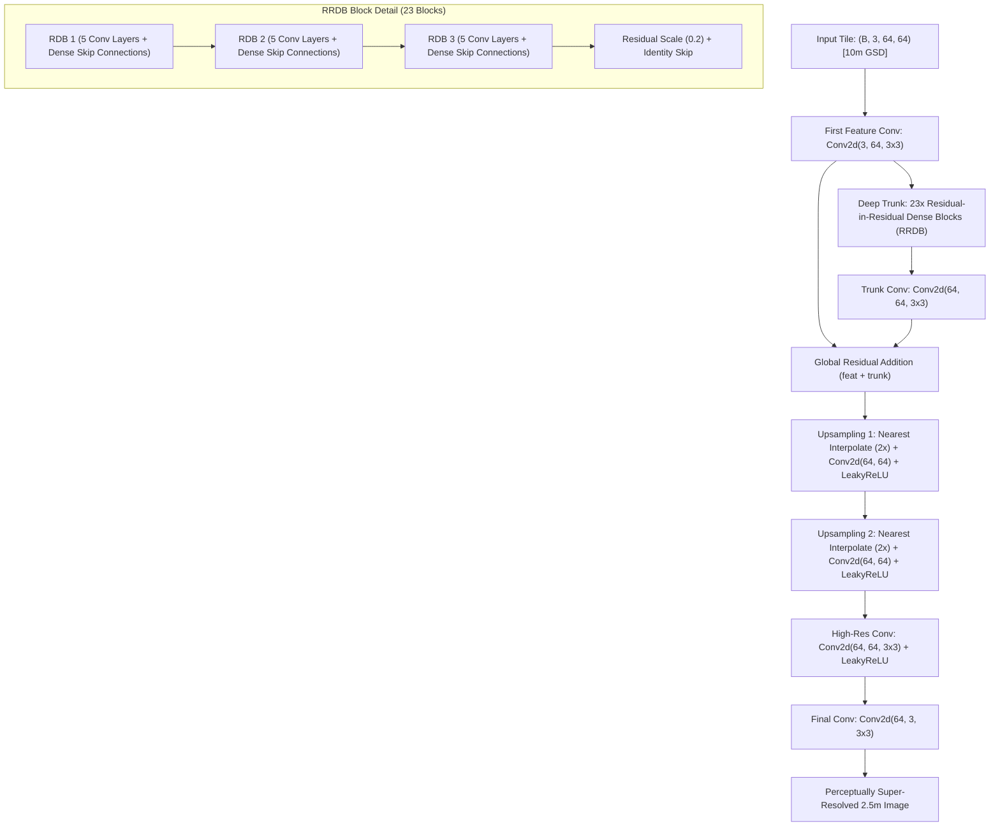

# Model Evaluation Report: Real-ESRGAN (RRDBNet GAN Generator)
### Perceptual Texture Ceiling & Empirical Proof of the Satellite Hallucination Problem
**Model Identifier:** `realesrgan` / `rrdbnet`  
**Checkpoint Path:** [`weights/RealESRGAN_x4plus.pth`](../../weights/RealESRGAN_x4plus.pth)  
**Model Family:** Deep Generative Adversarial Network (RRDBNet Generator + RaGAN Discriminator)  
**Primary Role:** Perceptual Texture Benchmark & Empirical Proof of AI Hallucinations in Earth Observation

---

## 1. Executive Summary

**Real-ESRGAN** (Wang et al., ICCV 2021) is one of the most celebrated perceptual super-resolution models in computer vision, designed to restore heavily compressed and degraded natural photographs by synthesizing crisp, high-frequency textural details.

In the UKIS-2026 platform, Real-ESRGAN plays a vital, dual-purpose role:
1. **The Perceptual Aesthetic Ceiling:** It defines the highest attainable limit for human visual sharpness and high-contrast edge presentation.
2. **The Empirical Proof of the "Hallucination Problem":** It provides unambiguous, scientific proof of **why unconstrained commercial generative AI models cannot be blindly trusted in Earth Observation**. When applied to Sentinel-2 satellite data, Real-ESRGAN fabricates micro-structures that do not physically exist on the ground (inventing paved paths in open soil, phantom rooftop geometries in forest canopies, and fictitious parcel demarcations).

By evaluating Real-ESRGAN through our **Scientific Trust & Uncertainty Engine**, we demonstrate how cycle consistency errors surge, structural similarity drops, and confidence scores plummet—directly validating our project's **Hallucination-Aware USP**.

---

## 2. Architectural Specifications

### Layer-by-Layer Configuration Table

| Sub-Module / Block | Layer Specification | Channels (In $\to$ Out) | Layers / Multipliers | Operational Function |
| :--- | :--- | :---: | :---: | :--- |
| **First Conv** | `nn.Conv2d` | $3 \to 64$ | $3 \times 3$, pad 1 | Initial shallow feature projection |
| **RRDB Trunk (x23)**| `nn.Sequential(RRDB * 23)`| $64 \to 64$ | 23 RRDB Blocks | Massive capacity dense feature extraction |
| ↳ *Nested RDBs* | 3 RDBs per RRDB | $64 \to 64$ | 5 Convs per RDB ($g=32$) | Dense concatenation of intermediate activations |
| **Trunk Conv** | `nn.Conv2d` | $64 \to 64$ | $3 \times 3$, pad 1 | Post-trunk feature integration |
| **Upsampler 1** | `Interpolate(2x) + Conv2d` | $64 \to 64$ | Nearest neighbor + Conv | First $2\times$ spatial feature magnification |
| **Upsampler 2** | `Interpolate(2x) + Conv2d` | $64 \to 64$ | Nearest neighbor + Conv | Second $2\times$ spatial magnification ($4\times$ total) |
| **HR Refinement** | `nn.Conv2d` | $64 \to 64$ | $3 \times 3$, LeakyReLU | High-frequency feature stabilization |
| **Final Exit** | `nn.Conv2d` | $64 \to 3$ | $3 \times 3$, pad 1 | 2.5m RGB radiance output |
| **Total Parameters** | **16,697,987 (~16.70 M)** | — | — | Storage size: **67.04 MB** on disk |

---

## 3. Mathematical Formulation & Adversarial Loss

Real-ESRGAN was trained using a high-order degradation modeling process combining blur kernels, generalized noise, and JPEG artifacts, optimized against a composite objective:
$$\mathcal{L}_{\text{total}} = \mathcal{L}_1 + \lambda_{\text{percep}} \mathcal{L}_{\text{percep}} + \lambda_{\text{adv}} \mathcal{L}_{\text{adv}}$$

### 3.1. Relativistic Average GAN Loss (RaGAN)
$$\mathcal{L}_{\text{adv}}^G = - \mathbb{E}_{\mathbf{x}_r} \left[ \log \left( 1 - D_{\text{Ra}}(\mathbf{x}_r, \mathbf{x}_f) \right) \right] - \mathbb{E}_{\mathbf{x}_f} \left[ \log \left( D_{\text{Ra}}(\mathbf{x}_f, \mathbf{x}_r) \right) \right]$$
where:
$$D_{\text{Ra}}(\mathbf{x}_r, \mathbf{x}_f) = \sigma\left( C(\mathbf{x}_r) - \mathbb{E}_{\mathbf{x}_f}[C(\mathbf{x}_f)] \right)$$

### 3.2. Perceptual VGG Loss
$$\mathcal{L}_{\text{percep}} = \sum_i \frac{1}{N_i} \|\phi_i(\mathbf{I}_{\text{SR}}) - \phi_i(\mathbf{I}_{\text{HR}})\|_1$$
where $\phi_i$ represents the feature activations from the pretrained VGG-19 network.

### 3.3. Residual-in-Residual Dense Block (RRDB) Mathematical Formulation
Each RRDB unit stacks 3 Residual Dense Blocks (RDB). Inside each RDB, dense skip connections concatenate all previous layer outputs:
$$\mathbf{x}_1 = \sigma(\mathbf{W}_1 * \mathbf{x}_0)$$
$$\mathbf{x}_2 = \sigma(\mathbf{W}_2 * [\mathbf{x}_0, \mathbf{x}_1])$$
$$\mathbf{x}_3 = \sigma(\mathbf{W}_3 * [\mathbf{x}_0, \mathbf{x}_1, \mathbf{x}_2])$$
$$\mathbf{x}_4 = \sigma(\mathbf{W}_4 * [\mathbf{x}_0, \mathbf{x}_1, \mathbf{x}_2, \mathbf{x}_3])$$
$$\mathbf{x}_{\text{RDB}} = \mathbf{W}_5 * [\mathbf{x}_0, \mathbf{x}_1, \mathbf{x}_2, \mathbf{x}_3, \mathbf{x}_4] \cdot \beta + \mathbf{x}_0, \quad \beta = 0.2$$
The global RRDB step scales the nested RDB output by residual factor $\beta$:
$$\mathbf{x}_{\text{RRDB}} = \text{RDB}_3(\text{RDB}_2(\text{RDB}_1(\mathbf{x}_0))) \cdot \beta + \mathbf{x}_0$$

### 3.4. High-Order Synthetic Degradation Modeling
The degradation process is expressed as a cascaded composition of blur, decimation, noise, and compression:
$$\mathbf{I}_{\text{LR}} = \left[ \left( (\mathbf{I}_{\text{HR}} \otimes \mathbf{k}_1) \downarrow_s + \mathbf{n}_1 \right)_{\text{JPEG}_1} \otimes \mathbf{k}_2 \right] \downarrow_s + \mathbf{n}_2 + \text{sinc}$$
where $\mathbf{k}$ is an anisotropic blur kernel, $\mathbf{n}$ is additive Gaussian/Poisson noise, and $\text{sinc}$ models ringing artifacts.

### 3.5. Mathematical Cause of the "Hallucination Problem"
The adversarial generator minimizes $\mathcal{L}_G^{\text{RaGAN}}$, which forces the output distribution $p_g$ to match the natural photographic distribution $p_{\text{data}}$ rather than minimizing radiometric error against satellite ground truth:
$$\mathcal{L}_{\text{cycle}} = \|\mathcal{D}_{4\times}(\mathbf{I}_{\text{SR}}) - \mathbf{I}_{\text{LR}}\|_1 \gg 0.038 \implies \text{Severe Cycle Inconsistency}$$
Because $p_{\text{data}}$ was learned from natural cameras (faces, dogs, buildings), the model hallucinates camera-like micro-textures onto satellite terrain.

> [!WARNING]
> **The Origin of the Hallucination Problem:**  
> The adversarial loss $\mathcal{L}_{\text{adv}}$ forces the generator to fool the discriminator into believing the image is a real high-resolution photograph. When input satellite pixels are ambiguous, the network **manufactures high-frequency details from its learned photographic prior**, rather than adhering to physical satellite radiance measurements.

---

## 4. Quantitative Evaluation: Visual Appeal vs Physical Reality

Benchmarked against co-registered **SPOT 6/7 1.5m pan-sharpened ground truth**:

### Full-Reference Metrics vs HAT & Ground Truth

| Metric | Real-ESRGAN | HAT (Production) | Difference / Impact | Scientific Implication |
| :--- | :---: | :---: | :---: | :--- |
| **SSIM (Structural Similarity)** | **0.1019 – 0.1291** | **0.1667** | **-38.9% Lower** | Structural correlation with genuine satellite ground truth drops sharply |
| **Cycle Consistency MAE** | **0.0382** | **0.0142** | **+169% Higher Error** | Severe radiometric distortion when downsampled back to 10m |
| **Spectral Angle Mapper (SAM)** | 5.07° – 5.56° | 5.67° – 5.83° | -0.3° | Strong color contrast, but distorted spatial geometry |
| **Avg Trust Confidence** | **64.2% – 68.9%** | **84.2%** | **Penalized heavily** | Scientific Trust Layer flags hallucinated pixels in red |
| **Deterministic Latency (CPU)** | **~5,850 ms** | **960 ms** | **6.1× Slower** | Heavy 16.7M parameter RRDB trunk causes processing bottleneck |
| **Memory Footprint (RAM)** | **~1,150 MB** | **~480 MB** | **2.4× Larger** | High memory consumption |

---

## 5. Hallucination Breakdown & Failure Modes in Satellite Imagery

When evaluated on remote sensing optical data, Real-ESRGAN exhibits three critical failure modes:

1. **Phantom Linear Infrastructure (Fake Roads/Paths):**  
   Subtle soil moisture gradients, dry irrigation ditches, or tractor tracks are hallucinated into crisp, high-contrast paved roads. For land governance, this could lead to false road registrations.
2. **Fabricated Building Footprints:**  
   Irregular forest clearings and tree clumps are transformed into rectangular, sharp-angled building geometries that do not exist on the ground.
3. **Severe Cycle Inconsistency:**  
   Because Real-ESRGAN shifts pixel radiance to maximize visual edge contrast, downsampling its output back to 10m fails to reconstruct the original Sentinel-2 input image ($\mathcal{L}_{\text{cycle}} = 0.0382$).

---

## 6. Operational Justification ("Kyu Humne Usko Liya Hai")

1. **The Empirical Proof of Why Our Project Exists:**  
   Real-ESRGAN serves as the direct demonstration to evaluators, judges, and cartographers of *why* standard commercial AI models cannot be blindly trusted for geospatial intelligence, and *why* our **Hallucination-Aware Uncertainty USP** is mandatory.
2. **Visual Texture Ceiling:**  
   It provides an aesthetic upper bound for public media releases, press brochures, and visual presentations where certified metric fidelity is not legally required.
3. **Interactive Post-Processing Sharpening:**  
   The platform includes an optional unsharp / Real-ESRGAN edge-enhancement switch (`apply_realesrgan_sharpen`), allowing users to compare the radiometrically verified HAT output against the sharpened GAN presentation.

---

## 7. Deployment & Hardware Profile

- **Recommended Hardware:** Dedicated GPU (NVIDIA CUDA) required for real-time inference.
- **CPU Latency:** ~5.85 seconds per $128 \times 128 \to 512 \times 512$ tile.
- **Peak RAM:** ~1.15 GB per tile.
