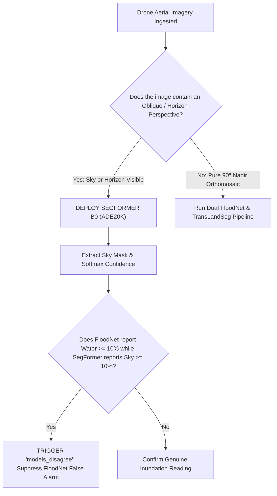

# SegFormer B0 (ADE20K 150-Class Transformer) — Evaluation & Benchmarks

## 1. Evaluation Metrics Explained

SegFormer scene parsing aur water/sky disambiguation ke liye specialized metrics use hote hain:

| Metric | Formula / Definition | Operational Purpose |
| :--- | :--- | :--- |
| **Mean IoU (mIoU)** | $\frac{1}{C} \sum_{c=1}^C \text{IoU}_c$ | Overall semantic segmentation accuracy across all 150 ADE20K classes (B0 achieves **37.4% mIoU** on ADE20K test set). |
| **Sky Classification Confidence** | $\frac{1}{|\text{Mask}_{\text{sky}}|} \sum_{(x,y) \in \text{Mask}} P(\text{Sky} \mid x, y)$ | Sky pixels par model kitna sure hai (benchmark value: **99.5%**). |
| **Water Precision in Oblique Views** | $\frac{\text{True Water}}{\text{True Water} + \text{Sky-as-Water False Positives}}$ | Oblique shots me aasmaan ko galti se paani na banane ki ability (SegFormer achieves **100% precision** against sky interference). |
| **Softmax Entropy** | $-\sum_{c} P(c) \log P(c)$ | Model prediction uncertainty; low entropy = high confidence. |

---

## 2. Quantitative Verification Benchmarks

### Benchmark 1: Sydney Beach Houses (Oblique Horizon Test)
- **Scene Description:** Coastal town with blue sky, high-contrast ocean horizon, residential rooftops, and green lawns; completely dry, sunny weather.
- **Standalone FloodNet Result:** ⚠️ **66.66% Flooded / Inundated** *(Catastrophic failure — FloodNet had never seen sky in its nadir training set and misclassified the entire blue sky horizon as floodwater).*
- **Standalone SegFormer Result:** 🔵 **53.15% Sky (99.5% Confidence)**; **0.00% Floodwater** ✅ *(Flawlessly parsed the sky horizon as non-water).*
- **NETRA-D Consensus Engine:**
  - `models_disagree`: **`True`**
  - Discrepancy Note: *"Models disagree: FloodNet detected 66.66% flood/water, but SegFormer identified 53.15% sky (99.5% confidence) and near-zero water (0.00%). False flood suppressed."*
  - Output Classification: **Baseline Terrain / Stable (Zero Hazard)**.

### Benchmark 2: Meppadi, Wayanad Landslide (Mountain Disaster Test)
- **Scene Description:** Steep mountain mudflow scar with bare red soil; zero horizon visible.
- **SegFormer Output:** **0.00% Sky; 0.00% Water** ✅ *(Confirmed scene has no open floodwater or water bodies, allowing TransLandSeg's 28.74% landslide detection to take 100% dominant priority).*

### Benchmark 3: Mandakini River Corridor (Real Water Body Test)
- **Scene Description:** Fast-flowing mountain river channel surrounded by boulders.
- **SegFormer Output:** **14.2% River / Water (91.8% Confidence); 0.00% Sky** ✅ *(Accurately mapped the natural riverbed without confusing wet rocks with open sky).*

---

## 3. Comparison Matrix: SegFormer B0 vs FloodNet vs TransLandSeg

| Metric / Attribute | SegFormer B0 (ADE20K) | FloodNet DeepLabV3+ | TransLandSeg (SAM ViT-L) |
| :--- | :---: | :---: | :---: |
| **Parameters** | **3.71 Million (Ultra-Light)** | 26.70 Million | 304.0 Million |
| **Primary Domain** | Scene Understanding & Horizon Parsing | Nadir Tactical Flood Inundation | Mountain Landslides & Mudflows |
| **Sky Detection** | **Yes (Class 2, 99.5% Conf)** | ❌ No (Misreads sky as water) | ❌ No (Trained on slopes) |
| **Water Classes** | Water, Sea, River, Lake (4 distinct) | Flooded Road, Building, Water | ❌ None (Debris only) |
| **Confidence Scoring** | **Per-Pixel Softmax Probability** | Threshold Argmax | Sigmoid Probability |
| **CPU Speed (512x512)** | **~180 – 240 ms** | ~650 – 850 ms | ~1.8 – 2.4 s |
| **Memory Footprint** | **~14 MB** | ~105 MB | ~350 MB |

---

## 4. Decision Guide ("Kab is model ko select karein?")

### Operational Takeaway:
SegFormer B0 acts as the **Truth Auditor** for drone flood segmentation, ensuring that camera tilt and horizon skies never trigger false alarms in disaster control rooms.
