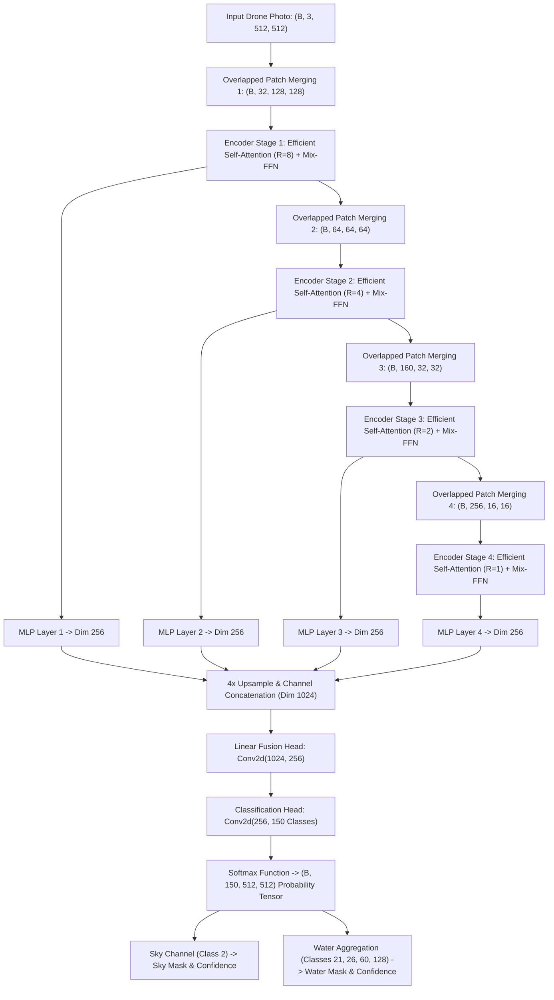

# SegFormer B0 (ADE20K 150-Class Transformer) — Working & Architecture

## 1. Formulas & Mathematical Equations

SegFormer ka design do major innovations par adharit hai: **Hierarchical Transformer Encoder (Overlapped Patch Merging)** aur **All-MLP Decoder (Positional-Encoding Free)**.

### 1.1 Efficient Multi-Head Self-Attention with Spatial Reduction
Standard self-attention ki computational complexity $\mathcal{O}(N^2)$ hoti hai jo high-resolution drone imagery par memory-intensive hoti hai. SegFormer sequence length ko spatial reduction ratio $R$ se reduce karta hai:

$$\mathbf{K}' = \text{Reshape}\left(\frac{H \cdot W}{R^2}, \, C \cdot R^2\right)(\mathbf{K}) \mathbf{W}_K$$

$$\mathbf{V}' = \text{Reshape}\left(\frac{H \cdot W}{R^2}, \, C \cdot R^2\right)(\mathbf{V}) \mathbf{W}_V$$

$$\text{Attention}(\mathbf{Q}, \mathbf{K}', \mathbf{V}') = \text{Softmax}\left(\frac{\mathbf{Q} (\mathbf{K}')^T}{\sqrt{d_k}}\right) \mathbf{V}'$$

- **Computational Complexity:** $\mathcal{O}\left(\frac{N^2}{R^2}\right)$ — yeh self-attention ko $R^2$ times faster bana deta hai. Stage 1 me $R=8$, Stage 2 me $R=4$, Stage 3 me $R=2$, Stage 4 me $R=1$.

---

### 1.2 Mix-FFN (Positional-Encoding Free Feed-Forward Network)
Traditional transformers me fixed positional embeddings hote hain jisse arbitrary test resolution par interpolation errors aate hain. SegFormer positional encoding ko **$3 \times 3$ Depth-wise Convolution** se replace karta hai:

$$\mathbf{x}_1 = \text{Linear}(C_{\text{in}}, C_{\text{hidden}})(\mathbf{x}_{\text{in}})$$

$$\mathbf{x}_2 = \text{DepthwiseConv2d}_{3 \times 3}(\mathbf{x}_1)$$

$$\mathbf{x}_3 = \text{GELU}(\mathbf{x}_2)$$

$$\mathbf{x}_{\text{out}} = \text{Linear}(C_{\text{hidden}}, C_{\text{in}})(\mathbf{x}_3) + \mathbf{x}_{\text{in}}$$

- **Advantage:** Zero-shot arbitrary resolution evaluation — drone camera ki kisi bhi aspect ratio ko bina crop kiye process kiya ja sakta hai.

---

### 1.3 Lightweight All-MLP Decoder
Encoder ke 4 multi-scale hierarchical stages se feature maps $\mathbf{F}_i \in \mathbb{R}^{\frac{H}{2^{i+1}} \times \frac{W}{2^{i+1}} \times C_i}$ extract hoti hain:

$$\mathbf{M}_i = \text{Linear}(C_i, C)(\mathbf{F}_i), \quad \forall i \in \{1, 2, 3, 4\}$$

$$\mathbf{M}_i^{\text{up}} = \text{BilinearUpsample}\left(\mathbf{M}_i, \, \frac{H}{4} \times \frac{W}{4}\right)$$

$$\mathbf{M}_{\text{fused}} = \text{Linear}(4C, C)\left( [\mathbf{M}_1^{\text{up}}, \mathbf{M}_2^{\text{up}}, \mathbf{M}_3^{\text{up}}, \mathbf{M}_4^{\text{up}}] \right)$$

$$\mathbf{Z} = \text{Linear}(C, 150)(\mathbf{M}_{\text{fused}})$$

---

### 1.4 Softmax Probability & Water/Sky Disambiguation
Pixel $(x, y)$ ke liye raw logits $\mathbf{Z}(x, y)$ ko 150 classes ke probability distribution me normalize kiya jata hai:

$$P(k \mid x, y) = \frac{e^{\mathbf{Z}_k(x, y)}}{\sum_{j=1}^{150} e^{\mathbf{Z}_j(x, y)}}$$

ADE20K class definitions ke anusar:
- **Sky Probability:** $P_{\text{sky}}(x, y) = P(2 \mid x, y)$
- **Unified Water Probability:** 
  $$P_{\text{water}}(x, y) = \sum_{c \in \{21, 26, 60, 128\}} P(c \mid x, y)$$
  Jaha $21 = \text{water}, 26 = \text{sea}, 60 = \text{river}, 128 = \text{lake}$.

---

### 1.5 Discrepancy Auditing Formula (`models_disagree`)
Jab FloodNet aur SegFormer ke beech oblique perspective par vivad hota hai, toh consensus audit formula evaluate hota hai:

$$\text{models\_disagree} = \begin{cases} \text{True} & \text{if } \text{FloodNet}_{\text{water}} \ge 10.0\% \land \text{SegFormer}_{\text{water}} < 3.0\% \land \text{SegFormer}_{\text{sky}} \ge 10.0\% \\ \text{False} & \text{otherwise} \end{cases}$$

Discrepancy trigger hone par:
1. FloodNet ki false water detection suppress ho jati hai.
2. Effective water percentage SegFormer ki reading ($\approx 0\%$) se replace ho jata hai.
3. Operator briefing me discrepancy warning note automatically add ho jata hai.

---

## 2. Structure & Model Architecture

---

## 3. Data Processing Workflow

1. **Preprocessing:** Drone image ko RGB me load kiya jata hai. `AutoImageProcessor` ImageNet mean $[0.485, 0.456, 0.406]$ aur std $[0.229, 0.224, 0.225]$ se tensor banata hai.
2. **PyTorch Forward Pass:** `SegformerForSemanticSegmentation` raw logits output karta hai shape `(1, 150, 128, 128)`.
3. **Bilinear Interpolation:** Logits ko original image resolution par upscale kiya jata hai via `F.interpolate(logits, size=(H, W), mode='bilinear')`.
4. **Softmax Extraction:** Per-pixel class probabilities compute hoti hain.
5. **Mask Filtering:** Confidence threshold $\tau = 0.35$ se zyada wale pixels ko binary mask me save kiya jata hai.

---

## 4. Hyperparameters & Specifications

| Spec / Hyperparameter | Value | Description |
| :--- | :--- | :--- |
| **Model Checkpoint** | `nvidia/segformer-b0-finetuned-ade-512-512` | Hugging Face official weights |
| **Parameter Count** | **3.71 Million** | Ultra-lightweight edge transformer |
| **Backbone Family** | MiT-B0 (Mix Transformer B0) | Overlapped Patch Merging + Mix-FFN |
| **Target Dataset** | ADE20K (150 Scene Classes) | General scene parsing benchmark |
| **Decoder Architecture** | All-MLP Decoder ($C=256$) | Lightweight multi-scale aggregation |
| **Encoder Stages** | 4 Stages ($C_1=32, C_2=64, C_3=160, C_4=256$) | Hierarchical feature pyramid |
| **Default Image Size** | $512 \times 512 \times 3$ | Native trained resolution |
| **Inference Time (CPU)** | **~180 – 240 ms** | Real-time capable |
