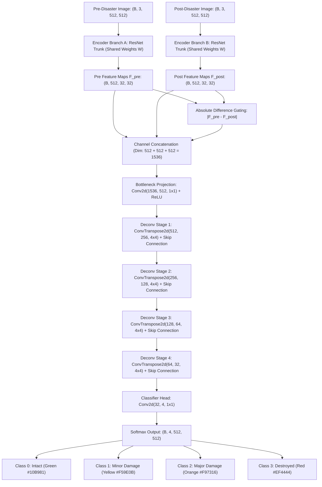

# Microsoft SiamUnet (xBD Pre/Post Damage) — Working & Architecture

## 1. Formulas & Mathematical Equations

Microsoft SiamUnet ka core principle **Siamese Feature Extraction**, **Absolute Difference Gating**, aur **Deconvolutional Multi-Scale Fusion** par adharit hai.

### 1.1 Weight-Shared Siamese Feature Extraction
Pre-disaster image $\mathbf{I}_{\text{pre}}$ aur post-disaster image $\mathbf{I}_{\text{post}}$ ko do identical encoder branches se pass kiya jata hai jinke weights $\mathbf{W}$ bilkul same (shared) hote hain:

$$\mathbf{F}_{\text{pre}} = \mathcal{E}(\mathbf{I}_{\text{pre}}; \, \mathbf{W})$$

$$\mathbf{F}_{\text{post}} = \mathcal{E}(\mathbf{I}_{\text{post}}; \, \mathbf{W})$$

- **Intuition:** Weight-sharing guarantee karta hai ki feature representation space dono images ke liye identical ho, jisse seasonal lighting differences artificial damage na ban jayein.

---

### 1.2 Absolute Difference Vector & Feature Concatenation
Structural change ko isolate karne ke liye direct absolute difference calculate hota hai:

$$\Delta \mathbf{F} = |\mathbf{F}_{\text{pre}} - \mathbf{F}_{\text{post}}|$$

$$\mathbf{F}_{\text{fusion}} = \text{Concat}\left([\mathbf{F}_{\text{pre}}, \, \mathbf{F}_{\text{post}}, \, \Delta \mathbf{F}]\right)$$

Concatenated tensor decoder network $\mathcal{D}$ me feed hota hai:

$$\mathbf{Z} = \mathcal{D}(\mathbf{F}_{\text{fusion}}) \in \mathbb{R}^{4 \times H \times W}$$

$$\hat{\mathbf{Y}}_{c}(x, y) = \frac{e^{\mathbf{Z}_c(x, y)}}{\sum_{j=0}^3 e^{\mathbf{Z}_j(x, y)}}$$

---

### 1.3 Structural Integrity Index (0% to 100%)
Disaster sector ki overall structural health ko single composite index me evaluate kiya jata hai:

$$\text{Integrity} = \frac{1.0 \cdot N_{\text{intact}} + 0.70 \cdot N_{\text{minor}} + 0.20 \cdot N_{\text{major}} + 0.0 \cdot N_{\text{destroyed}}}{N_{\text{total}}} \times 100.0\%$$

- **Integrity > 85%:** Survey Complete — Low Structural Risk.
- **Integrity 60% – 85%:** Moderate Damage — Engineering Inspection Required.
- **Integrity < 60%:** Catastrophic Failure — Immediate Evacuation & Search-and-Rescue Directive.

---

### 1.4 Mathematical Normalization to 100.0%
Damage breakdown percentage calculation me zero arithmetic drift enforce hota hai:

$$\text{Destroyed}_{\text{pct}} + \text{Major}_{\text{pct}} + \text{Minor}_{\text{pct}} \equiv 100.0\% \quad \text{(of damaged footprints)}$$

---

## 2. Structure & Model Architecture

---

## 3. Hyperparameters & Specifications

| Parameter | Value | Operational Role |
| :--- | :--- | :--- |
| **Model Family** | Siamese Convolutional Neural Network | Paired pre/post image differencing |
| **Parameter Count** | **7.80 Million** | Balanced latency and structural depth |
| **Target Standard** | **xBD / FEMA HAZUS** | 4 international disaster damage tiers |
| **Input Shape** | $2 \times (3, 512, 512)$ | Pre and post RGB imagery |
| **Loss Function** | Focal Loss + Dice Loss | Handles severe intact vs destroyed class imbalance |
| **Inference Time (CPU)** | **~420 – 550 ms** | Rapid pre/post comparison |
| **Inference Time (CUDA)** | **~18 ms** | Sub-second batch evaluation |
