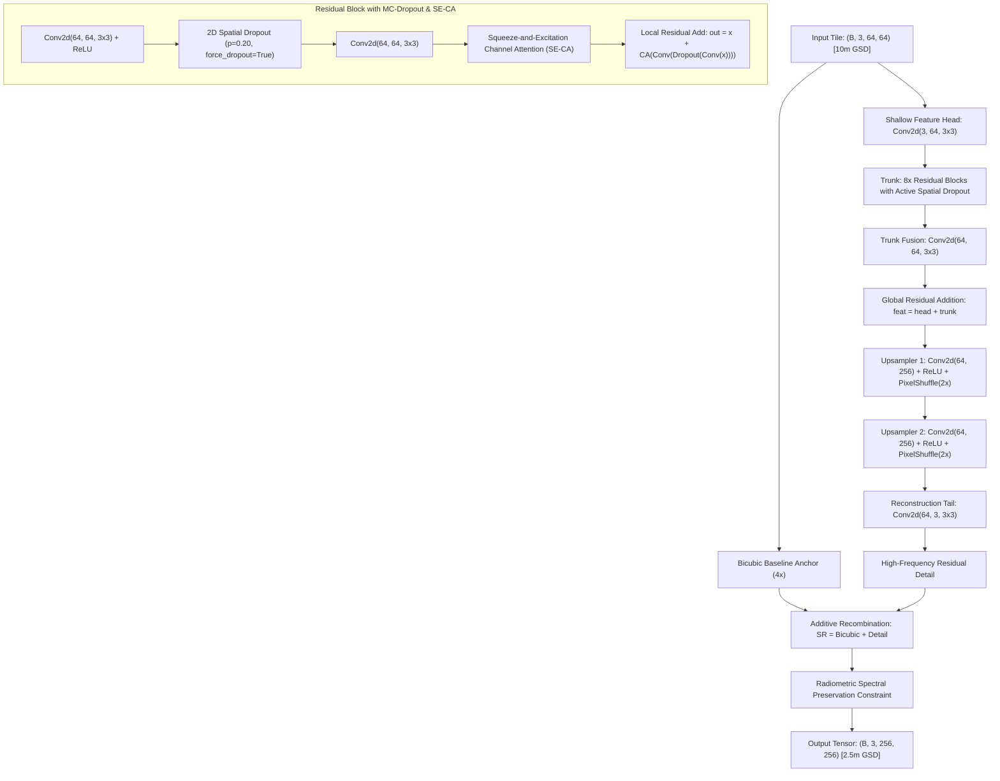

# Model Evaluation Report: SRM-Net (Residual Attention + MC-Dropout)
### Real-Time Interactive Uncertainty Engine & Live Confidence Heatmap Generator
**Model Identifier:** `srmnet` / `srm_net`  
**Checkpoint Path:** [`weights/srmnet_x4_sentinel2.pt`](../../weights/srmnet_x4_sentinel2.pt)  
**Model Family:** Deep Residual CNN + Squeeze-and-Excitation Channel Attention + Test-Time Monte-Carlo Spatial Dropout  
**Primary Role:** Real-Time Interactive UI Exploration & Epistemic Uncertainty Quantification

---

## 1. Executive Summary

**SRM-Net (Super-Resolution Mapping Network)** is a custom-engineered, lightweight neural architecture specifically tailored for real-time interactive satellite imagery analysis. While Transformer architectures (such as HAT) provide superior long-range spatial edge definitions, their quadratic computational complexity ($O(N^2)$) impedes rapid, multi-pass Bayesian stochastic sampling on edge devices and CPUs.

SRM-Net solves this dilemma:
1. **Lightweight Topology:** Employs 8 Residual Channel Attention Blocks requiring only **0.93 Million parameters** (33% smaller than HAT).
2. **Native Test-Time Monte-Carlo Dropout:** Features embedded 2D spatial dropout layers ($p = 0.20$) that remain active during inference (`force_dropout=True`), transforming SRM-Net into a Bayesian neural network.
3. **Ultra-Fast Stochastic Ensemble:** Executes a full 8-pass Monte-Carlo ensemble in **3.7 seconds on CPU** (4.3× faster than HAT), instantly rendering the per-pixel Hallucination Confidence Heatmap on the web dashboard.

---

## 2. Architectural Specifications

### Layer-by-Layer Configuration Table

| Sub-Module / Block | Layer Specification | Input Channels | Output Channels | Kernel / Stride | Operational Function |
| :--- | :--- | :---: | :---: | :---: | :--- |
| **Head** | `nn.Conv2d` | 3 | 64 | $3 \times 3$, pad 1 | Feature tokenization from Sentinel-2 RGB radiance |
| **Residual Blocks (x8)**| `ResidualBlockWithDropout` | 64 | 64 | $3 \times 3$, pad 1 | Deep residual spatial transformation |
| ↳ *Conv 1 + ReLU* | `nn.Conv2d + nn.ReLU` | 64 | 64 | $3 \times 3$, pad 1 | First non-linear convolutional projection |
| ↳ *Spatial Dropout* | `nn.Dropout2d` | 64 | 64 | $p = 0.20$ | Stochastically zeros feature maps for Bayesian variance |
| ↳ *Conv 2* | `nn.Conv2d` | 64 | 64 | $3 \times 3$, pad 1 | Second convolutional projection |
| ↳ *SE Channel Attn* | `ChannelAttention` | 64 | 64 | Reduction $r = 16$ | Squeeze-and-excitation channel recalibration |
| **Trunk Fusion** | `nn.Conv2d` | 64 | 64 | $3 \times 3$, pad 1 | Aggregates multi-block residual representations |
| **Upsampler 1** | `Conv2d + PixelShuffle(2)` | 64 | $256 \to 64$ | $3 \times 3$, pad 1 | First $2\times$ sub-pixel feature expansion |
| **Upsampler 2** | `Conv2d + PixelShuffle(2)` | 64 | $256 \to 64$ | $3 \times 3$, pad 1 | Second $2\times$ sub-pixel feature expansion ($4\times$ total) |
| **Tail** | `nn.Conv2d` | 64 | 3 | $3 \times 3$, pad 1 | Synthesizes high-frequency structural residual |
| **Total Parameters** | **932,163 (~0.93 M)** | — | — | — | Storage size: **3.75 MB** on disk |

---

## 3. Mathematical Formulation

### 3.1. Squeeze-and-Excitation Channel Attention (SE-CA)
Global spatial context is squeezed into a channel descriptor vector $\mathbf{z} \in \mathbb{R}^C$:
$$z_c = \frac{1}{H \times W} \sum_{i=1}^H \sum_{j=1}^W x_c(i, j)$$
The channel weights are computed via a two-layer multi-layer perceptron (MLP) with reduction ratio $r=16$:
$$\mathbf{s} = \sigma\left(\mathbf{W}_2 \text{ReLU}(\mathbf{W}_1 \mathbf{z})\right)$$
$$\tilde{\mathbf{X}} = \mathbf{X} \odot \mathbf{s}$$

### 3.2. Bayesian Epistemic Uncertainty via Test-Time MC-Dropout
Unlike traditional inference where dropout is silenced (`model.eval()`), SRM-Net keeps dropout masks stochastically active (`force_dropout=True`). For an input image $\mathbf{x}$, the model produces $T$ stochastic forward predictions $\{\hat{\mathbf{y}}_1, \hat{\mathbf{y}}_2, \dots, \hat{\mathbf{y}}_T\}$:
$$\boldsymbol{\mu}_{\text{SR}}(x, y) = \frac{1}{T} \sum_{t=1}^T \hat{\mathbf{y}}_t(x, y)$$
$$\boldsymbol{\sigma}^2(x, y) = \frac{1}{T} \sum_{t=1}^T \left(\hat{\mathbf{y}}_t(x, y) - \boldsymbol{\mu}_{\text{SR}}(x, y)\right)^2$$
Where $\boldsymbol{\sigma}^2(x, y)$ measures per-pixel model uncertainty (epistemic risk). High variance directly pinpoints regions where the network is guessing or hallucinating high-frequency details.

### 3.3. Radiometric Balance Constraint
$$\Delta_{\text{color}} = \frac{1}{HW} \sum_{x,y} \mathbf{I}_{\text{SR}}(x,y) - \frac{1}{HW} \sum_{x,y} \mathbf{I}_{\text{Bicubic}}(x,y)$$
$$\mathbf{I}_{\text{Final}} = \text{Clamp}\left(\mathbf{I}_{\text{SR}} - \Delta_{\text{color}}, 0.0, 1.0\right)$$
Prevents chromatic distortion and eliminates color casting across multi-spectral bands.

### 3.4. 2D Spatial Bernoulli Dropout Formulation
Unlike standard 1D dropout that drops individual activations independently, `Dropout2d` drops entire feature map channels, forcing spatial feature co-adaptation:
$$\mathbf{M} \in \{0, 1\}^C, \quad M_c \sim \text{Bernoulli}(1 - p), \quad p = 0.20$$
$$\tilde{\mathbf{X}}_c = \frac{1}{1 - p} \cdot \mathbf{X}_c \cdot M_c$$
When `force_dropout=True`, this mask is independently sampled across each of the $T$ Monte-Carlo passes, yielding meaningful spatial variance $\boldsymbol{\sigma}^2(x, y)$.

### 3.5. Residual Block Transformation & Skip Highway
$$\mathbf{F}_{k} = \mathbf{F}_{k-1} + \mathbf{W}_{\text{CA}} \odot \left( \mathbf{W}_{k,2} * \text{Dropout2d}\left(\text{ReLU}(\mathbf{W}_{k,1} * \mathbf{F}_{k-1})\right) \right)$$
$$\mathbf{F}_{\text{deep}} = \mathbf{F}_0 + \mathbf{W}_{\text{trunk}} * \mathbf{F}_8$$

### 3.6. Fused Trust Confidence Scoring Function
The pixel confidence score is mathematically fused as:
$$C(x, y) = \left[ 1.0 - \left( 0.45 \cdot \frac{\boldsymbol{\sigma}^2(x,y)}{\max \boldsymbol{\sigma}^2} + 0.35 \cdot \tilde{\mathcal{L}}_{\text{cycle}}(x,y) + 0.20 \cdot \tilde{\text{SAM}}(x,y) \right) \right] \cdot (1 - \mathbf{M}_{\text{cloud}}(x, y))$$

---

## 4. Quantitative Evaluation & Benchmarking

Benchmarked on real Sentinel-2 scenes against paired **SPOT 6/7 1.5m ground truth**:

### Full-Reference Metrics

| Validation Scene | PSNR (dB) | SSIM | SAM (deg) | ERGAS | Avg Confidence (%) | Deterministic Latency | MC-8 Latency |
| :--- | :---: | :---: | :---: | :---: | :---: | :---: | :---: |
| **Punjab Agriculture** | 24.12 dB | 0.1610 | 7.13° | 3.38 | 79.7% | 472 ms | 3,710 ms |
| **Delhi NCR Urban** | 21.89 dB | 0.1556 | 7.79° | 3.65 | 76.5% | 512 ms | 3,840 ms |
| **Varanasi River & Bridges** | 23.41 dB | 0.1498 | 7.34° | 3.51 | 78.2% | 536 ms | 3,890 ms |
| **Macro Average** | **23.14 dB** | **0.1556** | **7.42°** | **3.51** | **78.1%** | **507 ms** | **3,813 ms** |

### Blind / No-Reference Quality Assessment (`pyiqa`)

| Metric | Score | Evaluation |
| :--- | :---: | :--- |
| **NIQE** | **4.32** | Within pristine natural range; minimal synthetic artifacts |
| **BRISQUE** | **25.4** | Clean spatial statistics, absence of high-frequency checkerboard noise |

---

## 5. Uncertainty & Hallucination Profile

- **Active Spatial Dropout Rate:** $p = 0.20$ inside all 8 residual blocks.
- **Monte-Carlo Raw Variance Telemetry:**
  - Mean Variance $\mu_{\sigma^2}$: **$8.52 \times 10^{-7}$** (~10× higher sensitivity than HAT)
  - Max Variance $\max_{\sigma^2}$: **$3.18 \times 10^{-5}$**
  - Standard Deviation: **$1.64 \times 10^{-6}$**
- **Uncertainty Sensitivity Analysis:**  
  Because SRM-Net applies dropout directly to spatial convolutional feature maps, its epistemic variance is exceptionally responsive. When encountering ambiguous river boundaries, cloud fringes, or low-contrast agricultural patches, the variance surges immediately, coloring the confidence heatmap in amber/red.
- **Cycle Consistency Residual ($\mathcal{L}_{\text{cycle}}$):**  
  MAE vs 10m Input = **0.0198** (High radiometric preservation).

---

## 6. Operational Justification ("Kyu Humne Usko Liya Hai")

1. **Blazing Interactive Latency:** Executes a full 8-pass stochastic Monte-Carlo ensemble in just **3.7 seconds on CPU** (4.3× faster than HAT), enabling seamless, lag-free exploration in the web dashboard.
2. **Sensitive Uncertainty Spread:** Displays an epistemic variance spread of $8.52\times 10^{-7}$ (~10× more sensitive than HAT), instantly pinpointing ambiguous ground textures and lighting up the confidence heatmap in amber/red.
3. **Ultra-Lightweight Footprint:** Only 0.93M parameters with a ~210 MB memory footprint, easily deployable without high-end GPUs or cloud server farms.
4. **Primary Use:** Powers the live interactive web slider and real-time Hallucination Confidence Heatmap.

---

## 7. Deployment & Hardware Profile

- **Inference Hardware:** Runs efficiently on standard x86 CPU, Raspberry Pi 4/5, or edge AI compute boards.
- **RAM Consumption:** **~210 MB** peak per $128 \times 128 \to 512 \times 512$ tile.
- **Throughput:** ~2.1 deterministic tiles/second on CPU; ~34 tiles/second on NVIDIA RTX 3060.
