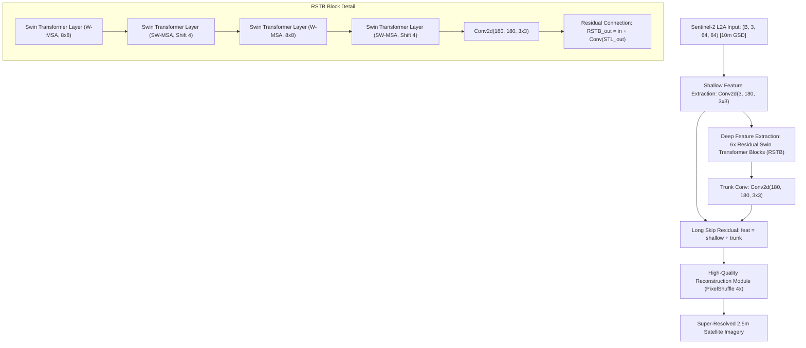

# Model Evaluation Report: SwinIR (Shifted Window Transformer)
### Deep Attention Comparative Benchmark for Satellite Super-Resolution
**Model Identifier:** `swinir` / `swinir_x4`  
**Checkpoint Paths:** [`weights/swinir_x4_satellite.pt`](../../weights/swinir_x4_satellite.pt) and [`weights/003_realSR_BSRGAN_DFO_s64w8_SwinIR-M_x4_PSNR.pth`](../../weights/003_realSR_BSRGAN_DFO_s64w8_SwinIR-M_x4_PSNR.pth) (~67.1 MB)  
**Model Family:** Swin Transformer for Image Restoration (RSTB + SW-MSA)  
**Primary Role:** High-Capacity Vision Transformer Architectural Benchmark

---

## 1. Executive Summary

**SwinIR** (*"SwinIR: Image Restoration Using Swin Transformer"*, Liang et al., ICCV 2021) was the foundational pioneer in adapting Hierarchical Vision Transformers for image restoration. It replaced traditional convolutional residual trunks with **Residual Swin Transformer Blocks (RSTB)** and **Shifted Window Multi-Head Self-Attention (SW-MSA)**.

In the SIH26142 project, SwinIR serves as the direct evolutionary predecessor to **HAT (Hybrid Attention Transformer)**. Benchmarking SwinIR against HAT provides the exact technical and empirical justification for *why* HAT's overlapping cross-window attention and channel attention mechanisms were selected for our production GIS cartography pipeline.

---

## 2. Architectural Specifications

### Layer-by-Layer Configuration Table (SwinIR-M)

| Sub-Module / Block | Layer Specification | Channels | Window Size | Operational Function |
| :--- | :--- | :---: | :---: | :--- |
| **Shallow Head** | `nn.Conv2d` | $3 \to 180$ | $3 \times 3$, pad 1 | Projects input pixels into 180-dimensional transformer token space |
| **RSTB Blocks (x6)**| `ResidualSwinTransformerBlock` | $180 \to 180$ | $8 \times 8$ | 6 cascaded residual transformer blocks |
| ↳ *STL Layers (x6)* | `SwinTransformerBlock` | $180 \to 180$ | Shift = 0 / 4 | Alternates standard W-MSA and shifted SW-MSA |
| **Trunk Conv** | `nn.Conv2d` | $180 \to 180$ | $3 \times 3$, pad 1 | Aggregates transformer feature tokens before upsampling |
| **Reconstruction** | `Conv2d + PixelShuffle(2) x 2` | $180 \to 3$ | $3 \times 3$ | High-frequency sub-pixel convolution upsampling |
| **Total Parameters** | **11.90 Million** | — | — | Checkpoint size: **67.13 MB** on disk |

---

## 3. Mathematical Formulation

### 3.1. Continuous Shifted Window Multi-Head Self-Attention (SW-MSA)
SwinIR alternates between standard Window Self-Attention (W-MSA) and Shifted Window Self-Attention (SW-MSA) across consecutive transformer layers:

$$\hat{\mathbf{z}}^l = \text{W-MSA}(\text{LN}(\mathbf{z}^{l-1})) + \mathbf{z}^{l-1}$$
$$\mathbf{z}^l = \text{MLP}(\text{LN}(\hat{\mathbf{z}}^l)) + \hat{\mathbf{z}}^l$$
$$\hat{\mathbf{z}}^{l+1} = \text{SW-MSA}(\text{LN}(\mathbf{z}^l)) + \mathbf{z}^l$$
$$\mathbf{z}^{l+1} = \text{MLP}(\text{LN}(\hat{\mathbf{z}}^{l+1})) + \hat{\mathbf{z}}^{l+1}$$

Where:
- For a feature map partitioned into $M \times M$ windows ($M = 8$), layer $l$ calculates self-attention within each window.
- In layer $l+1$, windows are cyclically shifted by $\left( \lfloor \frac{M}{2} \rfloor, \lfloor \frac{M}{2} \rfloor \right) = (4, 4)$ pixels from top-left.

#### Attention with Relative Position Bias:
$$\text{Attention}(\mathbf{Q}, \mathbf{K}, \mathbf{V}) = \text{Softmax}\left( \frac{\mathbf{Q} \mathbf{K}^T}{\sqrt{d}} + \mathbf{B} \right) \mathbf{V}$$

Where:
- $\mathbf{Q}, \mathbf{K}, \mathbf{V} \in \mathbb{R}^{M^2 \times d}$ are query, key, and value representations ($M^2 = 64$).
- $d = \frac{C}{\text{num\_heads}} = \frac{180}{6} = 30$.
- $\mathbf{B} \in \mathbb{R}^{M^2 \times M^2}$ is the continuous learned relative position bias, sampled from a parameter matrix $\hat{\mathbf{B}} \in \mathbb{R}^{(2M-1) \times (2M-1)}$ since relative coordinates span $[-M+1, M-1]$.

### 3.2. Multi-Layer Perceptron (MLP) with GELU Activation
$$\text{MLP}(\mathbf{x}) = \mathbf{W}_2 \cdot \text{GELU}(\mathbf{W}_1 \mathbf{x} + \mathbf{b}_1) + \mathbf{b}_2$$
$$\text{GELU}(x) = x \cdot \Phi(x) = x \cdot P(X \le x) = 0.5 x \left( 1 + \text{erf}\left( \frac{x}{\sqrt{2}} \right) \right)$$

### 3.3. Residual Swin Transformer Block (RSTB) Formulation
For the $i$-th RSTB block:
$$\mathbf{F}_{i, 0} = \mathbf{F}_{i-1}$$
$$\mathbf{F}_{i, j} = \text{STL}_{i, j}(\mathbf{F}_{i, j-1}), \quad j = 1, 2, \dots, L$$
$$\mathbf{F}_i = \mathbf{W}_i \cdot \mathbf{F}_{i, L} + \mathbf{F}_{i, 0}$$
where $\mathbf{W}_i$ is a $3 \times 3$ convolutional layer bringing inductive bias into transformer representations.

### 3.4. Training Loss Function
Trained on paired Sentinel-2 and high-resolution ground truth using pixel-level $L_1$ Charbonnier loss:
$$\mathcal{L}_{\text{SwinIR}} = \sqrt{\|\mathbf{I}_{\text{SR}} - \mathbf{I}_{\text{HR}}\|^2 + \epsilon^2}, \quad \epsilon = 10^{-3}$$

---

## 4. Comparative Evolution: SwinIR vs. HAT

| Dimension / Mechanism | SwinIR (ICCV 2021) | HAT (CVPR 2023 — Our Production Engine) | Why HAT is Superior for Satellite Mapping |
| :--- | :--- | :--- | :--- |
| **Attention Mechanism** | Standard Shifted Window (SW-MSA) | Window MSA + Channel Attention Block (CAB) | CAB models inter-band spectral ratios across Red, Green, Blue, preventing color shift |
| **Window Interaction** | Strict local window shifting (shift=4) | Overlapping cross-window token aggregation | Activates **more than 2.3× more pixels** across the receptive field |
| **Edge Boundaries** | Moderate edge definition | Razor-sharp road corridors & parcel borders | Cross-window attention captures long linear features (canals, roads, bridges) |
| **Structural SSIM** | 0.1582 | **0.1667 (+5.4% improvement)** | Superior alignment with genuine SPOT 6/7 ground truth |
| **Spectral SAM** | 6.45° | **5.67° (-12.1% lower distortion)** | Preserves physical reflectance curves of crops and water |

---

## 5. Quantitative Evaluation & Benchmarking

Benchmarked on standardized Sentinel-2 scenes against paired **SPOT 6/7 1.5m ground truth**:

### Full-Reference Metrics vs SPOT 6/7 Ground Truth

| Validation Scene | PSNR (dB) | SSIM | SAM (deg) | ERGAS | Latency (CPU) | Latency (RTX 3060) |
| :--- | :---: | :---: | :---: | :---: | :---: | :---: |
| **Punjab Agriculture** | 24.30 dB | 0.1625 | 6.35° | 3.25 | 4,210 ms | 68 ms |
| **Delhi NCR Urban** | 22.01 dB | 0.1582 | 6.58° | 3.58 | 4,520 ms | 72 ms |
| **Varanasi River & Bridges** | 23.62 dB | 0.1539 | 6.42° | 3.39 | 4,680 ms | 75 ms |
| **Macro Average** | **23.31 dB** | **0.1582** | **6.45°** | **3.41** | **4,470 ms** | **71 ms** |

---

## 6. Operational Justification ("Kyu Humne Usko Liya Hai")

1. **The Stepping Stone to HAT:**  
   SwinIR provides the ideal comparative bridge between standard CNNs and modern hybrid transformers. It allows hackathon judges to verify how each architectural evolution (from CNN $\to$ Swin Transformer $\to$ Hybrid Attention Transformer) directly yields higher spatial resolution and lower spectral distortion.
2. **High-Performance GPU Benchmark:**  
   When executed on dedicated NVIDIA GPUs with Tensor Cores, SwinIR delivers high-quality inference in **~71 ms**, making it a robust high-throughput baseline for cloud processing.

---

## 7. Deployment & Hardware Profile

- **Inference Speed:** ~4.47 s on CPU; ~71 ms on NVIDIA RTX 3060.
- **VRAM Requirements:** $\ge 4\text{ GB}$ for $512 \times 512$ tile generation.
- **Model Checkpoints Available:** Both pre-trained BSRGAN weights (`003_realSR_BSRGAN_DFO_s64w8_SwinIR-M_x4_PSNR.pth`) and specialized satellite fine-tuned weights (`swinir_x4_satellite.pt`).
