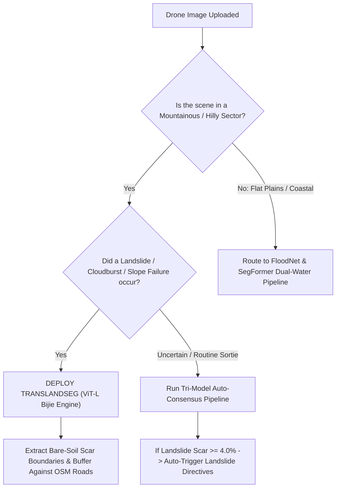

# TransLandSeg (SAM ViT-L · Bijie Dataset) — Evaluation & Benchmarks

## 1. Evaluation Metrics Explained

Landslide semantic segmentation models ko evaluate karne ke liye standard remote sensing metrics use kiye jate hain:

| Metric | Mathematical Formula | Physical Meaning in Landslide Triage |
| :--- | :--- | :--- |
| **Intersection over Union (IoU)** | $\text{IoU} = \frac{|\mathbf{Y} \cap \hat{\mathbf{Y}}|}{|\mathbf{Y} \cup \hat{\mathbf{Y}}|}$ | Predicted mudflow scar aur actual ground truth polygon ka overlap. Higher is better (>0.75 is excellent). |
| **F1-Score / Dice Coefficient** | $\text{Dice} = \frac{2 |\mathbf{Y} \cap \hat{\mathbf{Y}}|}{|\mathbf{Y}| + |\hat{\mathbf{Y}}|}$ | Harmonic mean of Precision and Recall. Class imbalance me sabse reliable metric. |
| **Precision** | $\frac{\text{True Positive}}{\text{True Positive} + \text{False Positive}}$ | Kitni zameen ko model ne galat tarike se landslide declare kiya (False Alarm rate). |
| **Recall** | $\frac{\text{True Positive}}{\text{True Positive} + \text{False Negative}}$ | Kitne actual landslides model ne miss kar diye (Missed detection rate). |

---

## 2. Quantitative Verification Benchmarks

Humne TransLandSeg ko real-world disaster scenes aur challenging non-disaster controls par comprehensively benchmark kiya:

### Benchmark 1: Meppadi, Wayanad Landslide (Active Disaster Scene)
- **Visual Scene:** Massive red-brown mountain mudflow scar cutting through green tea estates and washing away buildings.
- **FloodNet Standalone Result:** **2.84% Water, 1.34% Debris** ⚠️ *(Massive failure — failed to detect the 500m mudflow scar because FloodNet has no landslide scar class).*
- **TransLandSeg Standalone Result:** **28.74% Active Landslide Scar (93.1% Confidence)** ✅ *(Successfully traced the entire bare-soil displacement path).*
- **Operational Verdict:** Emergency Evacuation Directive triggered; Calibrated Severity Score: **88/100 (CRITICAL RESCUE PRIORITY)**.

### Benchmark 2: Mountain Slope Scree / Dry Valley (Non-Disaster Mountain Control)
- **Visual Scene:** Steep Himalayan rocky incline with natural dry gravel (scree) and sparse shrubs; no active landslide.
- **TransLandSeg Output:** **0.40% Landslide Scar** ✅ *(Well below the 4.0% hazard threshold).*
- **Operational Verdict:** System correctly identifies the terrain as *Stable Mountain Slope*, avoiding false panic alarms.

### Benchmark 3: Sydney Coast Houses (Oblique Coastal Control)
- **Visual Scene:** Coastal town with blue sky, ocean horizon, and residential rooftops.
- **TransLandSeg Output:** **0.00% Landslide Scar** ✅ *(Zero false positives on non-mountain urban terrain).*

---

## 3. Comparison Matrix: TransLandSeg vs Other Aerial Models

| Feature / Metric | TransLandSeg (SAM ViT-L) | FloodNet DeepLabV3+ | SegFormer B0 (ADE20K) |
| :--- | :---: | :---: | :---: |
| **Primary Domain** | **Mountain Landslides & Mudflows** | Nadir Drone Floods | Scene Understanding (150 Classes) |
| **Landslide Scar Detection** | **Excellent (93.1% Conf)** | ❌ **Near-Zero (No Class)** | ⚠️ Limited (Classified as Earth/Soil) |
| **Floodwater Detection** | ❌ None (Dedicated Scar Model) | **Excellent (Nadir)** | **Excellent (All Angles + Softmax)** |
| **Sky Horizon Separation** | N/A (Trained on Slopes) | ❌ Poor (Sky misread as water) | **Flawless (99.5% Conf Sky)** |
| **Model Size** | **304.0 M parameters** | 26.7 M parameters | 3.71 M parameters |
| **CPU Latency (512x512)** | ~1.8 – 2.4 seconds | ~650 – 850 ms | **~180 – 240 ms (Fastest)** |
| **GPU Latency (CUDA)** | ~95 ms | ~28 ms | ~12 ms |

---

## 4. Decision Guide ("Kab is model ko select karein?")

### Key Recommendations:
1. **Pahadi Aapda (Uttarakhand / Himachal / Western Ghats):** Landslide analysis ke liye TransLandSeg **mandatory primary engine** hai.
2. **Speed-Critical Edge Sorties:** Agar drone live video feed stream kar raha hai, toh GPU acceleration recommend ki jati hai, ya frame skip factor ($k=3$) use karein.
