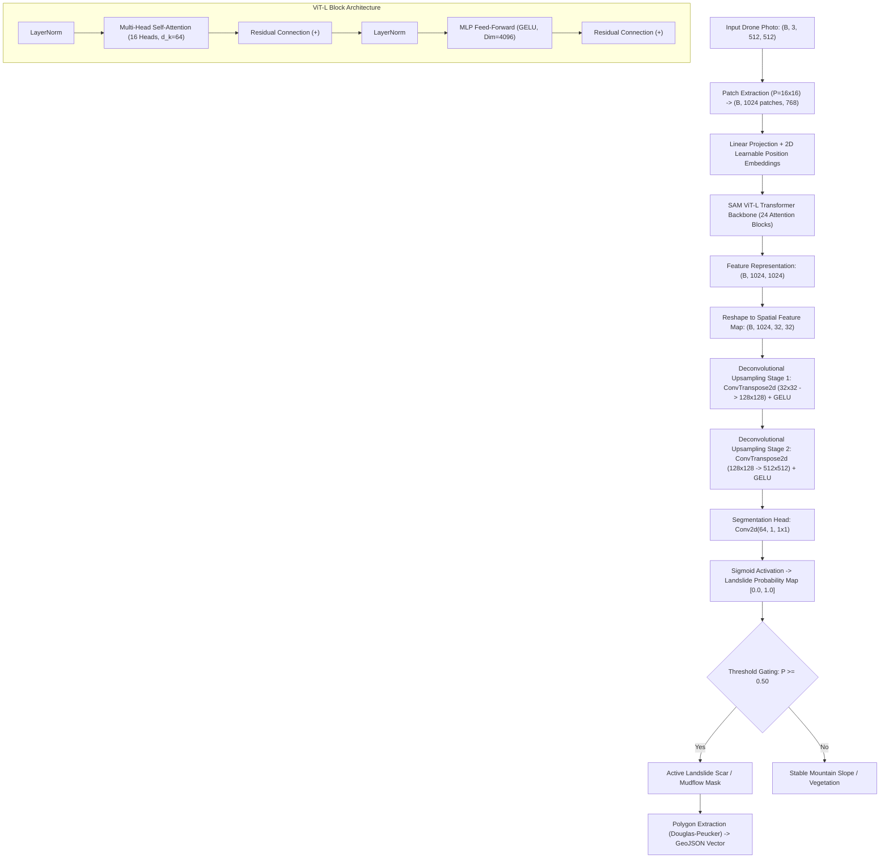

# TransLandSeg (SAM ViT-L · Bijie Dataset) — Working & Architecture

## 1. Formulas & Mathematical Equations

TransLandSeg ek hierarchical Vision Transformer architecture use karta hai jo spatial patch embeddings ko multi-head self-attention se process karke fine-grained semantic landslide masks generate karta hai.

### 1.1 Vision Transformer Patch Embedding
Input drone photo $\mathbf{I} \in \mathbb{R}^{H \times W \times C}$ ko non-overlapping patches $P \times P$ ($P=16$) me slice kiya jata hai:

$$N = \frac{H \cdot W}{P^2}$$

$$\mathbf{x}_p \in \mathbb{R}^{N \times (P^2 \cdot C)}, \quad \mathbf{z}_0 = [\mathbf{x}_p^1 \mathbf{E}; \, \mathbf{x}_p^2 \mathbf{E}; \, \dots; \, \mathbf{x}_p^N \mathbf{E}] + \mathbf{E}_{\text{pos}}$$

- **$\mathbf{E} \in \mathbb{R}^{(P^2 C) \times D}$:** Linear projection matrix jo raw pixel patches ko $D$-dimensional latent space ($D=1024$ for ViT-L) me map karti hai.
- **$\mathbf{E}_{\text{pos}} \in \mathbb{R}^{N \times D}$:** Learnable 2D spatial position embedding jo spatial coordinates preserve karti hai.

---

### 1.2 Multi-Head Self-Attention (MHSA)
Har transformer block me queries ($\mathbf{Q}$), keys ($\mathbf{K}$), aur values ($\mathbf{V}$) compute hoti hain:

$$\mathbf{Q} = \mathbf{z} \mathbf{W}_Q, \quad \mathbf{K} = \mathbf{z} \mathbf{W}_K, \quad \mathbf{V} = \mathbf{z} \mathbf{W}_V$$

$$\text{Attention}(\mathbf{Q}, \mathbf{K}, \mathbf{V}) = \text{Softmax}\left(\frac{\mathbf{Q} \mathbf{K}^T}{\sqrt{d_k}}\right) \mathbf{V}$$

$$\text{MHSA}(\mathbf{z}) = [\text{head}_1, \dots, \text{head}_h] \mathbf{W}_O$$

- **Intuition:** Self-attention pure pahadi scene ko ek saath dekhta hai. Agar ek slope par mitti ka rang badal raha hai aur upar se neeche tak continuous tear line (scar) ban rahi hai, toh transformer un patches ke beech strong attention link create karta hai.

---

### 1.3 Lightweight Mask Decoder & Probability Sigmoid
Latent features ko upscale karke binary landslide probability map $\hat{\mathbf{Y}} \in [0, 1]^{H \times W}$ me convert kiya jata hai:

$$\mathbf{F}_{\text{up}} = \text{ConvTranspose2d}(\mathbf{z}_L) \to \text{GELU} \to \text{Conv2d}(\mathbf{F}, \text{num\_classes}=1)$$

$$\hat{\mathbf{Y}}(x, y) = \sigma(\mathbf{F}_{\text{up}}(x, y)) = \frac{1}{1 + e^{-\mathbf{F}_{\text{up}}(x, y)}}$$

Pixels exceeding classification threshold $\tau = 0.50$ ko landslide scar classify kiya jata hai:

$$\mathbf{M}_{\text{landslide}}(x, y) = \begin{cases} 1 & \text{if } \hat{\mathbf{Y}}(x, y) \ge \tau \\ 0 & \text{otherwise} \end{cases}$$

---

### 1.4 Composite Landslide Segmentation Loss (Dice + BCE)
Pahado me landslides aamtaur par pure frame ka 5% se 30% area hi gherte hain (severe class imbalance). Is imbalance ko overcome karne ke liye composite loss use hoti hai:

$$\mathcal{L}_{\text{total}} = \alpha \mathcal{L}_{\text{BCE}}(\hat{\mathbf{Y}}, \mathbf{Y}) + (1 - \alpha) \mathcal{L}_{\text{Dice}}(\hat{\mathbf{Y}}, \mathbf{Y})$$

$$\mathcal{L}_{\text{BCE}} = -\frac{1}{HW} \sum_{i=1}^{HW} \left[ y_i \log \hat{y}_i + (1 - y_i) \log(1 - \hat{y}_i) \right]$$

$$\mathcal{L}_{\text{Dice}} = 1 - \frac{2 \sum_{i=1}^{HW} \hat{y}_i y_i + \epsilon}{\sum_{i=1}^{HW} \hat{y}_i + \sum_{i=1}^{HW} y_i + \epsilon}$$

---

### 1.5 Landslide Physical Surface Area Calculation
Segmented binary mask aur drone sensor Ground Sample Distance (GSD in meters) se actual physical damage area calculate hota hai:

$$\text{Pixel Count} = \sum_{x, y} \mathbf{M}_{\text{landslide}}(x, y)$$

$$\text{Area}_{\text{landslide}} (\text{m}^2) = \text{Pixel Count} \times (\text{GSD}_m)^2$$

$$\text{Coverage Percentage (\%)} = \frac{\text{Pixel Count}}{H \times W} \times 100.0\%$$

---

## 2. Structure & Model Architecture

---

## 3. Data Processing Workflow

1. **Image Standardization:** Input aerial image (PIL or numpy array) ko RGB format me convert kiya jata hai aur $512 \times 512$ resolution par resize kiya jata hai.
2. **Normalization:** ImageNet mean $[0.485, 0.456, 0.406]$ aur standard deviation $[0.229, 0.224, 0.225]$ se tensor normalize hota hai.
3. **Transformer Forward Pass:** Model bare-soil features, vegetation loss boundaries, aur slope scar patterns ko identify karta hai.
4. **Sigmoid Probability & Contouring:** $512 \times 512$ probability map generate hoti hai. Connected component analysis se continuous debris polygons extract hote hain.
5. **Color Overlay Synthesis:** Red transparent mask (`#DC2626`, opacity 0.55) original image par superimpose hota hai, aur base64 data-URL frontend ko serve hota hai.

---

## 4. Hyperparameters & Training Specifications

| Hyperparameter / Spec | Value | Operational Context |
| :--- | :--- | :--- |
| **Backbone Architecture** | SAM ViT-L (Vision Transformer Large) | Large receptive field for mountain slopes |
| **Pre-trained Weights** | Meta SAM Large (`checkpoints/Bijie.pth.tar`) | Pre-trained on SA-1B + Fine-tuned on Bijie |
| **Training Dataset** | **Bijie Landslide Dataset** | 7,748 aerial/satellite images of mountain slope failures |
| **Input Resolution** | $512 \times 512 \times 3$ pixels | Standard tactical drone tile size |
| **Patch Size ($P$)** | $16 \times 16$ pixels | Total $32 \times 32 = 1,024$ spatial tokens |
| **Embedding Dimension ($D$)** | $1,024$ | Hidden layer capacity |
| **Number of Heads ($h$)** | $16$ | Parallel attention projections |
| **Transformer Depth** | $24$ blocks | Deep feature abstraction |
| **Loss Function** | $0.5 \times \text{BCE} + 0.5 \times \text{Dice Loss}$ | Robust against severe background-to-scar class imbalance |
| **Classification Threshold** | $\tau = 0.50$ | Balanced precision/recall cutoff |
